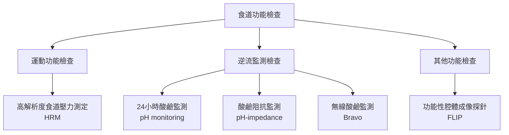
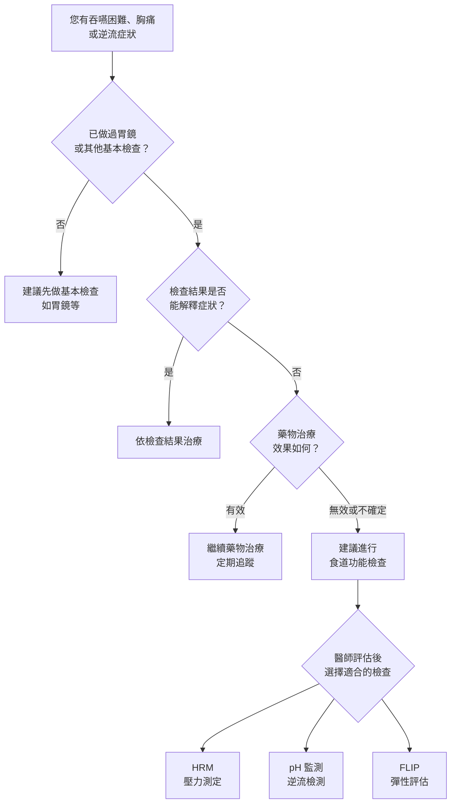

# 什麼是食道功能檢查 (Esophageal Function Testing)

## 前言

食道 (esophagus) 是連接喉嚨與胃之間的管狀器官，長約 25 公分。當我們吞嚥食物時，食道會透過有規律的肌肉收縮（稱為蠕動，peristalsis）將食物推送到胃中。食道下方有一個重要的環狀肌肉，叫做下食道括約肌 (lower esophageal sphincter, LES)，它就像一道門，在吞嚥時打開讓食物通過，平時則關閉防止胃酸逆流 (reflux) 回食道。

**食道功能檢查**是一系列專門評估食道運動功能和逆流狀況的檢查，能幫助醫師了解您的食道是否正常運作。

*圖：HRM 檢查示意圖。細管經鼻腔放入食道，36 個壓力感測器記錄吞嚥時的壓力變化。*

## 為什麼需要做食道功能檢查？

當您出現以下症狀，且一般的內視鏡 (endoscopy) 或影像檢查無法充分解釋原因時，醫師可能會建議您接受食道功能檢查：

### 常見適應症

1. **吞嚥困難 (dysphagia)**
   - 感覺食物卡在喉嚨或胸口
   - 吞嚥時有阻塞感
   - 需要反覆吞嚥才能將食物送下

2. **不明原因的胸痛 (non-cardiac chest pain)**
   - 已排除心臟問題後仍有胸口疼痛
   - 疼痛與進食有關

3. **胃食道逆流疾病 (gastroesophageal reflux disease, GERD) 相關**
   - 藥物治療效果不佳的胃酸逆流
   - 火燒心 (heartburn) 持續發作
   - 逆流手術前的評估

4. **手術前評估**
   - 抗逆流手術 (antireflux surgery) 前的必要檢查
   - 確認食道運動功能正常，以選擇最適合的手術方式

5. **其他情況**
   - 不明原因的噁心或嘔吐
   - 慢性咳嗽 (chronic cough) 或氣喘 (asthma)，懷疑與逆流有關
   - 喉嚨異物感 (globus sensation)

## 食道功能檢查有哪些類型？

### 快速總覽

| 檢查名稱 | 主要目的 | 一句話說明 |
|----------|---------|-----------|
| 高解析度食道壓力測定 (HRM) | 評估食道肌肉運動 | 測量吞嚥時食道的壓力變化 |
| 24 小時酸鹼監測 (pH monitoring) | 測量胃酸逆流 | 記錄一整天食道內的酸度 |
| 酸鹼阻抗監測 (pH-impedance) | 偵測所有類型逆流 | 同時測量酸性和非酸性逆流 |
| 無線酸鹼監測 (wireless pH/Bravo) | 測量胃酸逆流 | 免鼻管，用小膠囊記錄酸度 |
| 功能性腔體成像探針 (FLIP) | 評估食道彈性 | 測量食道可以撐開的程度 |

## 什麼樣的人需要做食道功能檢查？

### 您可能需要食道功能檢查的情境

### 常見需要檢查的族群

- **長期吞嚥困難的患者**：食道壓力測定可以找出食道運動異常的原因
- **逆流症狀對藥物反應不佳的患者**：pH 監測可以確認是否真的有異常逆流
- **計畫接受抗逆流手術的患者**：手術前必須確認食道運動功能
- **食道弛緩不能症 (achalasia) 疑似患者**：需要壓力測定來確診
- **不明原因胸痛的患者**：排除心臟問題後，食道功能檢查可找出食道相關原因

## 檢查注意事項與禁忌

以下情況可能不適合進行食道功能檢查，請事先告知醫師：

| 情況 | 說明 |
|------|------|
| 嚴重鼻腔異常或近期鼻部手術 | 導管可能無法順利經鼻置入 |
| 嚴重凝血功能異常 | 導管置入可能造成出血 |
| 食道嚴重狹窄或阻塞 | 導管可能無法通過狹窄處 |
| 近期食道或胃部手術 | 需待傷口癒合後再進行 |
| 嚴重心肺功能不全 | 檢查過程可能加重不適 |
| 無法配合吞嚥指令 | 檢查需要病人配合吞嚥動作 |

> 以上為相對禁忌症，醫師會根據您的個別狀況評估是否適合接受檢查。

## 檢查安全嗎？

食道功能檢查整體而言是**安全且風險很低**的檢查。大多數人在檢查過程中可能會感到輕微不適（例如鼻腔或喉嚨的異物感），但通常都能順利完成。嚴重併發症極為罕見。

### 重要提醒

- 檢查前請務必告知醫師您目前使用的所有藥物
- 如有藥物過敏，請事先告知
- 如有鼻腔手術史或鼻中隔彎曲 (deviated septum)，請事先告知
- 懷孕或可能懷孕的女性，請事先告知醫師

## 國內外檢查資源

目前在台灣，多家醫學中心設有食道功能檢查的設備與專業團隊，包括台北榮總、三軍總醫院（設有專門的食道功能檢查中心）、亞東醫院、台大醫院、長庚醫院等。國際上，美國的西北大學 Kenneth C. Griffin 食道中心、紐約大學朗格尼食道健康中心等，都是此領域的知名機構。

<!-- 🏥 院內資料區 - 請自行填入 -->
> **📋 請填入貴院資料：**
>
> - 本院負責科別：_______________
> - 聯絡電話 / 分機：_______________
> - 門診時間：_______________
> - 主治醫師：_______________
> - 本院檢查設備與特色：_______________
<!-- 院內資料區結束 -->

---
## 延伸閱讀
- [想了解更多？請參閱進階版](../進階版/01_高解析度食道壓力測定_HRM.md)
- [食道弛緩不能症介紹](../../食道弛緩不能症/一般版/01_疾病介紹.md)
