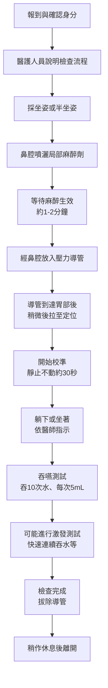
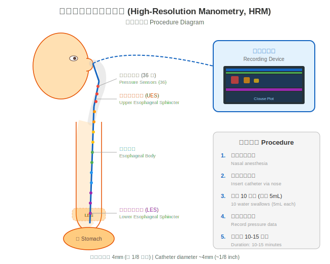
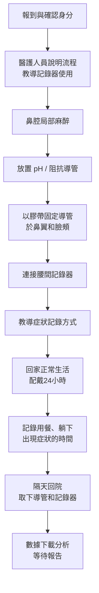

# 食道功能檢查流程與注意事項

## 前言

了解檢查的詳細流程，可以幫助您減輕緊張感，並更好地配合醫護人員完成檢查。本篇將為您說明高解析度食道壓力測定 (HRM) 和 24 小時酸鹼（阻抗）監測 (pH/pH-impedance monitoring) 的完整流程。

---

## 一、高解析度食道壓力測定 (HRM) 流程

### 步驟說明

*圖：高解析度食道壓力測定檢查流程。經鼻置入導管後進行 10 次吞嚥測試，全程約 10-15 分鐘。*

### 各步驟詳細說明

#### 步驟 1：報到

- 到達指定的檢查室，出示健保卡和檢查單
- 醫護人員會確認您的身分、過敏史和禁食狀況
- 確認您已依指示停用相關藥物

#### 步驟 2：說明與同意

- 醫護人員會再次說明檢查過程和可能的不適
- 簽署檢查同意書 (informed consent)
- 有任何疑問都可以在這時候提出

#### 步驟 3：麻醉準備

- 您會被安排在檢查床上，通常採坐姿或半坐姿
- 醫護人員會在您的一側鼻腔（通常是較通暢的一側）噴入局部麻醉劑
- 麻醉劑會讓鼻腔和喉嚨變得比較麻木，減少不適感
- 等待約 1-2 分鐘讓麻醉充分生效

#### 步驟 4：導管放置

- 醫護人員將細管（直徑約 4.2 毫米）從鼻腔輕輕送入
- 當導管到達喉嚨時，您會被要求做吞嚥動作
- **重要技巧**：配合醫護人員指令「現在吞一下」做吞嚥，管子會比較容易通過
- 導管通過喉嚨後的不適感會明顯減輕
- 整個放置過程約 1-2 分鐘

> **小技巧**：放置導管時，用鼻子慢慢吸氣、嘴巴慢慢吐氣，有助於放鬆。如果出現嘔吐感，深呼吸會有幫助。

#### 步驟 5：正式檢查

- 導管定位完成後，您會被要求**安靜不動**約 30 秒進行校準
- 醫護人員會用注射器給您 5 毫升（約一小口）的水
- 您在聽到指令後將水吞下
- 每次吞嚥之間間隔約 20-30 秒
- 總共需要吞嚥 **10 次**
- 醫師可能會請您在**躺著 (supine)** 和**坐著 (upright)** 兩種姿勢下進行測試
- 部分醫師可能會加做**激發測試 (provocative maneuver)**，例如快速連續喝水

#### 步驟 6：完成

- 所有吞嚥測試完成後，導管會被迅速拔出
- 拔管過程只需幾秒鐘，可能會有輕微不適
- 您可以擤鼻涕或漱口

### HRM 檢查時間

- 導管放置：約 1-2 分鐘
- 正式測試：約 10-15 分鐘
- **總時間：約 15-20 分鐘**

---

## 二、24 小時酸鹼（阻抗）監測流程

### 步驟說明

### 各步驟詳細說明

#### 放置階段（與 HRM 類似）

- 導管放置方式和 HRM 相似，但 pH 監測的導管更細
- 導管會固定在下食道括約肌上方約 5 公分處
- 導管會用醫療膠帶固定在鼻翼和臉頰上，防止移位

#### 配戴階段（24 小時）

- 導管外端連接到一台小型記錄器（約手機大小）
- 記錄器通常掛在腰間的皮帶或用肩帶攜帶
- **您需要記錄以下事件**：
  - 開始進餐和結束進餐的時間
  - 躺下和起床的時間
  - 出現症狀（如火燒心、胸痛、逆流感）的時間

#### 配戴期間的生活須知

| 可以做 | 不可以做 |
|-------|---------|
| 正常飲食（依醫囑） | 洗澡淋浴（記錄器不防水） |
| 正常說話 | 激烈運動 |
| 輕度工作和活動 | 游泳 |
| 使用手機和電腦 | 拉扯或移動導管 |
| 躺下休息和睡覺 | 做核磁共振 (MRI) |

#### 飲食注意事項（監測期間）

- 依醫師指示正常飲食（目的是記錄日常逆流狀況）
- 避免刻意改變飲食習慣（否則影響結果準確性）
- 進食時注意記錄時間
- 避免過度辛辣或刺激性食物（除非這是您平常的飲食）

#### 取下階段

- 隔天於約定時間回到醫院
- 醫護人員會移除膠帶並拔除導管（過程很快）
- 回收記錄器，下載數據進行分析
- 報告通常需要數天至一週

---

## 三、檢查後須知

### 檢查完成後可以做的事

- **恢復正常飲食**：HRM 完成後可立即進食；pH 監測取下導管後可立即進食
- **恢復正常活動**：大部分日常活動可立即恢復
- **恢復用藥**：依醫師指示恢復停用的藥物（通常取下記錄器後即可恢復）

### 可能出現的輕微不適

| 不適症狀 | 說明 | 通常持續時間 | 處理方式 |
|---------|------|------------|---------|
| 喉嚨痛 (sore throat) | 導管通過喉嚨造成的輕微刺激 | 數小時至 1-2 天 | 喝溫水、含喉糖 |
| 鼻腔不適 | 導管經過鼻腔造成的輕微疼痛 | 數小時至 1 天 | 通常自行緩解 |
| 輕微流鼻血 | 導管刺激鼻黏膜 | 通常很快停止 | 輕壓鼻翼，頭前傾 |
| 輕微噁心感 | 放置或拔除導管時的殘餘感覺 | 數分鐘至數小時 | 深呼吸，通常很快消退 |
| 打噴嚏 | 鼻腔刺激反應 | 短暫 | 正常反應，無需處理 |

> 以上不適通常都是暫時的，會在短時間內自行緩解。

### 需要立即聯繫醫師的情況

如果出現以下狀況，請盡快聯繫您的醫療團隊：

- **持續性鼻出血**，壓迫 15 分鐘後仍無法止住
- **嚴重胸痛**或呼吸困難
- **發燒**（體溫超過 38 度）
- **無法吞嚥**或吞嚥時劇烈疼痛
- **嘔吐物帶血**
- 導管自行脫出或移位（24 小時監測期間）
- 記錄器發出異常警示（24 小時監測期間）

---

## 四、檢查結果

### 何時可以得到結果？

| 檢查類型 | 報告等待時間 |
|---------|------------|
| HRM（壓力測定） | 通常 3-7 個工作天 |
| 24h pH / pH-阻抗監測 | 通常 5-10 個工作天 |
| Bravo 無線監測 | 通常 5-10 個工作天 |
| FLIP | 通常 3-7 個工作天 |

### 結果怎麼看？

- 醫師會在回診時詳細向您解釋檢查結果
- HRM 結果會根據國際標準（芝加哥分類，Chicago Classification v4.0）進行判讀
- pH 監測結果會根據國際標準（里昂共識，Lyon Consensus 2.0）進行判讀
- 醫師會根據結果制定後續的治療計畫

---

## 五、特殊情境說明

### Bravo 無線酸鹼監測的流程差異

- 通常在胃鏡 (endoscopy) 過程中放置，可能需要鎮靜
- 膠囊黏附在食道壁上後，胃鏡退出
- 攜帶接收器 48-96 小時
- 膠囊會在約 7-14 天後自行脫落，隨糞便排出
- **膠囊脫落前請勿進行核磁共振 (MRI) 檢查**

### FLIP 檢查的流程差異

- 通常在胃鏡鎮靜 (sedation) 下進行
- 經口腔放入探針（非經鼻腔）
- 探針末端的球囊會在食道內充水擴張
- 檢查時間約 5-10 分鐘
- 因使用鎮靜，檢查後需要有人陪同返家

<!-- 🏥 院內資料區 - 請自行填入 -->
> **📋 請填入貴院資料：**
>
> - 本院負責科別：_______________
> - 聯絡電話 / 分機：_______________
> - 門診時間：_______________
> - 主治醫師：_______________
> - 本院檢查設備與特色：_______________
<!-- 院內資料區結束 -->

---
## 延伸閱讀
- [想了解更多？請參閱進階版](../進階版/01_高解析度食道壓力測定_HRM.md)
- [食道弛緩不能症介紹](../../食道弛緩不能症/一般版/01_疾病介紹.md)
