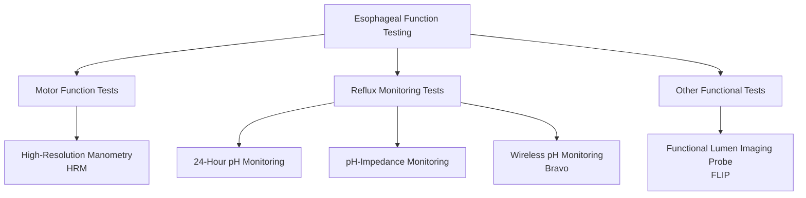
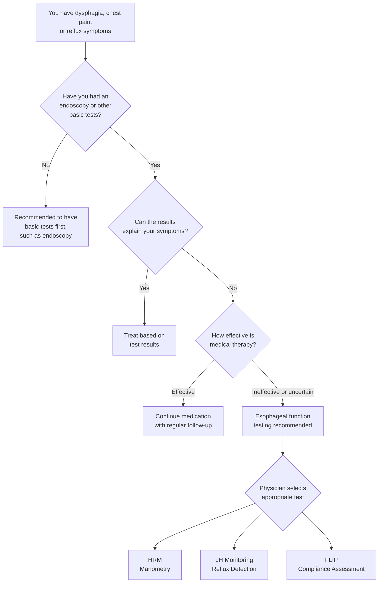

# What is Esophageal Function Testing

## Introduction

The esophagus is a tubular organ connecting the throat to the stomach, approximately 25 cm in length. When we swallow food, the esophagus pushes it down to the stomach through rhythmic muscle contractions called peristalsis. At the lower end of the esophagus, there is an important ring-shaped muscle called the lower esophageal sphincter (LES), which acts like a gate -- opening during swallowing to allow food to pass, and closing at rest to prevent stomach acid from flowing back (reflux) into the esophagus.

**Esophageal function testing** is a series of specialized tests that evaluate esophageal motor function and reflux conditions, helping your physician understand whether your esophagus is functioning normally.

*Figure: HRM test schematic. A thin catheter is inserted through the nose into the esophagus, where 36 pressure sensors record pressure changes during swallowing.*

## Why is Esophageal Function Testing Needed?

When you experience the following symptoms and standard endoscopy or imaging studies cannot fully explain the cause, your physician may recommend esophageal function testing:

### Common Indications

1. **Dysphagia (difficulty swallowing)**
   - Feeling that food is stuck in the throat or chest
   - Sensation of blockage during swallowing
   - Needing to swallow repeatedly to get food down

2. **Non-cardiac chest pain**
   - Persistent chest pain after cardiac causes have been ruled out
   - Pain related to eating

3. **Gastroesophageal reflux disease (GERD)-related**
   - Acid reflux with poor response to medication
   - Persistent heartburn episodes
   - Pre-surgical evaluation for reflux surgery

4. **Pre-surgical evaluation**
   - Essential testing before antireflux surgery
   - Confirming normal esophageal motor function to select the most appropriate surgical approach

5. **Other situations**
   - Unexplained nausea or vomiting
   - Chronic cough or asthma suspected to be reflux-related
   - Globus sensation (feeling of a lump in the throat)

## Types of Esophageal Function Tests

### Quick Overview

| Test Name | Primary Purpose | Brief Description |
|-----------|----------------|-------------------|
| High-Resolution Manometry (HRM) | Evaluate esophageal muscle movement | Measures pressure changes during swallowing |
| 24-Hour pH Monitoring | Measure acid reflux | Records esophageal acidity over a full day |
| pH-Impedance Monitoring | Detect all types of reflux | Simultaneously measures acidic and non-acidic reflux |
| Wireless pH Monitoring (Bravo) | Measure acid reflux | No nasal catheter; uses a small capsule to record acidity |
| Functional Lumen Imaging Probe (FLIP) | Evaluate esophageal compliance | Measures how much the esophagus can stretch |

## Who Needs Esophageal Function Testing?

### Situations Where You May Need Esophageal Function Testing

### Common Groups Requiring Testing

- **Patients with chronic dysphagia**: Esophageal manometry can identify the cause of esophageal motility abnormalities
- **Patients with reflux symptoms poorly responsive to medication**: pH monitoring can confirm whether abnormal reflux is truly present
- **Patients planning antireflux surgery**: Esophageal motor function must be confirmed before surgery
- **Patients with suspected achalasia**: Manometry is required for definitive diagnosis
- **Patients with unexplained chest pain**: After ruling out cardiac causes, esophageal function testing can identify esophageal-related causes

## Contraindications and Precautions

The following situations may make esophageal function testing unsuitable. Please inform your physician in advance:

| Condition | Explanation |
|-----------|-------------|
| Severe nasal abnormalities or recent nasal surgery | The catheter may not be able to pass through the nose smoothly |
| Severe coagulopathy | Catheter insertion may cause bleeding |
| Severe esophageal stricture or obstruction | The catheter may not be able to pass through the narrowed area |
| Recent esophageal or gastric surgery | The test should be performed after the wound has healed |
| Severe cardiopulmonary insufficiency | The test procedure may worsen discomfort |
| Inability to follow swallowing commands | The test requires patient cooperation with swallowing actions |

> The above are relative contraindications. Your physician will assess whether the test is appropriate based on your individual condition.

## Is the Test Safe?

Esophageal function testing is overall a **safe and low-risk** procedure. Most people may experience mild discomfort during the test (such as a foreign body sensation in the nose or throat), but the majority complete the test without difficulty. Serious complications are extremely rare.

### Important Reminders

- Please inform your physician of all medications you are currently taking before the test
- Report any drug allergies in advance
- Inform your physician if you have a history of nasal surgery or deviated septum
- Women who are pregnant or may be pregnant should notify their physician in advance

## Testing Resources

In Taiwan, several medical centers are equipped with esophageal function testing facilities and professional teams, including Taipei Veterans General Hospital, Tri-Service General Hospital (which has a dedicated esophageal function testing center), Far Eastern Memorial Hospital, National Taiwan University Hospital, and Chang Gung Memorial Hospital. Internationally, the Kenneth C. Griffin Esophageal Center at Northwestern University and the NYU Langone Esophageal Health Center are among the well-known institutions in this field.

<!-- 🏥 Hospital-Specific Information - Please fill in -->
> **📋 Please enter your hospital information:**
>
> - Department: _______________
> - Contact / Extension: _______________
> - Clinic Hours: _______________
> - Attending Physician(s): _______________
> - Hospital Specialties / Annual Volume: _______________
<!-- End of hospital-specific information -->

---
## Further Reading
- [Want to learn more? See the advanced version](../../進階版/EN/01_High_Resolution_Manometry_HRM.md)
- [Introduction to Achalasia](../../../食道弛緩不能症/一般版/01_疾病介紹.md)
