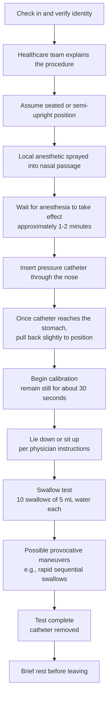
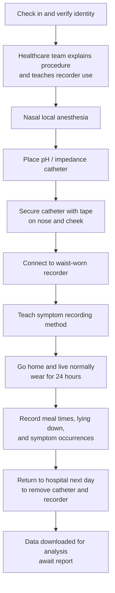

# Esophageal Function Test Procedure and Precautions

## Introduction

Understanding the detailed procedure can help reduce your anxiety and enable you to cooperate more effectively with the healthcare team during the test. This section describes the complete procedures for high-resolution manometry (HRM) and 24-hour pH/pH-impedance monitoring.

---

## 1. High-Resolution Manometry (HRM) Procedure

### Step-by-Step Overview

*Figure: High-resolution manometry procedure. After inserting the catheter through the nose, 10 swallow tests are performed. The entire procedure takes approximately 10-15 minutes.*

### Detailed Step Descriptions

#### Step 1: Check-In

- Arrive at the designated testing room and present your insurance card and test order
- The healthcare team will verify your identity, allergy history, and fasting status
- Confirmation that you have discontinued medications as instructed

#### Step 2: Explanation and Consent

- The healthcare team will explain the procedure and possible discomfort once more
- Sign the informed consent form
- Any questions you have can be raised at this time

#### Step 3: Anesthesia Preparation

- You will be positioned on the examination table, usually seated or semi-upright
- A local anesthetic will be sprayed into one side of your nasal passage (usually the more patent side)
- The anesthetic will numb the nasal passage and throat, reducing discomfort
- Wait approximately 1-2 minutes for the anesthesia to take full effect

#### Step 4: Catheter Placement

- The healthcare team gently inserts the thin catheter (approximately 4.2 mm diameter) through the nose
- When the catheter reaches the throat, you will be asked to swallow
- **Important tip**: Swallow on cue when the team says "swallow now" -- this helps the catheter pass through more easily
- Discomfort decreases significantly once the catheter passes the throat
- The entire placement process takes about 1-2 minutes

> **Helpful tip**: During catheter placement, breathe in slowly through your nose and out slowly through your mouth to help you relax. If you feel the urge to gag, deep breathing can help.

#### Step 5: Formal Testing

- Once the catheter is positioned, you will be asked to **remain still and quiet** for about 30 seconds for calibration
- The healthcare team will give you 5 mL (about a small sip) of water using a syringe
- You swallow the water when instructed
- Each swallow is spaced approximately 20-30 seconds apart
- A total of **10 swallows** are required
- The physician may ask you to perform tests in both **supine (lying down)** and **upright (sitting)** positions
- Some physicians may add **provocative maneuvers**, such as rapid sequential water swallows

#### Step 6: Completion

- After all swallow tests are completed, the catheter is quickly removed
- Removal takes only a few seconds and may cause brief discomfort
- You may blow your nose or rinse your mouth

### HRM Test Timing

- Catheter placement: approximately 1-2 minutes
- Formal testing: approximately 10-15 minutes
- **Total time: approximately 15-20 minutes**

---

## 2. 24-Hour pH (Impedance) Monitoring Procedure

### Step-by-Step Overview

### Detailed Step Descriptions

#### Placement Phase (similar to HRM)

- Catheter placement is similar to HRM, but the pH monitoring catheter is thinner
- The catheter is positioned approximately 5 cm above the lower esophageal sphincter
- Medical tape secures the catheter to the nose and cheek to prevent displacement

#### Wearing Phase (24 hours)

- The external end of the catheter is connected to a small recorder (approximately the size of a smartphone)
- The recorder is typically worn on a belt at the waist or carried with a shoulder strap
- **You need to record the following events**:
  - Start and end times of meals
  - Times of lying down and getting up
  - Times when symptoms occur (such as heartburn, chest pain, reflux sensation)

#### Daily Life During the Monitoring Period

| Allowed | Not Allowed |
|---------|------------|
| Normal eating (per physician instructions) | Showering or bathing (recorder is not waterproof) |
| Normal speaking | Vigorous exercise |
| Light work and activities | Swimming |
| Using phone and computer | Pulling or moving the catheter |
| Lying down, resting, and sleeping | MRI |

#### Dietary Considerations (During Monitoring)

- Eat normally per physician instructions (the goal is to record reflux during daily life)
- Avoid deliberately changing your eating habits (as this affects result accuracy)
- Record mealtimes carefully
- Avoid excessively spicy or irritating foods (unless this is your normal diet)

#### Removal Phase

- Return to the hospital at the appointed time the next day
- The healthcare team will remove the tape and extract the catheter (a quick process)
- The recorder is retrieved and data is downloaded for analysis
- Reports typically take several days to one week

---

## 3. Post-Test Instructions

### What You Can Do After the Test

- **Resume normal eating**: You may eat immediately after HRM is complete; you may eat immediately after the pH monitoring catheter is removed
- **Resume normal activities**: Most daily activities can be resumed immediately
- **Resume medications**: Resume discontinued medications per physician instructions (usually after the recorder is removed)

### Possible Mild Discomfort

| Symptom | Explanation | Typical Duration | Management |
|---------|------------|-----------------|------------|
| Sore throat | Mild irritation from catheter passing through the throat | Several hours to 1-2 days | Drink warm water, use throat lozenges |
| Nasal discomfort | Mild soreness from catheter passing through the nasal passage | Several hours to 1 day | Usually resolves on its own |
| Mild nosebleed | Catheter irritation of the nasal mucosa | Usually stops quickly | Apply gentle pressure to nostrils, tilt head forward |
| Mild nausea | Residual sensation from catheter placement or removal | Minutes to hours | Deep breathing; usually subsides quickly |
| Sneezing | Nasal irritation response | Brief | Normal response; no treatment needed |

> The above discomfort is usually temporary and resolves on its own within a short time.

### When to Contact Your Physician Immediately

If any of the following occur, please contact your healthcare team promptly:

- **Persistent nosebleed** that does not stop after 15 minutes of pressure
- **Severe chest pain** or difficulty breathing
- **Fever** (temperature above 38 degrees Celsius)
- **Inability to swallow** or severe pain when swallowing
- **Blood in vomit**
- Catheter falls out or shifts (during 24-hour monitoring)
- Recorder shows abnormal alerts (during 24-hour monitoring)

---

## 4. Test Results

### When Will Results Be Available?

| Test Type | Report Waiting Time |
|-----------|-------------------|
| HRM (Manometry) | Usually 3-7 business days |
| 24h pH / pH-Impedance Monitoring | Usually 5-10 business days |
| Bravo Wireless Monitoring | Usually 5-10 business days |
| FLIP | Usually 3-7 business days |

### How to Understand Your Results

- Your physician will explain the test results in detail during your follow-up visit
- HRM results are interpreted according to the international standard (Chicago Classification v4.0)
- pH monitoring results are interpreted according to the international standard (Lyon Consensus 2.0)
- Your physician will develop a subsequent treatment plan based on the results

---

## 5. Special Procedure Notes

### Bravo Wireless pH Monitoring Procedure Differences

- Typically placed during an endoscopy, which may require sedation
- After the capsule is attached to the esophageal wall, the endoscope is withdrawn
- Carry the receiver for 48-96 hours
- The capsule detaches on its own in approximately 7-14 days and is passed in the stool
- **Do not undergo MRI until the capsule has detached**

### FLIP Procedure Differences

- Usually performed under endoscopic sedation
- The probe is inserted through the mouth (not through the nose)
- The balloon at the probe tip is inflated with saline inside the esophagus
- Test duration is approximately 5-10 minutes
- Because sedation is used, you will need someone to accompany you home after the test

<!-- 🏥 Hospital-Specific Information - Please fill in -->
> **📋 Please enter your hospital information:**
>
> - Department: _______________
> - Contact / Extension: _______________
> - Clinic Hours: _______________
> - Attending Physician(s): _______________
> - Hospital Specialties / Annual Volume: _______________
<!-- End of hospital-specific information -->

---
## Further Reading
- [Want to learn more? See the advanced version](../../進階版/EN/01_High_Resolution_Manometry_HRM.md)
- [Introduction to Achalasia](../../../食道弛緩不能症/一般版/01_疾病介紹.md)
