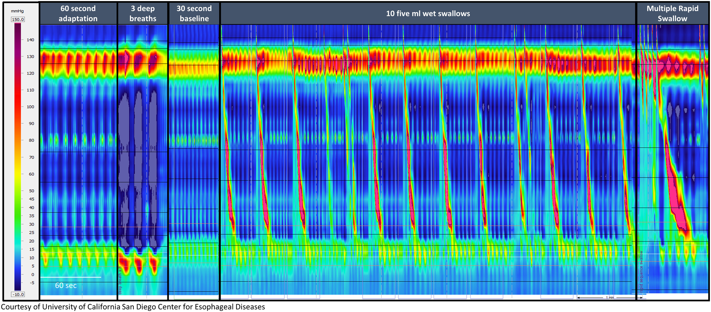
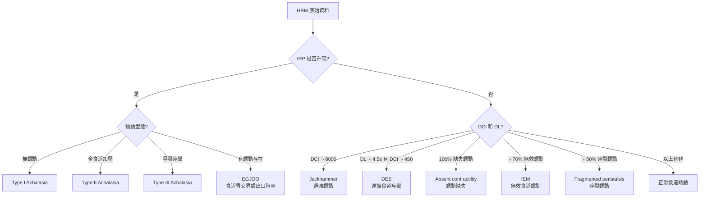

# 高解析度食道壓力測定 (High-Resolution Manometry, HRM)

## 概述

高解析度食道壓力測定 (High-Resolution Manometry, HRM) 是目前評估食道運動功能 (esophageal motility) 的金標準檢查。相較於傳統式食道壓力測定 (conventional manometry) 僅使用 4-8 個壓力感測器，HRM 使用 **36 個緊密排列的壓力感測器**，間距約 1 公分，能完整且連續地記錄從咽喉 (pharynx) 到胃 (stomach) 的壓力變化，並以彩色等壓圖 (Clouse plot) 方式呈現，大幅提升診斷的準確性與效率。

---

## 設備與技術

### 導管規格

- **直徑**：約 4.2 mm
- **感測器數量**：36 個環狀壓力感測器 (circumferential pressure sensors)
- **感測器間距**：約 1 cm
- **測量範圍**：從上食道括約肌 (upper esophageal sphincter, UES) 到胃內
- **壓力解析度**：可偵測 0-600 mmHg 範圍的壓力變化

### 商用 HRM 系統

目前臨床上主要使用三套商用 HRM 系統，各有其技術特色：

| 系統名稱 | 製造商 | 感測器技術 | 分析軟體 | 特色 |
|---------|-------|-----------|---------|------|
| ManoScan | Medtronic | 固態感測器 (solid-state) | ManoView | 最廣泛使用，Chicago Classification 開發基礎 |
| Solar GI / MMS | Laborie (原 MMS) | 水灌注式 (water-perfused) 或固態 | 專屬分析平台 | 歐洲使用較多 |
| InSIGHT Ultima | Diversatek | 固態感測器 | 專屬分析平台 | 高解析度阻抗整合 |

> **臨床要點**：Chicago Classification v4.0 已針對三套商用系統分別建立正常值，但不同系統間的數值不可直接互換比較。

### Clouse Plot（等壓圖）

Clouse plot 是 HRM 特有的視覺化方式，以色彩編碼呈現壓力數據：

- **X 軸**：時間
- **Y 軸**：導管上感測器的位置（對應食道的解剖位置）
- **色彩**：代表壓力大小（通常暖色系 = 高壓，冷色系 = 低壓）
- 能直觀地觀察吞嚥波 (peristaltic wave) 的完整傳播、括約肌的鬆弛 (relaxation) 與收縮 (contraction)

*圖：正常食道蠕動的 HRM Clouse Plot。仰臥位（左）及直立位（右）的標準檢查姿勢。圖片來源：Yadlapati R, et al. Neurogastroenterology & Motility. 2021;33(1):e14058. CC-BY. 原文：[PMC8034247](https://pmc.ncbi.nlm.nih.gov/articles/PMC8034247/)*

---

## 檢查流程 (Protocol)

### 標準檢查流程（依 Chicago Classification v4.0 建議）

#### 1. 患者準備

- 禁食至少 6 小時
- 依臨床需求決定是否停用影響食道運動的藥物（鈣離子通道阻斷劑、硝酸鹽類、鴉片類等）
- 如為逆流評估，PPI 停用 7 天

#### 2. 導管放置

- 鼻腔局部麻醉 (topical anesthesia)
- 經鼻腔將導管送入，使最遠端感測器位於胃內
- 確認上食道括約肌 (UES) 和下食道括約肌 (LES) 的位置

#### 3. 測量程序

| 步驟 | 內容 | 目的 |
|-----|------|------|
| 基線記錄 (baseline) | 靜止 30 秒，不吞嚥 | 記錄靜止壓力 (resting pressure)，包含 LES 基礎壓力 |
| 仰臥位吞嚥 (supine swallows) | 5 mL 水 x 10 次，間隔 20-30 秒 | 標準評估食道蠕動和 EGJ 鬆弛 |
| 直立位吞嚥 (upright swallows) | 5 mL 水 x 5 次 | CCv4.0 新增要求，部分異常僅在直立位出現 |
| 激發測試 (provocative maneuvers) | 多次快速吞嚥 (MRS) 和/或快速飲水挑戰 (RDC) | 評估蠕動儲備功能 (peristaltic reserve) |

#### 4. 激發測試詳述

**多次快速吞嚥 (Multiple Rapid Swallows, MRS)**
- 連續快速吞入 5 次 2 mL 水（間隔 < 4 秒）
- 正常反應：快速吞嚥期間蠕動被抑制 (deglutitive inhibition)，最後一次吞嚥後出現強力蠕動波
- 最後一次蠕動波的 DCI 應 > 基線平均 DCI
- 評估蠕動儲備功能：MRS 後 DCI 增強代表有儲備功能

**快速飲水挑戰 (Rapid Drink Challenge, RDC)**
- 以吸管快速喝下 200 mL 水
- 評估 EGJ 在大量液體通過時的鬆弛能力
- 對 EGJ 出口阻塞 (EGJOO) 的評估特別有幫助

---

## 核心測量指標 (Key Metrics)

### 食道胃交界處 (EGJ) 相關指標

| 指標 | 英文全稱 | 定義 | 臨床意義 |
|------|---------|------|---------|
| IRP | Integrated Relaxation Pressure | 吞嚥後 10 秒視窗內，最低 4 秒壓力的平均值 | 評估 EGJ 鬆弛功能，診斷 achalasia 的關鍵指標 |
| EGJ-CI | EGJ Contractile Integral | EGJ 高壓帶的收縮強度積分 | 評估 EGJ 屏障功能，與 GERD 相關 |
| EGJ 型態 | EGJ Morphology | LES 與橫膈腳 (crural diaphragm) 的相對位置 | Type I (重疊)、Type II (分離 1-2 cm)、Type III (分離 > 2 cm，即裂孔疝氣) |

### 食道體部 (Esophageal Body) 相關指標

| 指標 | 英文全稱 | 定義 | 臨床意義 |
|------|---------|------|---------|
| DCI | Distal Contractile Integral | 遠端食道蠕動波的收縮強度積分 (mmHg-s-cm) | 評估蠕動力量；> 8000 = 過強；< 100 = 缺失 |
| DL | Distal Latency | 從 UES 鬆弛起點到遠端收縮減速點 (CDP) 的時間 | 評估蠕動協調性；< 4.5 秒 = 早發收縮 (premature contraction) |
| Break size | Peristaltic Break | 蠕動波中壓力 < 20 mmHg 的缺口長度 | > 5 cm = 大缺口 (large break)；2-5 cm = 小缺口 |

### 正常參考值（依 Chicago Classification v4.0）

> **注意**：正常值因 HRM 系統而異，以下為概略參考範圍。

| 指標 | 仰臥位正常值 | 直立位正常值 |
|------|------------|------------|
| IRP (中位數) | < 15 mmHg（ManoScan） | < 12 mmHg（ManoScan） |
| DCI | 450-8000 mmHg-s-cm | 依系統而異 |
| DL | > 4.5 秒 | > 4.5 秒 |
| Peristaltic break | < 5 cm | -- |

---

## 臨床應用

### 主要適應症

1. **吞嚥困難 (dysphagia) 的評估**
   - 內視鏡檢查排除結構性病變後的下一步
   - 確認是否有食道運動障礙

2. **抗逆流手術前評估 (preoperative evaluation)**
   - 必須排除食道弛緩不能症 (achalasia) 和嚴重運動障礙
   - 影響手術方式的選擇（全包覆 vs 部分包覆）

3. **食道弛緩不能症 (achalasia) 的確診與分型**
   - HRM 是診斷 achalasia 的金標準
   - 分型（Type I、II、III）直接影響治療選擇

4. **不明原因胸痛 (non-cardiac chest pain)**
   - 評估是否有食道痙攣 (spasm) 或過強收縮 (hypercontractile)

5. **食道運動障礙的追蹤**
   - 治療前後的比較
   - 術後評估

### 結果判讀流程

結果依 Chicago Classification v4.0 進行階層式判讀：

---

## 限制與注意事項

### 技術限制

- 單一時間點的檢查，可能無法完全反映日常食道功能
- 患者的配合度和焦慮程度可能影響結果
- 不同 HRM 系統的正常值不同，不可跨系統比較
- 導管位置的些微變化可能影響 IRP 測量

### 與其他檢查的互補

| 情境 | 建議搭配檢查 |
|------|------------|
| IRP 邊界值 (borderline) | FLIP（評估 EGJ 擴張性） |
| 懷疑 EGJOO 但不確定 | 食道鋇劑攝影 (timed barium esophagram) + FLIP |
| 術前完整評估 | HRM + 24h pH-impedance |
| 蠕動異常合併逆流症狀 | HRM + pH-impedance monitoring |

---

## AI 輔助 HRM 判讀（2025 新進展）

### 現況

2025 年發表的系統性回顧分析了 17 項研究（2013-2025 年，涵蓋 4,588 名患者，來自 6 個國家），評估人工智慧 (AI) 在 HRM 判讀中的應用：

| 應用領域 | AI 表現 |
|---------|---------|
| 解剖標誌辨識 (UES/LES 定位) | 高準確度 |
| 檢查品質評估 | 高準確度 |
| 弛緩不能症 vs 非弛緩不能症分類 | 高準確度 |
| 弛緩不能症亞型分類 (Type I/II/III) | 良好準確度 |
| Chicago Classification 全分類自動化 | 進步中，尚待驗證 |

### 技術方法
- **卷積神經網路 (CNN)**：直接分析 Clouse Plot 影像
- **機器學習 (ML)**：基於 HRM 數值參數進行分類
- 82% 的研究發表於 2020 年之後，顯示此領域快速發展

### 臨床意義
- **解決專家間判讀差異**：目前即使是專家之間，HRM 判讀的不一致率高達 30-40%
- **潛在應用**：未來可作為臨床決策輔助工具，提高診斷一致性
- **現有限制**：目前研究多以專家分析為對照標準，尚未驗證 AI 診斷對臨床預後的實際影響

> AI 輔助 HRM 判讀是食道功能檢查領域最具前景的技術發展之一，但目前仍處於研究驗證階段，尚未普遍應用於臨床。

---

## 國內現況

台灣目前多家醫學中心具備 HRM 檢查能力：

- **台北榮總**：具備 HRM 及 24 小時 pH-阻抗監測
- **三軍總醫院**：設有專門的食道功能檢查中心
- **亞東醫院**：提供完整食道功能檢查服務
- **台大醫院**：具備 HRM 檢查設備
- **長庚醫院**：提供 HRM 及相關食道功能檢查

<!-- 🏥 院內資料區 - 請自行填入 -->
> **📋 請填入貴院資料：**
>
> - 本院負責科別：_______________
> - 聯絡電話 / 分機：_______________
> - 門診時間：_______________
> - 主治醫師：_______________
> - 本院檢查設備與特色：_______________
<!-- 院內資料區結束 -->
