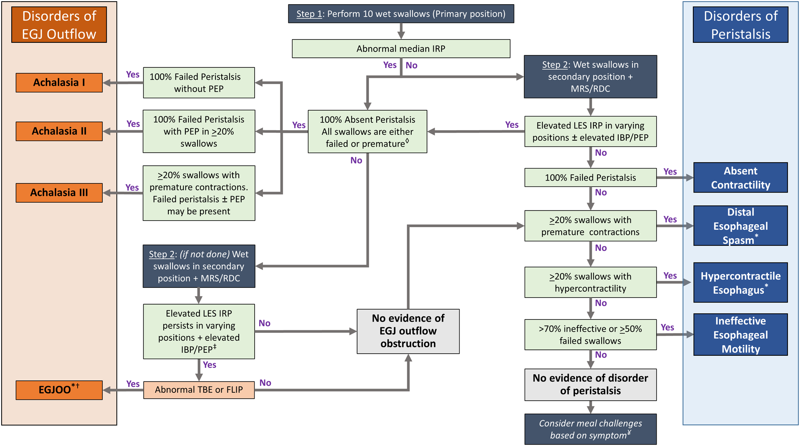
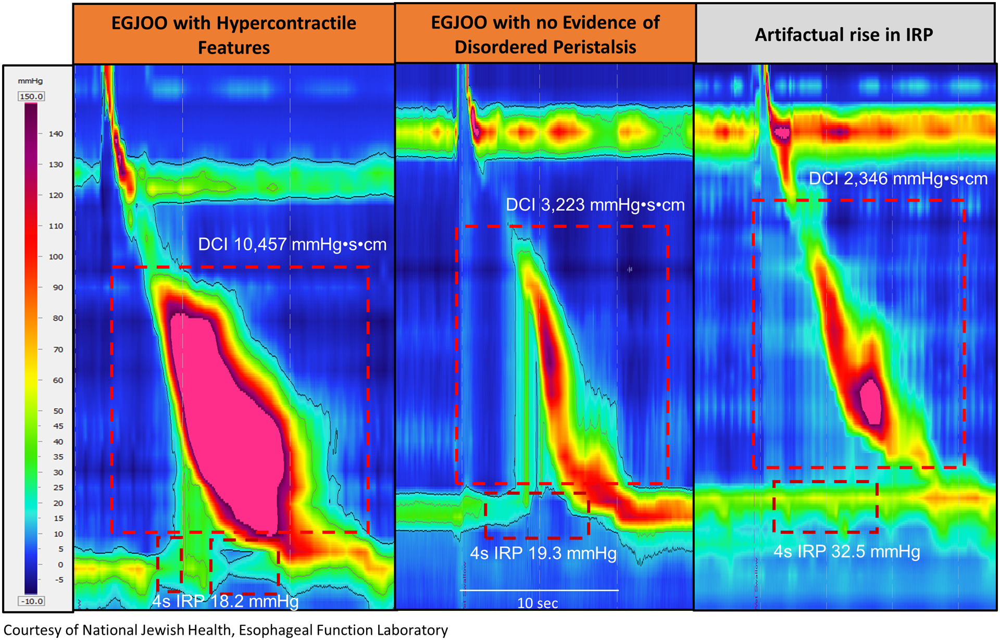
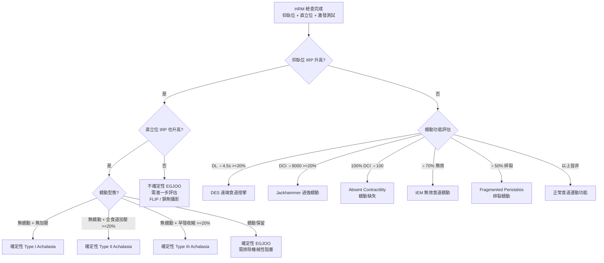

# 芝加哥分類第四版 (Chicago Classification v4.0, CCv4.0)

## 概述

芝加哥分類 (Chicago Classification, CC) 是國際上用於判讀高解析度食道壓力測定 (High-Resolution Manometry, HRM) 結果的標準化分類系統。自 2008 年首版發布以來，歷經多次修訂，第四版 (v4.0) 於 2021 年發表，代表了目前最新的國際共識。

### 發展背景

- **參與專家**：來自 **15 個國家**的 **52 位國際專家**共同制定
- **正常值資料庫**：納入 **469 位健康志願者**的數據
- **適用系統**：針對 **3 套商用 HRM 系統**（ManoScan/Medtronic、Solar GI/MMS、InSIGHT/Diversatek）分別建立正常值
- **重大革新**：首次納入**仰臥位 (supine) + 直立位 (upright) + 激發測試 (provocative testing)** 的整合評估

---

## 核心變革（相較 v3.0）

*圖：Chicago Classification v4.0 分層診斷架構圖。圖片來源：Yadlapati R, et al. Neurogastroenterology & Motility. 2021;33(1):e14058. CC-BY. 原文：[PMC8034247](https://pmc.ncbi.nlm.nih.gov/articles/PMC8034247/)*

*圖：弛緩不能症三種亞型的典型 HRM 表現。圖片來源：同上。*

*圖：食道胃接合處流出道阻塞 (EGJOO) 的 HRM 圖形。圖片來源：同上。*

*圖：瀰漫性食道痙攣 (DES) 與鑿岩機食道 (Jackhammer) 的 HRM 圖形。圖片來源：同上。*

### 主要更新重點

| 項目 | CCv3.0 | CCv4.0 |
|------|--------|--------|
| 測試體位 | 僅仰臥位 | 仰臥位 + 直立位 |
| 激發測試 | 非必要 | 建議納入 MRS/RDC |
| 正常值 | 僅 ManoScan | 三套系統分別建立 |
| EGJOO 診斷 | 較寬鬆 | 更嚴格（需多重證據） |
| 結論等級 | 無 | 引入確定性 (conclusive) vs 不確定 (inconclusive) |
| 蠕動儲備 | 未納入 | MRS 評估蠕動儲備功能 |

---

## 診斷指標定義

### 關鍵指標

| 指標 | 全稱 | 測量方式 | 正常值（ManoScan，仰臥位） |
|------|------|---------|--------------------------|
| IRP | Integrated Relaxation Pressure | 吞嚥後 10 秒內最低 4 秒壓力平均值 | < 15 mmHg |
| DCI | Distal Contractile Integral | 遠端蠕動波壓力-時間-長度積分 | 450-8000 mmHg-s-cm |
| DL | Distal Latency | UES 鬆弛至 CDP 的時間 | > 4.5 秒 |
| Break | Peristaltic Break | 20 mmHg 等壓線下的缺口長度 | < 5 cm |

### 直立位指標參考值

| 指標 | 正常值（ManoScan，直立位） |
|------|--------------------------|
| IRP | < 12 mmHg |
| DCI | 依系統建立之正常值 |

> **重要**：CCv4.0 強調不同 HRM 系統有不同正常值。臨床判讀時必須使用與所用系統對應的正常值。

---

## 階層式分類架構 (Hierarchical Classification)

CCv4.0 採用嚴格的階層式診斷流程，依優先順序由上而下判讀。高層級診斷一旦成立，即不再考慮低層級診斷。

### 第一層：食道胃交界處出口障礙 (Disorders of EGJ Outflow)

#### 食道弛緩不能症 (Achalasia)

**共同特徵**：IRP 升高（仰臥位和/或直立位）+ 無正常蠕動

| 分型 | 蠕動特徵 | 臨床特點 |
|------|---------|---------|
| **Type I**（經典型） | 100% 蠕動缺失 (failed peristalsis)，無食道加壓 | 最傳統的表現；食道可能擴張 |
| **Type II**（伴全食道加壓） | 蠕動缺失，但 ≥ 20% 吞嚥出現全食道加壓 (panesophageal pressurization) | 最常見類型；治療反應最佳 |
| **Type III**（痙攣型） | 蠕動缺失，但 ≥ 20% 吞嚥出現早發收縮 (premature/spastic contraction，DL < 4.5s) | 治療反應較差；需區分 DES |

**CCv4.0 診斷確定性**：
- **確定性診斷 (conclusive)**：仰臥位 IRP 升高 + 直立位 IRP 升高 + 符合蠕動特徵
- **不確定性 (inconclusive)**：僅仰臥位或僅直立位 IRP 升高 → 需額外佐證（如 FLIP、食道鋇劑攝影）

#### 食道胃交界處出口阻塞 (EGJ Outflow Obstruction, EGJOO)

- **定義**：IRP 升高，但蠕動功能保留（非 achalasia 型態）
- **CCv4.0 重大改變**：EGJOO 的診斷門檻大幅提高

**EGJOO 診斷要求（CCv4.0）**：

| 條件 | 要求 |
|------|------|
| 仰臥位 IRP | 升高 |
| 直立位 IRP | 升高 |
| 蠕動 | 保留（非 achalasia 型態） |
| 臨床佐證 | 需有相關症狀或客觀佐證 |

> **臨床要點**：CCv4.0 認為許多 v3.0 診斷的 EGJOO 可能是偽陽性 (false positive)。僅仰臥位 IRP 升高而直立位正常者，不應診斷為 EGJOO。建議搭配 FLIP 和/或食道鋇劑攝影進一步評估。

---

### 第二層：主要蠕動障礙 (Major Disorders of Peristalsis)

> 前提：IRP 正常（已排除第一層診斷）

| 診斷 | 英文名稱 | 診斷標準 | 臨床意義 |
|------|---------|---------|---------|
| 遠端食道痙攣 | Distal Esophageal Spasm (DES) | ≥ 20% 吞嚥的 DL < 4.5 秒（早發收縮） | 可能導致吞嚥困難和胸痛 |
| 過強蠕動 | Jackhammer Esophagus | ≥ 20% 吞嚥的 DCI > 8000 mmHg-s-cm | 可能導致胸痛和吞嚥困難 |
| 蠕動缺失 | Absent Contractility | 100% 吞嚥的 DCI < 100 mmHg-s-cm | 嚴重蠕動功能喪失；抗逆流手術禁忌 |

**CCv4.0 要點**：
- 主要蠕動障礙在仰臥位和直立位都應呈現異常時最為可靠
- 僅在一個體位出現異常者，診斷確定性較低

---

### 第三層：次要蠕動障礙 (Minor Disorders of Peristalsis)

> 前提：IRP 正常 + 不符合主要蠕動障礙

| 診斷 | 英文名稱 | 診斷標準 | 臨床意義 |
|------|---------|---------|---------|
| 無效食道蠕動 | Ineffective Esophageal Motility (IEM) | > 70% 無效吞嚥（DCI < 450 或 break > 5 cm） | 可能影響食道清除功能；與 GERD 相關 |
| 碎裂蠕動 | Fragmented Peristalsis | > 50% 碎裂吞嚥（DCI > 450 但 break > 5 cm） | 臨床意義較不確定 |

**CCv4.0 對 IEM 的補充**：
- MRS 後蠕動儲備功能正常者，IEM 的臨床意義可能較低
- MRS 後蠕動儲備功能缺失者，IEM 可能有更重要的臨床意義（例如影響抗逆流手術決策）

---

## 診斷演算法

---

## 正常值速查表

### ManoScan/Medtronic 系統

| 指標 | 仰臥位正常值 | 直立位正常值 |
|------|------------|------------|
| IRP (中位數) | < 15 mmHg | < 12 mmHg |
| DCI | 450-8000 mmHg-s-cm | 依建立之常模 |
| DL | > 4.5 秒 | > 4.5 秒 |
| 無效蠕動定義 | DCI < 450 或 break > 5 cm | -- |
| 缺失蠕動定義 | DCI < 100 | -- |

### Solar GI/MMS 系統

| 指標 | 仰臥位正常值 |
|------|------------|
| IRP (中位數) | < 22 mmHg（水灌注式較高） |
| DCI | 依系統建立之常模 |

### InSIGHT/Diversatek 系統

| 指標 | 仰臥位正常值 |
|------|------------|
| IRP (中位數) | 依系統建立之常模 |

> **關鍵提醒**：不同系統的正常值不可直接套用。臨床判讀務必參考所使用系統的專屬正常值。

---

## 臨床應用注意事項

### 確定性 vs 不確定性診斷

CCv4.0 引入了診斷確定性的概念：

| 確定性等級 | 含義 | 處理建議 |
|-----------|------|---------|
| 確定性 (conclusive) | 仰臥位 + 直立位結果一致 | 可直接依據診斷進行治療決策 |
| 不確定性 (inconclusive) | 僅一個體位出現異常 | 需要額外檢查佐證（FLIP、鋇劑攝影、重複 HRM） |

### 常見臨床決策情境

1. **Achalasia 分型與治療選擇**
   - Type I 和 Type II：肌層切開術 (myotomy) 或氣球擴張 (balloon dilation) 或 POEM 效果良好
   - Type III：POEM 可能較氣球擴張有優勢
   - Type II 治療反應最佳

2. **EGJOO 的處理**
   - CCv4.0 後 EGJOO 診斷更嚴格
   - 需排除機械性阻塞（如裂孔疝氣壓迫、嗜酸性食道炎等）
   - 建議搭配 FLIP 進一步確認
   - 臨床相關的 EGJOO 應有客觀症狀佐證

3. **Absent contractility 與手術決策**
   - 蠕動完全缺失者，全包覆式胃底摺疊術 (Nissen fundoplication) 為相對禁忌
   - 可考慮部分包覆式手術 (partial fundoplication) 或其他替代方案

4. **IEM 的臨床意義**
   - 需結合 MRS 蠕動儲備功能評估
   - 有蠕動儲備者，臨床意義可能較低
   - 無蠕動儲備者，對抗逆流手術決策有影響

---

## 特殊情境判讀

### 藥物影響

- 鴉片類藥物 (opioids) 可導致 EGJ 壓力升高和食道痙攣，可能造成偽陽性 EGJOO 或 DES
- 鈣離子通道阻斷劑 (calcium channel blockers) 可降低 LES 壓力和蠕動
- 建議在可能的情況下停用影響藥物再進行檢查

### 上食道括約肌 (UES) 異常

- CCv4.0 未涵蓋 UES 異常的標準化分類
- UES 殘餘壓力升高可見於頭頸部肌張力不全 (cricopharyngeal dysfunction)
- 需結合臨床和其他檢查（如螢光透視吞嚥攝影）綜合評估

<!-- 🏥 院內資料區 - 請自行填入 -->
> **📋 請填入貴院資料：**
>
> - 本院負責科別：_______________
> - 聯絡電話 / 分機：_______________
> - 門診時間：_______________
> - 主治醫師：_______________
> - 本院檢查設備與特色：_______________
<!-- 院內資料區結束 -->
