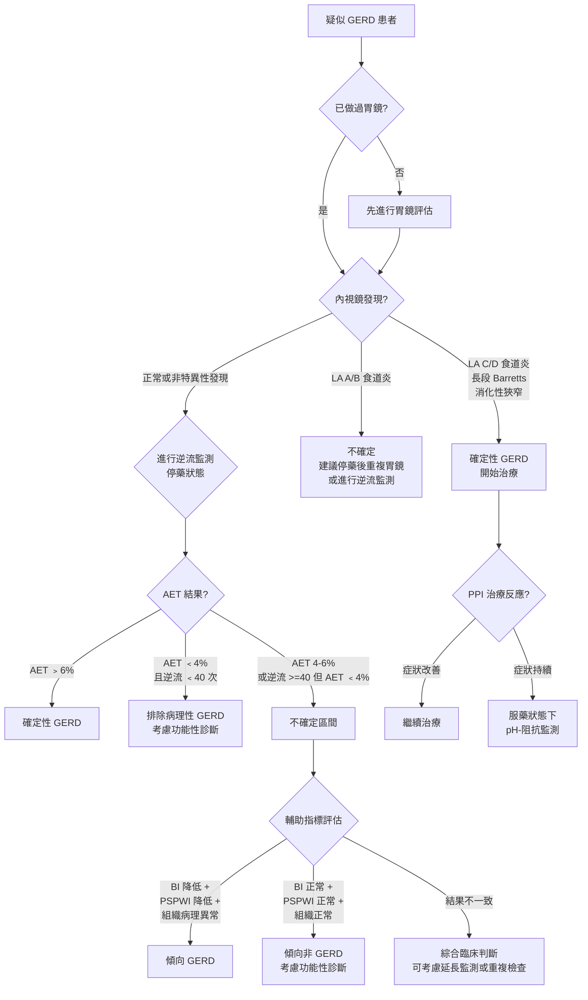

# 里昂共識第二版 (Lyon Consensus 2.0) 與 GERD 診斷

## 概述

里昂共識 (Lyon Consensus) 是國際上用於定義胃食道逆流疾病 (gastroesophageal reflux disease, GERD) 客觀診斷標準的重要共識文件。第二版 (Lyon Consensus 2.0) 於 2023 年發表，建立了一套整合多項檢查結果的標準化架構，將 GERD 的證據強度分為「支持 GERD (conclusive for GERD)」、「反對 GERD (against GERD)」和「不確定 (borderline/inconclusive)」三個等級。

### 制定背景

- GERD 是最常見的消化道疾病之一，但長期以來缺乏統一的客觀診斷標準
- 許多患者僅憑症狀和經驗性藥物治療 (empirical PPI therapy) 即被診斷為 GERD，缺乏客觀證據
- Lyon Consensus 旨在建立以證據為基礎的 GERD 診斷框架

---

## 支持 GERD 的確定性證據 (Conclusive Evidence for GERD)

以下任何一項即可確立 GERD 診斷，無需額外檢查：

### 內視鏡 (Endoscopy) 證據

| 發現 | 說明 | 確定性等級 |
|------|------|-----------|
| LA 分級 C 或 D 級食道炎 | 嚴重糜爛性食道炎 (erosive esophagitis) | 確定性 |
| 長段巴瑞特食道 (long-segment Barrett's esophagus) | 化生黏膜 (intestinal metaplasia) 長度 ≥ 3 cm | 確定性 |
| 消化性食道狹窄 (peptic stricture) | 因長期逆流導致的食道狹窄 | 確定性 |

> **注意**：LA 分級 A 和 B 級食道炎雖然提示可能的 GERD，但在 Lyon 2.0 中被歸為不確定證據，因為觀察者間的判讀一致性較低，且可見於正常人。

### 逆流監測 (Reflux Monitoring) 證據

| 指標 | 確定 GERD 的閾值 | 說明 |
|------|-----------------|------|
| 酸暴露時間 (Acid Exposure Time, AET) | **> 6%** | 24 小時內食道 pH < 4 的總時間百分比 |

---

## 反對 GERD 的證據 (Evidence Against GERD)

以下條件同時滿足時，可合理排除病理性 GERD：

| 指標 | 閾值 | 說明 |
|------|------|------|
| AET | **< 4%** | 酸暴露時間在正常範圍 |
| 逆流次數 (reflux episodes) | **< 40 次 / 24 小時** | 總逆流事件數正常 |

> **臨床要點**：AET < 4% **且** 逆流次數 < 40 時，可合理認為沒有病理性 GERD。但需注意，這不排除功能性火燒心 (functional heartburn) 或逆流高敏感 (reflux hypersensitivity)。

---

## 不確定區間 (Borderline / Inconclusive Zone)

| 情境 | 建議 |
|------|------|
| AET 4-6% | 需要輔助指標 (adjunctive metrics) 協助判斷 |
| LA 分級 A 或 B 級食道炎 | 建議在停藥狀態下重複胃鏡確認 |
| AET < 4% 但逆流次數 ≥ 40 | 需結合症狀關聯性分析 |
| AET > 6% 但症狀不典型 | 需確認監測品質和症狀記錄 |

---

## 輔助指標 (Adjunctive Metrics)

當主要指標落在不確定區間時，以下輔助指標可協助判斷：

### 基線阻抗 (Baseline Impedance, BI)

- **定義**：在無吞嚥和無逆流期間，食道黏膜的阻抗值
- **意義**：反映食道黏膜的完整性 (mucosal integrity)；BI 降低代表黏膜受損
- **GERD 建議值**：
  - 遠端食道 BI < 1500 ohms（24 小時阻抗監測）
  - 或 夜間基線阻抗 (Mean Nocturnal Baseline Impedance, MNBI) 降低

### 吞嚥後蠕動波誘導吞嚥指數 (Post-Reflux Swallow-Induced Peristaltic Wave Index, PSPWI)

- **定義**：逆流事件後 30 秒內出現吞嚥引起的蠕動波的比例
- **意義**：反映食道的化學清除能力 (chemical clearance)
- **GERD 建議值**：PSPWI < 61% 提示食道清除功能受損

### 組織病理學 (Histopathology)

- **黏膜微觀變化**：
  - 基底細胞增生 (basal cell hyperplasia)
  - 乳突延長 (papillary elongation)
  - 細胞間隙擴大 (dilated intercellular spaces, DIS)
  - 炎性細胞浸潤 (inflammatory cell infiltration)
- **評分系統**：微觀食道炎評分可作為輔助證據

### 運動功能評估 (Motor Evaluation)

- HRM 上的 EGJ 屏障功能 (EGJ barrier function)
- EGJ-CI（EGJ Contractile Integral）降低提示屏障功能不足
- EGJ 型態（Type III = 裂孔疝氣）與 GERD 風險增加相關

---

## 逆流監測 (Ambulatory Reflux Monitoring) 方案

### 停藥 (off PPI) vs 服藥 (on PPI) 監測

| 監測方式 | 適用情境 | 目的 |
|---------|---------|------|
| **停藥監測 (off PPI)** | 未確診 GERD，需客觀證據 | 確認是否有病理性逆流 |
| **服藥監測 (on PPI)** | 已確診 GERD 但藥物治療無效 | 評估藥物控制下的殘餘逆流 |

### 停藥監測 (Off-PPI Monitoring)

- **停藥要求**：
  - PPI：停用 **7 天**
  - H2 受體拮抗劑 (H2RA)：停用 **3 天**
  - 制酸劑 (antacids)：停用 **6-12 小時**
- **監測方式**：pH 監測或 pH-阻抗監測
- **主要指標**：AET（以 4% 和 6% 為閾值）

### 服藥監測 (On-PPI Monitoring)

- **適用**：已有確定性 GERD 證據（如 LA C/D 食道炎），但 PPI 治療後症狀持續
- **建議使用 pH-阻抗監測**（因服藥後逆流可能轉為弱酸性或非酸性）
- **評估重點**：
  - AET 是否在 PPI 下已正常化
  - 是否有殘餘的弱酸性逆流與症狀相關
  - 症狀關聯性分析（SAP、SI）

### 症狀相關性分析指標

| 指標 | 全名 | 定義 | 陽性閾值 |
|------|------|------|----------|
| SI | Symptom Index（症狀指數） | 與逆流事件相關的症狀次數 / 總症狀次數 × 100% | > 50% |
| SAP | Symptom Association Probability（症狀關聯機率） | 使用 Fisher's exact test 計算症狀與逆流事件的統計關聯性 | > 95% |

- **SI** 較簡單但未考量逆流事件總數，可能高估關聯性
- **SAP** 統計嚴謹度較高，為目前 Lyon 共識建議使用的主要指標
- 兩者皆陽性時，症狀與逆流的關聯性最為確定

### 監測方式選擇

| 監測方式 | 優點 | 缺點 | 適用情境 |
|---------|------|------|---------|
| 導管式 pH 監測 | 成本較低、廣泛可用 | 僅測酸性逆流、鼻管不適 | 基本逆流評估 |
| 導管式 pH-阻抗監測 | 偵測所有逆流類型、測 BI | 鼻管不適、設備較貴 | 服藥監測、不確定區間 |
| 無線 Bravo 監測 | 免鼻管、可延長至 96 小時 | 僅測 pH、費用高、需胃鏡 | 門診延長監測、無法耐受鼻管 |

---

## GERD 診斷決策演算法

---

## 功能性食道疾病的鑑別

當 GERD 被排除後，需考慮以下功能性診斷（依據 Rome IV 標準）：

| 診斷 | 定義 | 與 GERD 的區別 |
|------|------|---------------|
| 功能性火燒心 (Functional Heartburn) | 有火燒心症狀但無病理性逆流證據，且症狀與逆流事件無關 | AET 正常，無症狀關聯 |
| 逆流高敏感 (Reflux Hypersensitivity) | AET 正常，但症狀與逆流事件有正相關 | AET 正常，但有症狀關聯 |
| 功能性胸痛 (Functional Chest Pain) | 非心因性胸痛，無 GERD 或運動障礙證據 | 需排除心臟、GERD、運動障礙 |

---

## 特殊臨床情境

### 術前逆流評估

- 抗逆流手術前**必須**有客觀的 GERD 證據
- 建議：內視鏡 + HRM + 停藥逆流監測
- HRM 排除 achalasia 和嚴重運動障礙
- 逆流監測確認病理性逆流的存在

### 食道外逆流症狀 (Extraesophageal Reflux)

- 慢性咳嗽 (chronic cough)、喉部症狀 (laryngeal symptoms)、氣喘 (asthma)
- Lyon 2.0 建議：這些症狀與 GERD 的因果關係常被高估
- 需要更嚴格的逆流證據來建立因果關係
- 單憑食道外症狀不應診斷 GERD

### 巴瑞特食道 (Barrett's Esophagus) 患者

- 長段 Barrett's (≥ 3 cm) 本身即為確定性 GERD 證據
- 短段 Barrett's (< 3 cm) 在 Lyon 2.0 中不被視為確定性證據
- Barrett's 患者需要長期追蹤和內視鏡監測

---

## 證據等級與臨床實踐

### Lyon 2.0 的實踐建議摘要

| 情境 | 建議 |
|------|------|
| 典型逆流症狀，未做胃鏡 | 可先嘗試 PPI，但持續症狀需胃鏡評估 |
| PPI 無效的逆流症狀 | 胃鏡 + 停藥逆流監測 |
| 術前評估 | HRM + 停藥逆流監測（必要） |
| PPI 治療中仍有症狀 | 服藥下 pH-阻抗監測 |
| 不確定區間 | 輔助指標（BI、PSPWI、組織學）協助判斷 |
| 食道外症狀 | 需嚴格客觀逆流證據，不可僅憑症狀 |

### 與 Chicago Classification v4.0 的整合

- GERD 評估常需同時進行 HRM（依 CCv4.0 判讀）和逆流監測（依 Lyon 2.0 判讀）
- HRM 提供運動功能資訊，Lyon 2.0 提供逆流資訊，兩者互補
- EGJ 屏障功能（HRM 上的 EGJ-CI 和 EGJ 型態）可作為 Lyon 2.0 的輔助指標
- IEM（HRM 診斷）可能影響食道對逆流的清除能力

<!-- 🏥 院內資料區 - 請自行填入 -->
> **📋 請填入貴院資料：**
>
> - 本院負責科別：_______________
> - 聯絡電話 / 分機：_______________
> - 門診時間：_______________
> - 主治醫師：_______________
> - 本院檢查設備與特色：_______________
<!-- 院內資料區結束 -->
