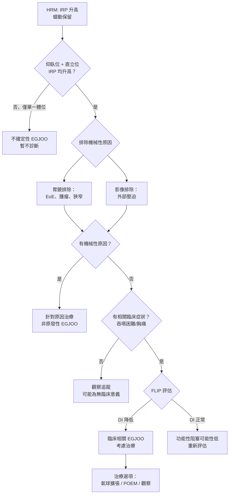

# 食道功能檢查 -- 臨床問答 FAQ

## 前言

本篇整理臨床工作者在食道功能檢查實務中常遇到的問題，涵蓋 HRM 判讀、逆流監測應用、Chicago Classification v4.0 和 Lyon Consensus 2.0 的臨床實踐等主題。

---

### Q1：何時應在停藥 (off PPI) vs 服藥 (on PPI) 狀態下進行逆流監測？

**答**：

**停藥監測 (off PPI)** -- 適用於需要**建立 GERD 診斷**的情境：
- 患者從未有確定性 GERD 證據（無 LA C/D、無 Barrett's）
- 計畫進行抗逆流手術，需術前客觀確認 GERD
- PPI 經驗性治療反應不佳，需確認是否真有病理性逆流
- 停藥要求：PPI 停 7 天、H2RA 停 3 天、制酸劑停 6-12 小時

**服藥監測 (on PPI)** -- 適用於**已確診 GERD 但治療效果不佳**的情境：
- 已有確定性 GERD 證據（LA C/D、長段 Barrett's），但 PPI 治療後症狀持續
- 目的：評估 PPI 控制下是否仍有殘餘逆流
- **建議使用 pH-阻抗監測**（非單純 pH），因服藥後逆流可能轉為弱酸性或非酸性

> **臨床要點**：如果目的是「確認有沒有 GERD」，用停藥監測。如果已知有 GERD 但要「評估藥物效果」，用服藥監測。

---

### Q2：如何判讀邊界值 IRP (borderline IRP)？

**答**：

IRP 邊界值是臨床上常見的難題。CCv4.0 的處理策略：

1. **確認體位一致性**：
   - 仰臥位和直立位 IRP 均升高 → 確定性較高
   - 僅仰臥位升高而直立位正常 → 可能為偽陽性（常見原因：導管位移、腹壓增加、裂孔疝氣影響）

2. **搭配其他證據**：
   - FLIP 評估 EGJ 擴張性 (distensibility index, DI)：DI 降低支持真正的出口阻塞
   - 定時鋇劑攝影 (timed barium esophagram, TBE)：1 分鐘和 5 分鐘的鋇劑殘留量
   - 症狀評估：是否有與 EGJ 阻塞一致的臨床症狀

3. **重複檢查**：在不確定時，可考慮重複 HRM 或在不同體位下重新評估

4. **考慮技術因素**：
   - 導管是否正確定位？
   - 患者是否過度焦慮導致腹壓升高？
   - 是否有使用可能影響 LES 壓力的藥物（鴉片類等）？

---

### Q3：EGJOO 的完整處理流程為何？

**答**：

CCv4.0 對 EGJOO (EGJ Outflow Obstruction) 的診斷和處理更加謹慎：

**關鍵注意事項**：
- CCv4.0 後，EGJOO 的確診率應較 v3.0 大幅下降
- 許多 v3.0 時期的 EGJOO 診斷在 v4.0 標準下可能不成立
- 鴉片類藥物是造成偽陽性 EGJOO 的常見原因
- 不可在未充分評估下直接進行侵入性治療

---

### Q4：何時應使用 FLIP 而非 HRM？兩者如何互補？

**答**：

FLIP (Functional Lumen Imaging Probe) 和 HRM 測量的是不同面向：

| 面向 | HRM | FLIP |
|------|-----|------|
| 測量內容 | 食道壁產生的壓力 | 食道腔的擴張性和順應性 |
| 體外/體內 | 導管經鼻腔放置 | 通常在胃鏡鎮靜下經口放置 |
| EGJ 評估 | 鬆弛壓力 (IRP) | 擴張性 (distensibility index) |
| 蠕動評估 | 直接測量蠕動壓力 | 可觀察 FLIP 蠕動反應 (FLIP panometry) |

**FLIP 特別有價值的情境**：
1. **IRP 邊界值**：FLIP DI 可協助確認 EGJ 阻塞是否真實存在
2. **EGJOO 評估**：FLIP 是評估 EGJOO 臨床意義的重要輔助工具
3. **嗜酸性食道炎 (EoE)**：FLIP 可評估食道體部的順應性降低（纖維化程度）
4. **術中即時評估**：FLIP 可在手術中即時評估肌層切開或胃底摺疊的效果
5. **兒童或無法配合 HRM 的患者**：在鎮靜下進行，不需要患者配合吞嚥

**建議組合**：
- 標準食道運動障礙評估：以 HRM 為主
- IRP 邊界值或 EGJOO 的進一步評估：HRM + FLIP
- EoE 的食道功能評估：FLIP 優先
- 術中監測：FLIP

---

### Q5：無線 Bravo 監測 vs 導管式 pH/pH-阻抗監測，各自適應症為何？

**答**：

| 比較項目 | 導管式 pH-阻抗 | 無線 Bravo |
|---------|--------------|-----------|
| 監測時間 | 24 小時 | 48-96 小時 |
| 鼻管 | 需要 | 不需要 |
| 偵測非酸逆流 | 可以 | 不可以 |
| 基線阻抗 (BI) | 可測量 | 不可測量 |
| PSPWI | 可計算 | 不可計算 |
| 日常活動影響 | 鼻管可能限制活動和飲食 | 更接近日常生活 |
| 放置方式 | 經鼻腔 | 需胃鏡 |
| 費用 | 較低 | 較高 |

**選擇建議**：

- **優先選擇導管式 pH-阻抗**：
  - 需要偵測非酸性逆流（服藥監測）
  - 需要 BI 和 PSPWI 等輔助指標
  - Lyon 2.0 不確定區間需要更多資訊
  - 標準初次停藥評估

- **優先選擇 Bravo**：
  - 患者無法耐受鼻管
  - 需要延長監測時間以提高敏感度（如間歇性症狀）
  - 兒童或極度焦慮的患者
  - 已知 24 小時監測可能正常而臨床高度懷疑逆流

---

### Q6：HRM 和 pH 監測結果不一致時如何處理？

**答**：

臨床上確實會遇到兩項檢查結果不一致的情況：

**情境一：HRM 正常但 pH 監測顯示異常逆流**
- 最常見的組合：正常食道運動合併 GERD
- 逆流可能來自 EGJ 屏障功能不足（HRM 上的 EGJ-CI 降低或 Type III EGJ 型態）
- 暫時性 LES 鬆弛 (transient LES relaxation, TLESR) 是主要逆流機制，HRM 標準測試中可能不會捕捉到
- 處理：以逆流治療為主

**情境二：HRM 異常（如 IEM）但 pH 監測正常**
- IEM 可能影響食道清除功能，但如果沒有病理性逆流，可能不需要針對逆流治療
- 需要評估 IEM 是否與患者的吞嚥困難症狀相關
- 考慮是否有功能性食道疾病

**情境三：EGJOO (HRM) 但無逆流 (pH)**
- 不矛盾：EGJOO 造成的是出口阻塞，不一定伴隨逆流
- EGJOO 的症狀通常是吞嚥困難，非逆流
- 需進一步以 FLIP 和鋇劑攝影評估 EGJOO 的臨床意義

**原則**：每項檢查提供不同面向的資訊，不一致時需結合臨床全貌綜合判斷，而非僅依賴單一檢查結果。

---

### Q7：何時需要重複食道功能檢查？

**答**：

**建議重複檢查的情境**：
1. **首次結果不確定 (inconclusive)**：CCv4.0 定義的不確定性診斷，可在不同日重複以確認一致性
2. **治療效果評估**：
   - POEM 或肌層切開術後評估 EGJ 功能
   - 抗逆流手術後評估逆流控制
3. **症狀顯著變化**：原本穩定的患者出現新症狀或症狀惡化
4. **技術問題**：首次檢查因導管位移、患者配合度差等技術問題而結果不可靠
5. **長期追蹤**：某些進行性疾病（如硬皮症 scleroderma 相關食道病變）需定期監測

**通常不需重複的情境**：
- 首次檢查結果確定且與臨床一致
- 診斷明確且治療方向已確定
- 短期內症狀無明顯變化

---

### Q8：激發測試 (provocative testing) 在 CCv4.0 中的角色為何？

**答**：

CCv4.0 將激發測試提升為建議納入的標準流程：

#### 多次快速吞嚥 (Multiple Rapid Swallows, MRS)

- **方法**：連續快速吞入 5 次 2 mL 水（間隔 < 4 秒）
- **正常反應**：
  - 快速吞嚥期間蠕動被抑制 (deglutitive inhibition)
  - 最後一次吞嚥後出現增強的蠕動波（DCI > 基線平均值）
- **臨床意義**：
  - 評估蠕動儲備功能 (peristaltic reserve)
  - IEM 患者若 MRS 後蠕動增強 → 有儲備功能，手術風險較低
  - IEM 患者若 MRS 後蠕動無增強 → 無儲備功能，需謹慎考慮抗逆流手術
  - 可協助區分 achalasia 前期 (pre-achalasia) 和其他運動障礙

#### 快速飲水挑戰 (Rapid Drink Challenge, RDC)

- **方法**：以吸管快速喝下 200 mL 水
- **正常反應**：EGJ 充分鬆弛，液體順利通過
- **臨床意義**：
  - 評估 EGJ 在大量液體通過時的功能
  - 對 EGJOO 的評估特別敏感：EGJ 無法在 RDC 時充分鬆弛支持真正的出口阻塞
  - 正常的 RDC 反應使 EGJOO 診斷的可能性降低

---

### Q9：基線阻抗 (baseline impedance) 何時有用？如何應用？

**答**：

基線阻抗 (Baseline Impedance, BI) 反映食道黏膜完整性 (mucosal integrity)，是 Lyon 2.0 的重要輔助指標。

**測量方式**：
- 在 24 小時 pH-阻抗監測中，選取夜間（凌晨 12-6 點）無吞嚥、無逆流的穩定時段
- 計算平均夜間基線阻抗 (Mean Nocturnal Baseline Impedance, MNBI)
- 亦可在 HRM 導管上的阻抗通道進行即時測量（如有配置）

**BI 降低的意義**：
- 代表食道黏膜受損、通透性增加
- 與 GERD 相關的黏膜損傷一致
- 即使 AET 在邊界值範圍，BI 降低仍支持 GERD 診斷

**BI 的主要臨床應用**：
1. **Lyon 2.0 不確定區間（AET 4-6%）**：BI 降低傾向支持 GERD
2. **功能性火燒心 vs 逆流高敏感的鑑別**：BI 正常較支持功能性火燒心
3. **PPI 治療反應的預測**：BI 異常者對 PPI 反應可能較好
4. **嗜酸性食道炎 (EoE) 的評估**：EoE 也可造成 BI 降低

**閾值建議**：
- 遠端食道 MNBI < 1500 ohms：提示黏膜損傷
- 正常值因系統和導管位置而異，需參考各中心建立的常模

---

### Q10：如何在實際臨床中應用 Lyon 2.0？

**答**：

Lyon 2.0 的臨床實踐步驟：

**步驟一：確認是否已有確定性 GERD 證據**
- 回顧胃鏡：是否有 LA C/D、長段 Barrett's、消化性狹窄？
- 如有 → GERD 已確診，不需要停藥逆流監測來確認診斷

**步驟二：決定監測方式**
- 需要建立 GERD 診斷 → 停藥 pH 或 pH-阻抗監測
- 已有確診但治療不佳 → 服藥 pH-阻抗監測

**步驟三：判讀主要指標**
- AET > 6% → 確定性 GERD
- AET < 4% 且逆流 < 40 次 → 排除病理性 GERD
- AET 4-6% 或其他不一致 → 進入輔助指標評估

**步驟四：輔助指標（不確定時）**
- BI（基線阻抗）
- PSPWI（吞嚥後蠕動波指數）
- 組織病理學
- 症狀關聯性（SAP > 95%、SI > 50%）
- 多項輔助指標異常 → 傾向支持 GERD
- 多項輔助指標正常 → 傾向排除 GERD

**步驟五：整合 HRM 結果**
- EGJ 屏障功能（EGJ-CI、EGJ 型態）提供額外資訊
- IEM 可能影響食道清除能力
- Achalasia 和嚴重運動障礙需納入鑑別

---

### Q11：食道弛緩不能症治療後的食道功能檢查追蹤策略為何？

**答**：

治療後追蹤的目的是評估 EGJ 阻塞是否解除和是否有新的問題：

**治療後 HRM 變化**：
- 成功治療後 IRP 應下降（但不一定完全正常化）
- Type I 和 Type II 治療後蠕動不會恢復（食道體部肌層已退化）
- Type III 治療後痙攣性收縮可能減少

**追蹤建議**：
- 治療後症狀復發時：重複 HRM + 定時鋇劑攝影
- 術後常規追蹤：各中心做法不一，部分建議 3-6 個月重複 HRM
- FLIP 可用於術中即時評估和術後追蹤

**注意事項**：
- 治療後的 HRM 正常值可能與未治療時不同
- 治療後出現嚴重逆流症狀需進行逆流監測（尤其是 POEM 術後）
- POEM 術後反流發生率較外科肌層切開術高，需注意追蹤

---

### Q12：如何處理嗜酸性食道炎 (EoE) 患者的食道功能檢查？

**答**：

嗜酸性食道炎 (Eosinophilic Esophagitis, EoE) 是食道功能檢查中的特殊情境：

**HRM 在 EoE 的角色**：
- EoE 患者可出現多種 HRM 異常：IEM、EGJOO、DES 等
- 但這些異常的發生率和臨床意義仍有爭議
- EoE 的主要功能異常是順應性降低（食道壁纖維化、僵硬），HRM 可能無法完全反映

**FLIP 在 EoE 的角色（更為重要）**：
- FLIP 直接測量食道擴張性 (distensibility)，能反映 EoE 的纖維化程度
- EoE 的 FLIP 特徵：食道體部 DI 降低（食道撐不開）
- FLIP 可用於評估治療（類固醇、飲食限制、擴張術）的效果
- FLIP panometry 可觀察食道體部對擴張的蠕動反應

**建議**：
- EoE 的功能評估以 FLIP 優先
- HRM 可作為輔助，特別是有吞嚥困難合併疑似運動障礙時
- 逆流監測可協助排除合併的 GERD

---

### Q13：食道功能檢查在減重手術 (bariatric surgery) 患者中的角色為何？

**答**：

減重手術前後的食道功能評估越來越受重視：

**術前評估**：
- 部分中心建議減重手術前進行 HRM，特別是有食道症狀的患者
- 排除 achalasia 和嚴重運動障礙（可能影響手術方式選擇）
- 評估是否有術前 GERD（影響手術方式選擇：Roux-en-Y vs 袖狀胃切除）
- 袖狀胃切除術 (sleeve gastrectomy) 後 GERD 發生率較高，有嚴重 GERD 者可能更適合 Roux-en-Y

**術後評估**：
- 術後新發吞嚥困難：HRM 評估是否有手術相關的 EGJ 阻塞
- 術後 GERD 症狀：逆流監測評估逆流嚴重度
- FLIP 可用於術後 EGJ 或吻合口的擴張性評估

### Q14：AI 在 HRM 判讀中的角色是什麼？

2025 年系統性回顧（17 項研究，4,588 名患者）顯示，AI 工具在以下 HRM 判讀任務中表現良好：

- **基本任務**：解剖標誌辨識、檢查品質評估、弛緩不能症辨識 — 準確度高
- **進階任務**：亞型分類、全 Chicago Classification 自動化 — 持續改善中
- **主要優勢**：減少專家間 30-40% 的判讀差異

目前 AI 仍為研究工具，尚未取代臨床醫師判讀。預期未來 3-5 年內可能整合至商用 HRM 軟體中作為輔助功能。

---

<!-- 🏥 院內資料區 - 請自行填入 -->
> **📋 請填入貴院資料：**
>
> - 本院負責科別：_______________
> - 聯絡電話 / 分機：_______________
> - 門診時間：_______________
> - 主治醫師：_______________
> - 本院檢查設備與特色：_______________
<!-- 院內資料區結束 -->
