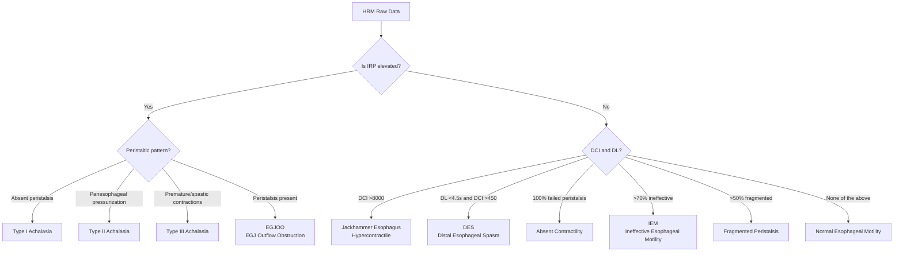

# High-Resolution Manometry (HRM)

## Overview

High-resolution manometry (HRM) is the current gold standard for evaluating esophageal motility. Compared to conventional manometry, which uses only 4-8 pressure sensors, HRM uses **36 closely spaced pressure sensors** at approximately 1 cm intervals, providing complete and continuous recording of pressure changes from the pharynx to the stomach. The data is displayed as a color-coded pressure topography plot (Clouse plot), significantly improving diagnostic accuracy and efficiency.

---

## Equipment and Technology

### Catheter Specifications

- **Diameter**: Approximately 4.2 mm
- **Number of sensors**: 36 circumferential pressure sensors
- **Sensor spacing**: Approximately 1 cm
- **Measurement range**: From the upper esophageal sphincter (UES) to the intragastric region
- **Pressure resolution**: Can detect pressure changes in the range of 0-600 mmHg

### Commercial HRM Systems

Three major commercial HRM systems are currently used in clinical practice, each with distinct technical features:

| System Name | Manufacturer | Sensor Technology | Analysis Software | Features |
|------------|-------------|-------------------|------------------|----------|
| ManoScan | Medtronic | Solid-state | ManoView | Most widely used; basis for Chicago Classification development |
| Solar GI / MMS | Laborie (formerly MMS) | Water-perfused or solid-state | Proprietary platform | More common in Europe |
| InSIGHT Ultima | Diversatek | Solid-state | Proprietary platform | High-resolution impedance integration |

> **Clinical point**: Chicago Classification v4.0 has established separate normal values for all three commercial systems, but values from different systems cannot be directly compared.

### Clouse Plot (Pressure Topography Plot)

The Clouse plot is a visualization method unique to HRM that uses color coding to display pressure data:

- **X-axis**: Time
- **Y-axis**: Sensor position along the catheter (corresponding to anatomical location in the esophagus)
- **Color**: Represents pressure magnitude (typically warm colors = high pressure, cool colors = low pressure)
- Provides an intuitive view of the complete propagation of the peristaltic wave, sphincter relaxation, and contraction

---

## Test Protocol

### Standard Protocol (per Chicago Classification v4.0 Recommendations)

#### 1. Patient Preparation

- Fasting for at least 6 hours
- Discontinuation of medications affecting esophageal motility (calcium channel blockers, nitrates, opioids, etc.) as clinically indicated
- If evaluating for reflux, discontinue PPI for 7 days

#### 2. Catheter Placement

- Topical nasal anesthesia
- Insert catheter through the nose so the most distal sensors are within the stomach
- Identify the positions of the upper esophageal sphincter (UES) and lower esophageal sphincter (LES)

#### 3. Measurement Procedure

| Step | Content | Purpose |
|------|---------|---------|
| Baseline recording | Remain still for 30 seconds, no swallowing | Record resting pressure, including LES basal pressure |
| Supine swallows | 5 mL water x 10, spaced 20-30 seconds apart | Standard assessment of esophageal peristalsis and EGJ relaxation |
| Upright swallows | 5 mL water x 5 | New requirement in CCv4.0; some abnormalities appear only in the upright position |
| Provocative maneuvers | Multiple rapid swallows (MRS) and/or rapid drink challenge (RDC) | Assess peristaltic reserve |

#### 4. Provocative Maneuvers in Detail

**Multiple Rapid Swallows (MRS)**
- Rapidly swallow 2 mL water 5 times in succession (interval < 4 seconds)
- Normal response: Peristalsis is inhibited during rapid swallowing (deglutitive inhibition), followed by a strong peristaltic wave after the last swallow
- The DCI of the final peristaltic wave should exceed the baseline mean DCI
- Assesses peristaltic reserve: Enhanced DCI after MRS indicates preserved reserve function

**Rapid Drink Challenge (RDC)**
- Drink 200 mL water rapidly through a straw
- Assesses EGJ relaxation capacity during passage of a large volume of liquid
- Particularly helpful for evaluating EGJ outflow obstruction (EGJOO)

---

## Key Metrics

### EGJ-Related Metrics

| Metric | Full Name | Definition | Clinical Significance |
|--------|-----------|-----------|----------------------|
| IRP | Integrated Relaxation Pressure | Mean of the lowest 4-second pressure within a 10-second window after swallowing | Assesses EGJ relaxation; key metric for diagnosing achalasia |
| EGJ-CI | EGJ Contractile Integral | Contractile integral of the EGJ high-pressure zone | Assesses EGJ barrier function; related to GERD |
| EGJ morphology | EGJ Morphology | Relative position of LES and crural diaphragm | Type I (overlapping), Type II (separated 1-2 cm), Type III (separated > 2 cm, i.e., hiatal hernia) |

### Esophageal Body Metrics

| Metric | Full Name | Definition | Clinical Significance |
|--------|-----------|-----------|----------------------|
| DCI | Distal Contractile Integral | Contractile integral of the distal esophageal peristaltic wave (mmHg-s-cm) | Assesses peristaltic vigor; > 8000 = hypercontractile; < 100 = failed |
| DL | Distal Latency | Time from UES relaxation onset to the contractile deceleration point (CDP) | Assesses peristaltic coordination; < 4.5 seconds = premature contraction |
| Break size | Peristaltic Break | Length of gap where pressure < 20 mmHg in the peristaltic wave | > 5 cm = large break; 2-5 cm = small break |

### Normal Reference Values (per Chicago Classification v4.0)

> **Note**: Normal values vary by HRM system. The following are approximate reference ranges.

| Metric | Supine Normal Value | Upright Normal Value |
|--------|-------------------|---------------------|
| IRP (median) | < 15 mmHg (ManoScan) | < 12 mmHg (ManoScan) |
| DCI | 450-8000 mmHg-s-cm | System-dependent |
| DL | > 4.5 seconds | > 4.5 seconds |
| Peristaltic break | < 5 cm | -- |

---

## Clinical Applications

### Primary Indications

1. **Evaluation of dysphagia**
   - Next step after endoscopy has ruled out structural lesions
   - Determine whether an esophageal motility disorder is present

2. **Preoperative evaluation for antireflux surgery**
   - Must rule out achalasia and severe motility disorders
   - Influences surgical approach (complete vs. partial fundoplication)

3. **Definitive diagnosis and subtyping of achalasia**
   - HRM is the gold standard for diagnosing achalasia
   - Subtyping (Type I, II, III) directly impacts treatment selection

4. **Non-cardiac chest pain**
   - Evaluate for esophageal spasm or hypercontractile disorder

5. **Follow-up of esophageal motility disorders**
   - Pre- and post-treatment comparison
   - Post-surgical assessment

### Results Interpretation Algorithm

Results are interpreted according to the hierarchical approach of Chicago Classification v4.0:

---

## Limitations and Considerations

### Technical Limitations

- A single time-point assessment may not fully reflect daily esophageal function
- Patient compliance and anxiety levels may affect results
- Different HRM systems have different normal values; cross-system comparisons are not valid
- Minor variations in catheter positioning may affect IRP measurement

### Complementary Tests

| Scenario | Recommended Adjunctive Test |
|----------|---------------------------|
| Borderline IRP | FLIP (assess EGJ distensibility) |
| Suspected EGJOO but uncertain | Timed barium esophagram + FLIP |
| Complete preoperative evaluation | HRM + 24h pH-impedance |
| Motility abnormality with reflux symptoms | HRM + pH-impedance monitoring |

---

## AI-Assisted HRM Interpretation (2025 New Development)

### Current Status

A 2025 systematic review analyzed 17 studies (2013-2025, encompassing 4,588 patients from 6 countries), evaluating the application of artificial intelligence (AI) in HRM interpretation:

| Application Area | AI Performance |
|-----------------|----------------|
| Anatomical landmark identification (UES/LES localization) | High accuracy |
| Test quality assessment | High accuracy |
| Achalasia vs non-achalasia classification | High accuracy |
| Achalasia subtype classification (Type I/II/III) | Good accuracy |
| Full Chicago Classification automated diagnosis | Improving, still awaiting validation |

### Technical Approaches
- **Convolutional neural networks (CNN)**: Direct analysis of Clouse Plot images
- **Machine learning (ML)**: Classification based on HRM numerical parameters
- 82% of studies were published after 2020, indicating rapid growth in this field

### Clinical Significance
- **Addressing inter-expert interpretation variability**: Currently, even among experts, HRM interpretation disagreement rates reach 30-40%
- **Potential applications**: May serve as a clinical decision support tool in the future, improving diagnostic consistency
- **Current limitations**: Most studies use expert analysis as the reference standard; the actual impact of AI diagnosis on clinical outcomes has not yet been validated

> AI-assisted HRM interpretation is one of the most promising technological developments in esophageal function testing, but it is currently still in the research validation phase and has not yet been widely adopted in clinical practice.

---

## Current Status in Taiwan

Several medical centers in Taiwan currently have HRM testing capability:

- **Taipei Veterans General Hospital**: Equipped with HRM and 24-hour pH-impedance monitoring
- **Tri-Service General Hospital**: Has a dedicated esophageal function testing center
- **Far Eastern Memorial Hospital**: Provides comprehensive esophageal function testing services
- **National Taiwan University Hospital**: Equipped with HRM testing facilities
- **Chang Gung Memorial Hospital**: Offers HRM and related esophageal function testing

<!-- 🏥 Hospital-Specific Information - Please fill in -->
> **📋 Please enter your hospital information:**
>
> - Department: _______________
> - Contact / Extension: _______________
> - Clinic Hours: _______________
> - Attending Physician(s): _______________
> - Hospital Specialties / Annual Volume: _______________
<!-- End of hospital-specific information -->
