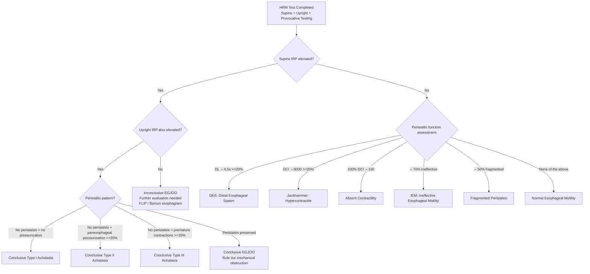

# Chicago Classification Version 4.0 (CCv4.0)

## Overview

The Chicago Classification (CC) is the internationally standardized classification system for interpreting high-resolution manometry (HRM) results. Since its first edition was published in 2008, it has undergone multiple revisions. Version 4.0 (v4.0), published in 2021, represents the current international consensus.

### Development Background

- **Contributing experts**: **52 international experts** from **15 countries**
- **Normative database**: Data from **469 healthy volunteers**
- **Applicable systems**: Separate normal values established for **3 commercial HRM systems** (ManoScan/Medtronic, Solar GI/MMS, InSIGHT/Diversatek)
- **Major innovation**: First version to incorporate an integrated assessment of **supine + upright + provocative testing**

---

## Key Changes (Compared to v3.0)

### Major Updates

| Item | CCv3.0 | CCv4.0 |
|------|--------|--------|
| Test position | Supine only | Supine + Upright |
| Provocative testing | Not required | Recommended inclusion of MRS/RDC |
| Normal values | ManoScan only | Separate values for three systems |
| EGJOO diagnosis | Less stringent | More stringent (requires multiple lines of evidence) |
| Conclusion grading | None | Introduction of conclusive vs. inconclusive |
| Peristaltic reserve | Not included | MRS assessment of peristaltic reserve |

---

## Diagnostic Metric Definitions

### Key Metrics

| Metric | Full Name | Measurement Method | Normal Value (ManoScan, supine) |
|--------|-----------|-------------------|-------------------------------|
| IRP | Integrated Relaxation Pressure | Mean of lowest 4-second pressure within 10-second post-swallow window | < 15 mmHg |
| DCI | Distal Contractile Integral | Pressure-time-length integral of distal peristaltic wave | 450-8000 mmHg-s-cm |
| DL | Distal Latency | Time from UES relaxation to CDP | > 4.5 seconds |
| Break | Peristaltic Break | Length of gap below 20 mmHg isobaric contour | < 5 cm |

### Upright Position Reference Values

| Metric | Normal Value (ManoScan, upright) |
|--------|-------------------------------|
| IRP | < 12 mmHg |
| DCI | Per system-specific normative values |

> **Important**: CCv4.0 emphasizes that different HRM systems have different normal values. Clinical interpretation must use the normal values corresponding to the system in use.

---

## Hierarchical Classification Framework

CCv4.0 employs a strict hierarchical diagnostic algorithm, interpreted in order from top to bottom. Once a higher-level diagnosis is established, lower-level diagnoses are no longer considered.

### Level 1: Disorders of EGJ Outflow

#### Achalasia

**Common features**: Elevated IRP (supine and/or upright) + absence of normal peristalsis

| Subtype | Peristaltic Features | Clinical Characteristics |
|---------|---------------------|------------------------|
| **Type I** (Classic) | 100% failed peristalsis, no esophageal pressurization | Most traditional presentation; esophagus may be dilated |
| **Type II** (With panesophageal pressurization) | Failed peristalsis, but >= 20% of swallows show panesophageal pressurization | Most common subtype; best treatment response |
| **Type III** (Spastic) | Failed peristalsis, but >= 20% of swallows show premature/spastic contractions (DL < 4.5s) | Poorer treatment response; must differentiate from DES |

**CCv4.0 Diagnostic Certainty**:
- **Conclusive diagnosis**: Elevated supine IRP + elevated upright IRP + matching peristaltic pattern
- **Inconclusive**: Elevated IRP in only supine or only upright position --> requires additional supporting evidence (e.g., FLIP, timed barium esophagram)

#### EGJ Outflow Obstruction (EGJOO)

- **Definition**: Elevated IRP with preserved peristalsis (not an achalasia pattern)
- **Major change in CCv4.0**: The diagnostic threshold for EGJOO has been substantially raised

**EGJOO Diagnostic Requirements (CCv4.0)**:

| Condition | Requirement |
|-----------|------------|
| Supine IRP | Elevated |
| Upright IRP | Elevated |
| Peristalsis | Preserved (not an achalasia pattern) |
| Clinical corroboration | Relevant symptoms or objective supporting evidence required |

> **Clinical point**: CCv4.0 recognizes that many cases diagnosed as EGJOO under v3.0 may have been false positives. Cases with elevated supine IRP but normal upright IRP should not be diagnosed as EGJOO. Further evaluation with FLIP and/or timed barium esophagram is recommended.

---

### Level 2: Major Disorders of Peristalsis

> Prerequisite: Normal IRP (Level 1 diagnoses have been excluded)

| Diagnosis | English Name | Diagnostic Criteria | Clinical Significance |
|-----------|-------------|--------------------|-----------------------|
| Distal esophageal spasm | Distal Esophageal Spasm (DES) | >= 20% of swallows with DL < 4.5 seconds (premature contraction) | May cause dysphagia and chest pain |
| Hypercontractile esophagus | Jackhammer Esophagus | >= 20% of swallows with DCI > 8000 mmHg-s-cm | May cause chest pain and dysphagia |
| Absent contractility | Absent Contractility | 100% of swallows with DCI < 100 mmHg-s-cm | Severe loss of peristaltic function; contraindication to antireflux surgery |

**CCv4.0 points**:
- Major disorders of peristalsis are most reliable when abnormalities are present in both supine and upright positions
- Abnormalities present in only one position carry lower diagnostic certainty

---

### Level 3: Minor Disorders of Peristalsis

> Prerequisite: Normal IRP + does not meet criteria for major disorders of peristalsis

| Diagnosis | English Name | Diagnostic Criteria | Clinical Significance |
|-----------|-------------|--------------------|-----------------------|
| Ineffective esophageal motility | Ineffective Esophageal Motility (IEM) | > 70% ineffective swallows (DCI < 450 or break > 5 cm) | May impair esophageal clearance; associated with GERD |
| Fragmented peristalsis | Fragmented Peristalsis | > 50% fragmented swallows (DCI > 450 but break > 5 cm) | Clinical significance less certain |

**CCv4.0 supplementary notes on IEM**:
- IEM with normal peristaltic reserve on MRS may be of lower clinical significance
- IEM with absent peristaltic reserve on MRS may have greater clinical significance (e.g., impacting antireflux surgery decisions)

---

## Diagnostic Algorithm

---

## Normal Value Quick Reference

### ManoScan/Medtronic System

| Metric | Supine Normal Value | Upright Normal Value |
|--------|-------------------|---------------------|
| IRP (median) | < 15 mmHg | < 12 mmHg |
| DCI | 450-8000 mmHg-s-cm | Per normative data |
| DL | > 4.5 seconds | > 4.5 seconds |
| Ineffective peristalsis definition | DCI < 450 or break > 5 cm | -- |
| Failed peristalsis definition | DCI < 100 | -- |

### Solar GI/MMS System

| Metric | Supine Normal Value |
|--------|-------------------|
| IRP (median) | < 22 mmHg (higher for water-perfused systems) |
| DCI | Per system-specific normative data |

### InSIGHT/Diversatek System

| Metric | Supine Normal Value |
|--------|-------------------|
| IRP (median) | Per system-specific normative data |

> **Key reminder**: Normal values from different systems cannot be applied interchangeably. Clinical interpretation must reference the system-specific normal values.

---

## Clinical Application Considerations

### Conclusive vs. Inconclusive Diagnoses

CCv4.0 introduced the concept of diagnostic certainty:

| Certainty Level | Meaning | Management Recommendation |
|----------------|---------|--------------------------|
| Conclusive | Supine + upright results are concordant | Treatment decisions can be made directly based on the diagnosis |
| Inconclusive | Abnormality present in only one position | Additional testing required (FLIP, barium esophagram, repeat HRM) |

### Common Clinical Decision Scenarios

1. **Achalasia subtyping and treatment selection**
   - Type I and Type II: Myotomy, balloon dilation, or POEM are effective
   - Type III: POEM may have an advantage over balloon dilation
   - Type II has the best treatment response

2. **Management of EGJOO**
   - Post-CCv4.0, EGJOO diagnosis is more stringent
   - Must rule out mechanical causes (e.g., hiatal hernia compression, eosinophilic esophagitis)
   - Recommend adjunctive FLIP for further confirmation
   - Clinically relevant EGJOO should have objective symptom corroboration

3. **Absent contractility and surgical decisions**
   - Complete Nissen fundoplication is relatively contraindicated in patients with absent peristalsis
   - Partial fundoplication or alternative approaches may be considered

4. **Clinical significance of IEM**
   - Must be interpreted in conjunction with MRS peristaltic reserve assessment
   - Preserved reserve: Clinical significance may be lower
   - Absent reserve: May impact antireflux surgery decisions

---

## Interpretation in Special Circumstances

### Medication Effects

- Opioids can cause elevated EGJ pressure and esophageal spasm, potentially resulting in false-positive EGJOO or DES
- Calcium channel blockers can decrease LES pressure and peristalsis
- When possible, discontinue medications that affect results before performing the test

### Upper Esophageal Sphincter (UES) Abnormalities

- CCv4.0 does not include a standardized classification for UES abnormalities
- Elevated UES residual pressure may be seen in cricopharyngeal dysfunction
- Requires comprehensive assessment combining clinical findings and other tests (e.g., videofluoroscopic swallow study)

<!-- 🏥 Hospital-Specific Information - Please fill in -->
> **📋 Please enter your hospital information:**
>
> - Department: _______________
> - Contact / Extension: _______________
> - Clinic Hours: _______________
> - Attending Physician(s): _______________
> - Hospital Specialties / Annual Volume: _______________
<!-- End of hospital-specific information -->
