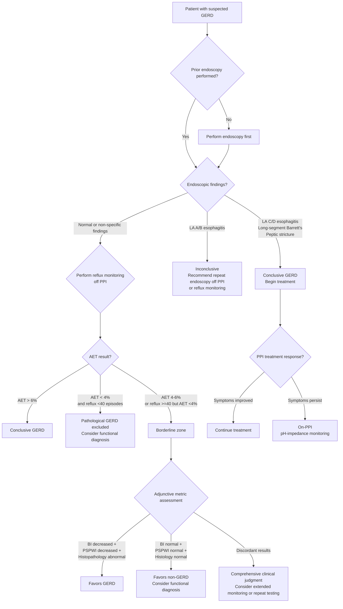

# Lyon Consensus 2.0 and GERD Diagnosis

## Overview

The Lyon Consensus is a key international consensus document establishing objective diagnostic criteria for gastroesophageal reflux disease (GERD). Version 2.0 (Lyon Consensus 2.0), published in 2023, established a standardized framework integrating multiple test results, categorizing the strength of evidence for GERD into three levels: "conclusive for GERD," "against GERD," and "borderline/inconclusive."

### Background

- GERD is one of the most common gastrointestinal diseases, yet it has long lacked unified objective diagnostic criteria
- Many patients have been diagnosed with GERD based solely on symptoms and empirical PPI therapy, without objective evidence
- The Lyon Consensus aims to establish an evidence-based diagnostic framework for GERD

---

## Conclusive Evidence for GERD

Any one of the following establishes a GERD diagnosis without the need for additional testing:

### Endoscopic Evidence

| Finding | Description | Certainty Level |
|---------|------------|----------------|
| LA Grade C or D esophagitis | Severe erosive esophagitis | Conclusive |
| Long-segment Barrett's esophagus | Intestinal metaplasia length >= 3 cm | Conclusive |
| Peptic stricture | Esophageal stricture due to chronic reflux | Conclusive |

> **Note**: LA Grade A and B esophagitis suggest possible GERD, but in Lyon 2.0 they are classified as inconclusive evidence, as inter-observer agreement is low and these findings can be seen in normal individuals.

### Reflux Monitoring Evidence

| Metric | Threshold for Conclusive GERD | Description |
|--------|------------------------------|-------------|
| Acid Exposure Time (AET) | **> 6%** | Total percentage of time esophageal pH < 4 over 24 hours |

---

## Evidence Against GERD

When the following conditions are simultaneously met, pathological GERD can be reasonably excluded:

| Metric | Threshold | Description |
|--------|-----------|-------------|
| AET | **< 4%** | Acid exposure time within normal range |
| Reflux episodes | **< 40 per 24 hours** | Total reflux event count is normal |

> **Clinical point**: When AET < 4% **and** reflux episodes < 40, pathological GERD can be reasonably excluded. However, this does not rule out functional heartburn or reflux hypersensitivity.

---

## Borderline / Inconclusive Zone

| Scenario | Recommendation |
|----------|---------------|
| AET 4-6% | Adjunctive metrics needed to assist determination |
| LA Grade A or B esophagitis | Recommend repeat endoscopy off PPI to confirm |
| AET < 4% but reflux episodes >= 40 | Require symptom association analysis |
| AET > 6% but atypical symptoms | Verify monitoring quality and symptom recording |

---

## Adjunctive Metrics

When primary metrics fall in the borderline zone, the following adjunctive metrics can assist in clinical determination:

### Baseline Impedance (BI)

- **Definition**: Impedance value of the esophageal mucosa during periods without swallowing or reflux
- **Significance**: Reflects mucosal integrity; decreased BI indicates mucosal damage
- **GERD thresholds**:
  - Distal esophageal BI < 1500 ohms (24-hour impedance monitoring)
  - Or decreased mean nocturnal baseline impedance (MNBI)

### Post-Reflux Swallow-Induced Peristaltic Wave Index (PSPWI)

- **Definition**: Proportion of reflux events followed by a swallow-induced peristaltic wave within 30 seconds
- **Significance**: Reflects esophageal chemical clearance capacity
- **GERD threshold**: PSPWI < 61% suggests impaired esophageal clearance

### Histopathology

- **Microscopic mucosal changes**:
  - Basal cell hyperplasia
  - Papillary elongation
  - Dilated intercellular spaces (DIS)
  - Inflammatory cell infiltration
- **Scoring system**: Microscopic esophagitis scores can serve as adjunctive evidence

### Motor Evaluation

- EGJ barrier function on HRM
- Decreased EGJ-CI (EGJ Contractile Integral) suggests impaired barrier function
- EGJ morphology (Type III = hiatal hernia) is associated with increased GERD risk

---

## Ambulatory Reflux Monitoring Protocols

### Off-PPI vs. On-PPI Monitoring

| Monitoring Approach | Applicable Scenario | Purpose |
|--------------------|--------------------|---------|
| **Off-PPI monitoring** | GERD not yet confirmed; objective evidence needed | Confirm whether pathological reflux is present |
| **On-PPI monitoring** | GERD already confirmed but medication treatment is ineffective | Assess residual reflux under medication control |

### Off-PPI Monitoring

- **Discontinuation requirements**:
  - PPI: Discontinue for **7 days**
  - H2 receptor antagonists (H2RA): Discontinue for **3 days**
  - Antacids: Discontinue for **6-12 hours**
- **Monitoring modality**: pH monitoring or pH-impedance monitoring
- **Primary metric**: AET (thresholds at 4% and 6%)

### On-PPI Monitoring

- **Applicable**: Patients with conclusive GERD evidence (e.g., LA C/D esophagitis) who have persistent symptoms despite PPI therapy
- **pH-impedance monitoring is recommended** (as reflux may become weakly acidic or non-acidic on medication)
- **Assessment focus**:
  - Whether AET has normalized under PPI
  - Whether residual weakly acidic reflux correlates with symptoms
  - Symptom association analysis (SAP, SI)

### Symptom Association Analysis Metrics

| Metric | Full Name | Definition | Positive Threshold |
|--------|-----------|-----------|-------------------|
| SI | Symptom Index | Number of symptom episodes associated with reflux events / total symptom episodes x 100% | > 50% |
| SAP | Symptom Association Probability | Statistical association between symptoms and reflux events calculated using Fisher's exact test | > 95% |

- **SI** is simpler but does not account for the total number of reflux events, potentially overestimating the association
- **SAP** has greater statistical rigor and is the primary metric recommended by the Lyon Consensus
- When both are positive, the association between symptoms and reflux is most conclusive

### Monitoring Modality Selection

| Modality | Advantages | Disadvantages | Applicable Scenario |
|----------|-----------|---------------|---------------------|
| Catheter-based pH monitoring | Lower cost, widely available | Detects acid reflux only, nasal catheter discomfort | Basic reflux evaluation |
| Catheter-based pH-impedance monitoring | Detects all reflux types, measures BI | Nasal catheter discomfort, more expensive equipment | On-PPI monitoring, borderline zone |
| Wireless Bravo monitoring | No nasal catheter, extendable to 96 hours | pH only, high cost, requires endoscopy | Extended outpatient monitoring, intolerance to nasal catheter |

---

## GERD Diagnostic Decision Algorithm

---

## Differential Diagnosis of Functional Esophageal Disorders

When GERD has been excluded, the following functional diagnoses should be considered (per Rome IV criteria):

| Diagnosis | Definition | Distinguishing Feature from GERD |
|-----------|-----------|--------------------------------|
| Functional Heartburn | Heartburn symptoms without pathological reflux evidence, and symptoms do not correlate with reflux events | Normal AET, no symptom association |
| Reflux Hypersensitivity | Normal AET, but symptoms positively correlate with reflux events | Normal AET, but positive symptom association |
| Functional Chest Pain | Non-cardiac chest pain without GERD or motility disorder evidence | Must rule out cardiac, GERD, and motility disorders |

---

## Special Clinical Scenarios

### Preoperative Reflux Evaluation

- Objective GERD evidence is **mandatory** before antireflux surgery
- Recommended: Endoscopy + HRM + off-PPI reflux monitoring
- HRM to rule out achalasia and severe motility disorders
- Reflux monitoring to confirm the presence of pathological reflux

### Extraesophageal Reflux Symptoms

- Chronic cough, laryngeal symptoms, asthma
- Lyon 2.0 recommendation: The causal relationship between these symptoms and GERD is often overestimated
- More stringent reflux evidence is needed to establish causation
- GERD should not be diagnosed based solely on extraesophageal symptoms

### Barrett's Esophagus Patients

- Long-segment Barrett's (>= 3 cm) is itself conclusive evidence of GERD
- Short-segment Barrett's (< 3 cm) is not considered conclusive evidence in Lyon 2.0
- Barrett's patients require long-term follow-up and endoscopic surveillance

---

## Evidence Levels and Clinical Practice

### Lyon 2.0 Practice Recommendations Summary

| Scenario | Recommendation |
|----------|---------------|
| Typical reflux symptoms, no prior endoscopy | May attempt PPI trial, but persistent symptoms require endoscopic evaluation |
| PPI-refractory reflux symptoms | Endoscopy + off-PPI reflux monitoring |
| Preoperative evaluation | HRM + off-PPI reflux monitoring (mandatory) |
| Persistent symptoms on PPI therapy | On-PPI pH-impedance monitoring |
| Borderline zone | Adjunctive metrics (BI, PSPWI, histology) to assist determination |
| Extraesophageal symptoms | Strict objective reflux evidence required; symptoms alone are insufficient |

### Integration with Chicago Classification v4.0

- GERD evaluation often requires both HRM (interpreted per CCv4.0) and reflux monitoring (interpreted per Lyon 2.0)
- HRM provides motor function information; Lyon 2.0 provides reflux information -- the two are complementary
- EGJ barrier function (EGJ-CI and EGJ morphology on HRM) can serve as adjunctive metrics for Lyon 2.0
- IEM (diagnosed on HRM) may affect esophageal reflux clearance capacity

<!-- 🏥 Hospital-Specific Information - Please fill in -->
> **📋 Please enter your hospital information:**
>
> - Department: _______________
> - Contact / Extension: _______________
> - Clinic Hours: _______________
> - Attending Physician(s): _______________
> - Hospital Specialties / Annual Volume: _______________
<!-- End of hospital-specific information -->
