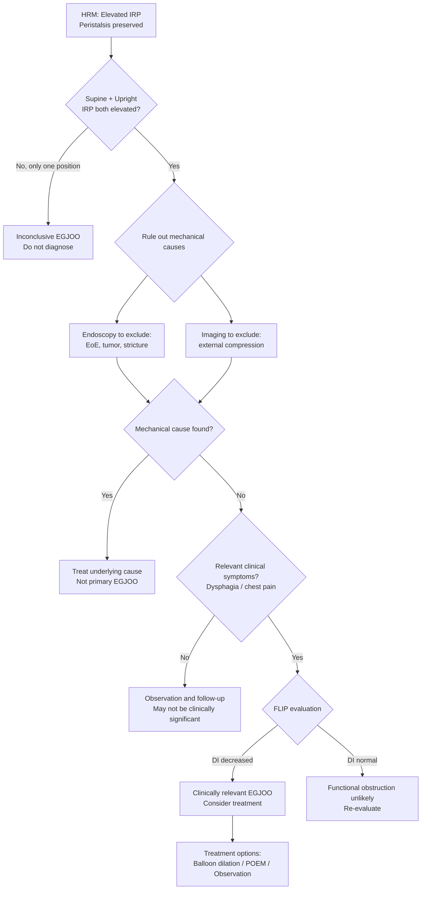

# Esophageal Function Testing -- Clinical FAQ

## Introduction

This section compiles frequently encountered questions in clinical practice regarding esophageal function testing, covering HRM interpretation, reflux monitoring applications, and the practical implementation of Chicago Classification v4.0 and Lyon Consensus 2.0.

---

### Q1: When should reflux monitoring be performed off PPI vs. on PPI?

**Answer**:

**Off-PPI monitoring** -- applicable when the goal is to **establish a GERD diagnosis**:
- The patient has never had conclusive GERD evidence (no LA C/D, no Barrett's)
- Planning antireflux surgery and need preoperative objective confirmation of GERD
- Poor response to empirical PPI therapy; need to confirm whether pathological reflux truly exists
- Discontinuation requirements: PPI for 7 days, H2RA for 3 days, antacids for 6-12 hours

**On-PPI monitoring** -- applicable when **GERD has been confirmed but treatment response is poor**:
- Conclusive GERD evidence exists (LA C/D, long-segment Barrett's), but symptoms persist despite PPI therapy
- Purpose: Assess whether residual reflux persists under PPI control
- **pH-impedance monitoring is recommended** (not pH alone), as reflux may become weakly acidic or non-acidic on medication

> **Clinical point**: If the goal is "to determine whether GERD exists," use off-PPI monitoring. If GERD is already known and the goal is "to evaluate medication effectiveness," use on-PPI monitoring.

---

### Q2: How should borderline IRP be interpreted?

**Answer**:

Borderline IRP is a common clinical challenge. The CCv4.0 approach:

1. **Confirm positional concordance**:
   - Elevated IRP in both supine and upright positions --> higher diagnostic certainty
   - Elevated in supine only with normal upright values --> possible false positive (common causes: catheter displacement, increased abdominal pressure, hiatal hernia effect)

2. **Integrate additional evidence**:
   - FLIP to assess EGJ distensibility (distensibility index, DI): Decreased DI supports true outflow obstruction
   - Timed barium esophagram (TBE): Barium retention at 1 minute and 5 minutes
   - Symptom assessment: Presence of clinical symptoms consistent with EGJ obstruction

3. **Repeat testing**: When uncertain, consider repeating HRM or re-evaluating in different positions

4. **Consider technical factors**:
   - Was the catheter properly positioned?
   - Was the patient excessively anxious, causing increased abdominal pressure?
   - Were medications that affect LES pressure being used (opioids, etc.)?

---

### Q3: What is the complete management algorithm for EGJOO?

**Answer**:

CCv4.0 has adopted a more cautious approach to the diagnosis and management of EGJOO (EGJ Outflow Obstruction):

**Key considerations**:
- Post-CCv4.0, the rate of confirmed EGJOO diagnoses should decrease substantially compared to v3.0
- Many EGJOO diagnoses made under v3.0 criteria may not meet v4.0 standards
- Opioid use is a common cause of false-positive EGJOO
- Invasive treatment should not be pursued without thorough evaluation

---

### Q4: When should FLIP be used instead of HRM? How do the two complement each other?

**Answer**:

FLIP (Functional Lumen Imaging Probe) and HRM measure different aspects:

| Aspect | HRM | FLIP |
|--------|-----|------|
| Measurement | Pressure generated by esophageal wall | Luminal distensibility and compliance |
| Access route | Catheter placed transnasally | Usually placed orally under endoscopic sedation |
| EGJ assessment | Relaxation pressure (IRP) | Distensibility index (DI) |
| Peristalsis assessment | Direct measurement of peristaltic pressure | Can observe FLIP-induced peristaltic response (FLIP panometry) |

**Scenarios where FLIP is particularly valuable**:
1. **Borderline IRP**: FLIP DI can help confirm whether EGJ obstruction truly exists
2. **EGJOO evaluation**: FLIP is an important adjunctive tool for assessing the clinical significance of EGJOO
3. **Eosinophilic esophagitis (EoE)**: FLIP can evaluate decreased esophageal body compliance (fibrosis)
4. **Intraoperative real-time assessment**: FLIP can provide real-time evaluation of myotomy or fundoplication effectiveness during surgery
5. **Children or patients unable to cooperate with HRM**: Performed under sedation without requiring patient cooperation for swallowing

**Recommended combinations**:
- Standard esophageal motility disorder evaluation: HRM as the primary test
- Further evaluation of borderline IRP or EGJOO: HRM + FLIP
- Esophageal function evaluation in EoE: FLIP preferred
- Intraoperative monitoring: FLIP

---

### Q5: Wireless Bravo monitoring vs. catheter-based pH/pH-impedance monitoring -- what are the indications for each?

**Answer**:

| Comparison Item | Catheter-Based pH-Impedance | Wireless Bravo |
|----------------|---------------------------|----------------|
| Monitoring duration | 24 hours | 48-96 hours |
| Nasal catheter | Required | Not required |
| Detection of non-acid reflux | Yes | No |
| Baseline impedance (BI) | Measurable | Not measurable |
| PSPWI | Calculable | Not calculable |
| Impact on daily activities | Nasal catheter may limit activities and eating | Closer to daily life |
| Placement method | Transnasal | Requires endoscopy |
| Cost | Lower | Higher |

**Selection recommendations**:

- **Prefer catheter-based pH-impedance**:
  - Need to detect non-acidic reflux (on-PPI monitoring)
  - Need BI and PSPWI adjunctive metrics
  - Lyon 2.0 borderline zone requiring additional data
  - Standard initial off-PPI evaluation

- **Prefer Bravo**:
  - Patient cannot tolerate nasal catheter
  - Extended monitoring needed to improve sensitivity (e.g., intermittent symptoms)
  - Children or extremely anxious patients
  - High clinical suspicion of reflux when 24-hour monitoring may be normal

---

### Q6: How should discordant HRM and pH monitoring results be managed?

**Answer**:

Discordant results between these two tests are indeed encountered clinically:

**Scenario 1: Normal HRM but abnormal pH monitoring showing pathological reflux**
- The most common combination: normal esophageal motility with GERD
- Reflux may be due to impaired EGJ barrier function (decreased EGJ-CI or Type III EGJ morphology on HRM)
- Transient LES relaxation (TLESR) is the primary reflux mechanism and may not be captured during standard HRM testing
- Management: Focus on reflux treatment

**Scenario 2: Abnormal HRM (e.g., IEM) but normal pH monitoring**
- IEM may affect esophageal clearance, but in the absence of pathological reflux, reflux-targeted treatment may not be needed
- Evaluate whether IEM is related to the patient's dysphagia symptoms
- Consider whether a functional esophageal disorder is present

**Scenario 3: EGJOO (on HRM) but no reflux (on pH monitoring)**
- Not contradictory: EGJOO causes outflow obstruction and is not necessarily accompanied by reflux
- EGJOO symptoms are typically dysphagia, not reflux
- Further evaluation with FLIP and barium esophagram is needed to assess the clinical significance of EGJOO

**Principle**: Each test provides different dimensions of information. When results are discordant, comprehensive clinical assessment is needed rather than reliance on a single test result.

---

### Q7: When should esophageal function testing be repeated?

**Answer**:

**Scenarios where repeat testing is recommended**:
1. **Initial results are inconclusive**: CCv4.0-defined inconclusive diagnoses may be repeated on a different day to confirm consistency
2. **Treatment outcome evaluation**:
   - Post-POEM or myotomy assessment of EGJ function
   - Post-antireflux surgery assessment of reflux control
3. **Significant symptom change**: Previously stable patient develops new symptoms or worsening symptoms
4. **Technical issues**: First test was unreliable due to catheter displacement, poor patient cooperation, or other technical problems
5. **Long-term follow-up**: Certain progressive diseases (e.g., scleroderma-related esophageal involvement) require periodic monitoring

**Scenarios where repeat testing is typically not needed**:
- Initial test result was conclusive and consistent with the clinical picture
- Diagnosis is clear and treatment direction has been established
- No significant change in symptoms in the short term

---

### Q8: What is the role of provocative testing in CCv4.0?

**Answer**:

CCv4.0 has elevated provocative testing to a recommended standard component of the protocol:

#### Multiple Rapid Swallows (MRS)

- **Method**: Rapidly swallow 2 mL water 5 times in succession (interval < 4 seconds)
- **Normal response**:
  - Peristalsis is inhibited during rapid swallowing (deglutitive inhibition)
  - An augmented peristaltic wave follows the last swallow (DCI > baseline mean)
- **Clinical significance**:
  - Assesses peristaltic reserve
  - IEM patients with augmented peristalsis after MRS --> preserved reserve, lower surgical risk
  - IEM patients without peristaltic augmentation after MRS --> absent reserve, cautious consideration of antireflux surgery needed
  - Can help differentiate pre-achalasia from other motility disorders

#### Rapid Drink Challenge (RDC)

- **Method**: Drink 200 mL water rapidly through a straw
- **Normal response**: Adequate EGJ relaxation with smooth liquid passage
- **Clinical significance**:
  - Assesses EGJ function during passage of a large liquid bolus
  - Particularly sensitive for EGJOO evaluation: Failure of EGJ to adequately relax during RDC supports true outflow obstruction
  - Normal RDC response reduces the likelihood of an EGJOO diagnosis

---

### Q9: When is baseline impedance (BI) useful? How should it be applied?

**Answer**:

Baseline impedance (BI) reflects esophageal mucosal integrity and is an important adjunctive metric in Lyon 2.0.

**Measurement method**:
- During 24-hour pH-impedance monitoring, select stable nighttime periods (midnight to 6 AM) without swallowing or reflux
- Calculate the mean nocturnal baseline impedance (MNBI)
- Can also be measured in real time using impedance channels on the HRM catheter (if equipped)

**Significance of decreased BI**:
- Indicates esophageal mucosal damage with increased permeability
- Consistent with GERD-related mucosal injury
- Even when AET is in the borderline range, decreased BI supports a GERD diagnosis

**Primary clinical applications of BI**:
1. **Lyon 2.0 borderline zone (AET 4-6%)**: Decreased BI favors GERD
2. **Differentiating functional heartburn vs. reflux hypersensitivity**: Normal BI favors functional heartburn
3. **Predicting PPI treatment response**: Abnormal BI may predict better PPI response
4. **Evaluation of eosinophilic esophagitis (EoE)**: EoE can also cause decreased BI

**Threshold recommendations**:
- Distal esophageal MNBI < 1500 ohms: Suggestive of mucosal damage
- Normal values vary by system and catheter position; refer to center-specific normative data

---

### Q10: How should Lyon 2.0 be applied in clinical practice?

**Answer**:

Practical steps for implementing Lyon 2.0:

**Step 1: Determine whether conclusive GERD evidence already exists**
- Review endoscopy: LA C/D, long-segment Barrett's, peptic stricture?
- If yes --> GERD is confirmed; off-PPI reflux monitoring is not needed to establish the diagnosis

**Step 2: Select the monitoring approach**
- Need to establish GERD diagnosis --> off-PPI pH or pH-impedance monitoring
- Already confirmed but treatment is suboptimal --> on-PPI pH-impedance monitoring

**Step 3: Interpret primary metrics**
- AET > 6% --> conclusive GERD
- AET < 4% and reflux < 40 episodes --> pathological GERD excluded
- AET 4-6% or other discordance --> proceed to adjunctive metric assessment

**Step 4: Adjunctive metrics (when inconclusive)**
- BI (baseline impedance)
- PSPWI (post-reflux swallow-induced peristaltic wave index)
- Histopathology
- Symptom association (SAP > 95%, SI > 50%)
- Multiple abnormal adjunctive metrics --> favors GERD
- Multiple normal adjunctive metrics --> favors non-GERD

**Step 5: Integrate HRM results**
- EGJ barrier function (EGJ-CI, EGJ morphology) provides additional information
- IEM may impair esophageal clearance capacity
- Achalasia and severe motility disorders should be included in the differential

---

### Q11: What is the follow-up strategy for esophageal function testing after achalasia treatment?

**Answer**:

The purpose of post-treatment follow-up is to assess whether EGJ obstruction has been resolved and whether new problems have arisen:

**Post-treatment HRM changes**:
- IRP should decrease after successful treatment (but may not fully normalize)
- Peristalsis does not recover after treatment of Type I and Type II (esophageal body muscle has already degenerated)
- Spastic contractions may decrease after treatment of Type III

**Follow-up recommendations**:
- Symptom recurrence after treatment: Repeat HRM + timed barium esophagram
- Routine post-treatment follow-up: Practices vary by center; some recommend repeat HRM at 3-6 months
- FLIP can be used for intraoperative real-time assessment and post-treatment follow-up

**Important considerations**:
- Post-treatment HRM normal values may differ from pre-treatment values
- Severe reflux symptoms after treatment require reflux monitoring (especially post-POEM)
- The incidence of post-POEM reflux is higher than after surgical myotomy and requires careful follow-up

---

### Q12: How should esophageal function testing be approached in patients with eosinophilic esophagitis (EoE)?

**Answer**:

Eosinophilic esophagitis (EoE) presents a unique scenario for esophageal function testing:

**Role of HRM in EoE**:
- EoE patients may exhibit various HRM abnormalities: IEM, EGJOO, DES, etc.
- However, the prevalence and clinical significance of these abnormalities remain debated
- The primary functional abnormality in EoE is decreased compliance (esophageal wall fibrosis and stiffness), which HRM may not fully capture

**Role of FLIP in EoE (more important)**:
- FLIP directly measures esophageal distensibility, reflecting the degree of fibrosis in EoE
- Characteristic FLIP finding in EoE: Decreased esophageal body DI (esophagus cannot stretch open)
- FLIP can evaluate treatment response (steroids, dietary restriction, dilation)
- FLIP panometry can observe the esophageal body's peristaltic response to distension

**Recommendations**:
- FLIP is the preferred functional assessment for EoE
- HRM can serve as an adjunct, particularly when dysphagia coexists with suspected motility disorders
- Reflux monitoring can help rule out concomitant GERD

---

### Q13: What is the role of esophageal function testing in bariatric surgery patients?

**Answer**:

Pre- and post-bariatric surgery esophageal function evaluation is receiving increasing attention:

**Preoperative evaluation**:
- Some centers recommend preoperative HRM for bariatric surgery candidates, particularly those with esophageal symptoms
- Rule out achalasia and severe motility disorders (which may affect surgical approach selection)
- Evaluate for preoperative GERD (influences surgical approach: Roux-en-Y vs. sleeve gastrectomy)
- Sleeve gastrectomy has a higher post-operative GERD incidence; patients with severe GERD may be better suited for Roux-en-Y

**Postoperative evaluation**:
- New-onset postoperative dysphagia: HRM to assess for surgery-related EGJ obstruction
- Postoperative GERD symptoms: Reflux monitoring to evaluate reflux severity
- FLIP can assess distensibility of the EGJ or anastomosis postoperatively

### Q14: What is the role of AI in HRM interpretation?

A 2025 systematic review (17 studies, 4,588 patients) showed that AI tools perform well in the following HRM interpretation tasks:

- **Basic tasks**: Anatomical landmark identification, test quality assessment, achalasia identification -- high accuracy
- **Advanced tasks**: Subtype classification, full Chicago Classification automation -- continuously improving
- **Key advantage**: Reduces inter-expert interpretation variability of 30-40%

Currently, AI remains a research tool and has not replaced clinician interpretation. It is anticipated that within the next 3-5 years, AI may be integrated into commercial HRM software as an assistive feature.

---

<!-- 🏥 Hospital-Specific Information - Please fill in -->
> **📋 Please enter your hospital information:**
>
> - Department: _______________
> - Contact / Extension: _______________
> - Clinic Hours: _______________
> - Attending Physician(s): _______________
> - Hospital Specialties / Annual Volume: _______________
<!-- End of hospital-specific information -->
