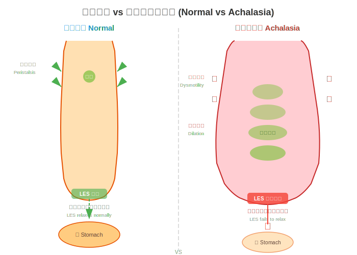
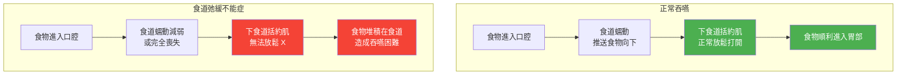

# 食道弛緩不能症（Esophageal Achalasia）— 疾病介紹

## 什麼是食道弛緩不能症？

食道弛緩不能症（Achalasia）是一種罕見的食道運動功能障礙（Esophageal Motility Disorder）。簡單來說，就是食道（Esophagus）下方的肌肉「忘記放鬆」，導致食物無法順利進入胃部（Stomach）。

正常情況下，當我們吞嚥食物時，食道會像波浪一樣將食物往下推，食道最下方的括約肌（Lower Esophageal Sphincter, LES）會適時打開，讓食物進入胃中。但在食道弛緩不能症的患者身上，這個括約肌無法正常放鬆，食物就「卡」在食道裡，造成吞嚥困難。

*圖：正常食道（左）與食道弛緩不能症（右）的比較。正常食道的下食道括約肌會在吞嚥時放鬆讓食物通過；弛緩不能症患者的下食道括約肌無法放鬆，導致食物堆積。*

### 用生活比喻來理解

想像食道是一條通往胃的隧道，隧道的出口有一扇門（下食道括約肌）。正常人的這扇門會在食物到達時自動打開；但食道弛緩不能症患者的門卻「鎖住了」，不管食物怎麼推，門都很難打開。

---

## 正常吞嚥 vs. 食道弛緩不能症

以下示意圖說明正常吞嚥與食道弛緩不能症的差異：

---

## 這個疾病有多常見？

食道弛緩不能症是一種**罕見疾病（Rare Disease）**：

| 項目 | 數據 |
|------|------|
| 發生率（Incidence） | 每年每 10 萬人約 1 ~ 1.6 人 |
| 盛行率（Prevalence） | 每 10 萬人約 10 ~ 13 人 |
| 好發年齡 | 多見於 25 ~ 60 歲，但任何年齡皆可能發生 |
| 性別差異 | 男女比例大致相同 |

> **提醒：** 雖然罕見，但若有持續性吞嚥困難，仍應儘早就醫檢查。

---

## 為什麼會得這個病？

目前醫學界對食道弛緩不能症的**確切病因尚不完全清楚**，但研究指向以下可能原因：

### 1. 神經退化（Neurodegeneration）
食道壁內負責控制肌肉放鬆的神經細胞逐漸退化、消失，導致括約肌無法正常接收「放鬆」的訊號。

### 2. 自體免疫理論（Autoimmune Theory）
目前最受支持的理論之一。研究認為，身體的免疫系統可能錯誤地攻擊食道內的神經節細胞（Ganglion Cells），造成神經損傷。部分患者同時患有其他自體免疫疾病，支持了這一推論。

### 3. 遺傳因素（Genetic Factors）
少數案例顯示家族中有多位成員罹患此病，但目前尚未找到明確的遺傳基因。

### 4. 病毒感染假說（Viral Infection Hypothesis）
有研究指出，某些病毒感染可能觸發免疫反應，間接導致食道神經受損。

> **重要：** 食道弛緩不能症**不是**因為飲食習慣不良、壓力大或情緒問題所引起的。如果您被診斷出此病，請不要自責。

---

## 這個病會怎樣發展？

食道弛緩不能症通常是**慢性且漸進式**的疾病：

1. **早期**：偶爾覺得食物「卡住」，可能被誤認為胃食道逆流（GERD）或壓力造成
2. **中期**：吞嚥困難愈來愈頻繁，固體和液體食物都可能受影響，開始有體重減輕現象
3. **晚期**：食道可能因長期食物堆積而擴張（稱為巨食道症，Megaesophagus），出現嚴重逆流、營養不良

> **好消息：** 雖然無法完全「治癒」，但透過適當治療，**絕大多數患者可以大幅改善症狀**，恢復正常飲食和生活品質。

---

## 食道弛緩不能症與癌症的關係

許多患者在得知診斷後最擔心的問題就是：「這會不會是癌症？」

- 食道弛緩不能症本身**不是癌症**（Cancer）
- 但長期未治療的患者，食道癌（Esophageal Cancer）的風險**略有增加**
- 因此建議接受治療並定期追蹤

> **請放心：** 透過規律回診與追蹤，醫師可以及早發現任何異常變化。

---

## 我該看哪一科？

如果您懷疑自己可能有食道弛緩不能症，可以先掛以下科別：

- **肝膽腸胃科（Gastroenterology）**：負責診斷與評估
- **一般外科 / 胸腔外科（General Surgery / Thoracic Surgery）**：若需要手術治療
- **消化外科（Digestive Surgery）**：專精食道手術的醫師

---

## 本院就醫資訊

<!-- 🏥 院內資料區 - 請自行填入 -->
> **📋 請填入貴院資料：**
>
> - 本院負責科別：_______________
> - 聯絡電話 / 分機：_______________
> - 門診時間：_______________
> - 主治醫師：_______________
> - 本院特色 / 年手術量：_______________
<!-- 院內資料區結束 -->

---

## 重點整理

| 重點 | 說明 |
|------|------|
| 什麼是食道弛緩不能症？ | 食道下方括約肌無法放鬆，食物難以進入胃部 |
| 常見嗎？ | 罕見疾病，每年每 10 萬人約 1 人發生 |
| 原因 | 可能與自體免疫、神經退化有關，確切病因未明 |
| 會好嗎？ | 無法完全治癒，但治療可大幅改善症狀 |
| 是癌症嗎？ | 不是癌症，但需定期追蹤 |

---
## 延伸閱讀
- [想了解更多？請參閱進階版](../進階版/01_病理機轉與亞型分類.md)
- [食道功能檢查介紹](../../食道功能檢查/一般版/01_什麼是食道功能檢查.md)
