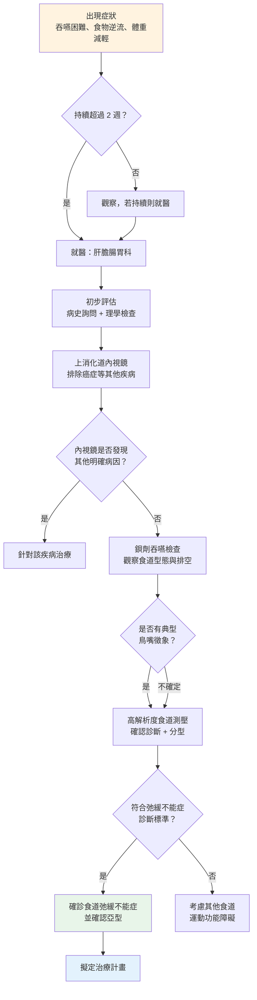

# 食道弛緩不能症（Esophageal Achalasia）— 症狀與診斷

## 常見症狀有哪些？

食道弛緩不能症的症狀通常**慢慢出現**，一開始可能不太明顯，容易被忽略或誤認為其他問題。以下是最常見的症狀：

### 1. 吞嚥困難（Dysphagia）— 最核心的症狀

- 這是幾乎**所有患者**都會經歷的症狀
- 一開始可能只有吞固體食物時覺得「卡住」
- 隨著病情發展，**連喝水、喝湯等液體都會有困難**
- 患者常描述為「食物停在胸口，下不去」

> **與其他疾病不同的特點：** 一般食道狹窄只影響固體食物，但食道弛緩不能症常常**固體和液體都會困難**，這是重要的鑑別線索。

### 2. 食物逆流（Regurgitation）

- 未消化的食物從食道逆流回口腔
- 注意：這和胃食道逆流（GERD）不同 — 逆流的食物**沒有酸味**，因為食物還沒到達胃部
- 常發生在**躺下或彎腰**時
- 夜間逆流可能導致嗆咳，甚至吸入性肺炎（Aspiration Pneumonia）

### 3. 體重減輕（Weight Loss）

- 因為進食困難，攝取的食物量減少
- 長期下來可能出現營養不良（Malnutrition）
- 有些患者會**不自覺地避免進食**，因為怕吞不下去

### 4. 胸痛（Chest Pain）

- 食道痙攣或食物堆積造成的胸口不適
- 胸痛可能被誤認為心臟問題（如心絞痛），但實際上是食道肌肉痙攣所引起，需與心臟疾病做鑑別診斷
- 部分患者在進食時或進食後感到明顯胸痛

### 5. 咳嗽與呼吸道症狀

- 食物逆流進入呼吸道引起慢性咳嗽
- 夜間咳嗽特別明顯
- 反覆性肺炎（Recurrent Pneumonia）是嚴重的併發症

### 6. 燒心感（Heartburn）

- 部分患者會有類似胃酸逆流的燒灼感
- 容易被誤診為胃食道逆流疾病（Gastroesophageal Reflux Disease, GERD）
- 但服用制酸劑（Antacid）後效果不佳

### 症狀嚴重度對照表

| 症狀 | 發生率 | 特徵描述 |
|------|--------|----------|
| 吞嚥困難（Dysphagia） | > 90% | 固體和液體皆受影響 |
| 食物逆流（Regurgitation） | 60 ~ 90% | 無酸味的未消化食物 |
| 體重減輕（Weight Loss） | 30 ~ 60% | 漸進式，可達數公斤 |
| 胸痛（Chest Pain） | 25 ~ 50% | 進食時或進食後發生 |
| 咳嗽（Cough） | 20 ~ 40% | 夜間較明顯 |
| 燒心感（Heartburn） | 20 ~ 40% | 制酸劑效果不佳 |

---

## 什麼時候應該看醫師？

如果您有以下情況，建議儘早就醫：

- **吞嚥困難持續超過 2 週**，無論是固體或液體
- 經常性食物逆流，尤其是**夜間逆流或嗆到**
- 不明原因的**體重持續下降**
- 吃東西時反覆出現**胸痛**
- 已被診斷為胃食道逆流，但藥物治療**效果不好**
- 反覆性肺炎或不明原因的慢性咳嗽

> **提醒：** 食道弛緩不能症的症狀平均要經過 **2 ~ 5 年** 才被正確診斷。如果您有持續性的吞嚥問題，請主動告知醫師您的完整症狀，有助於縮短診斷時間。

---

## 醫師會做哪些檢查？

確診食道弛緩不能症通常需要以下幾項檢查：

### 1. 上消化道攝影 / 鋇劑吞嚥檢查（Barium Swallow / Esophagram）

**什麼是這個檢查？**
- 喝下含有鋇劑（Barium）的白色液體
- 透過 X 光觀察鋇劑在食道中的流動情形

**會看到什麼？**
- 典型的「鳥嘴徵象」（Bird-beak Sign）：食道下端像鳥嘴一樣變窄
- 食道上方可能擴張，鋇劑堆積在食道中不易排空
- 嚴重時可見食道明顯擴大，呈現「S 型」或「乙狀結腸樣」（Sigmoid-shaped）外觀

**檢查感受：**
- 無痛、非侵入性
- 約 15 ~ 30 分鐘完成
- 只需喝下鋇劑液體即可

<!-- 📷 圖片佔位 -->
> **🖼️ 請插入圖片：**
> - 建議圖片：鋇劑吞嚥攝影顯示「鳥嘴狀外觀」(Bird-beak appearance)
> - 檔案放置：`../images/barium_bird_beak.png`
> - 來源：院內病例影像（需去識別化）

<!-- 圖片佔位結束 -->

### 2. 食道壓力測定 / 高解析度食道測壓（High-Resolution Manometry, HRM）

**什麼是這個檢查？**
- 經由鼻腔放入一條細細的壓力感測管到食道中
- 測量食道各段的壓力變化和蠕動功能

**為什麼重要？**
- 這是診斷食道弛緩不能症的**「黃金標準」（Gold Standard）**
- 可以精確判斷下食道括約肌是否無法放鬆
- 能區分不同亞型（Subtype），對治療選擇非常重要

**檢查感受：**
- 放管時可能有短暫不適，但多數人可以忍受
- 檢查過程中會請您喝幾口水，觀察吞嚥時的壓力變化
- 全程約 20 ~ 30 分鐘

<!-- 📷 圖片佔位 -->
> **🖼️ 請插入圖片：**
> - 建議圖片：高解析度食道壓力測定 (HRM) Clouse Plot 顯示弛緩不能症特徵
> - 檔案放置：`../images/hrm_achalasia_clouse_plot.png`
> - 來源：院內檢查報告（需去識別化）

<!-- 圖片佔位結束 -->

### 3. 上消化道內視鏡 / 胃鏡（Upper Endoscopy / Esophagogastroduodenoscopy, EGD）

**什麼是這個檢查？**
- 經由口腔將一條帶攝影鏡頭的軟管放入食道和胃
- 直接觀察食道內部的狀況

**目的：**
- **排除其他疾病**：如食道癌、食道狹窄等
- 觀察食道是否有發炎、糜爛或食物殘留
- 排除「假性弛緩不能症」（Pseudoachalasia），這可能是腫瘤造成的類似症狀

**檢查感受：**
- 可選擇鎮靜麻醉（Sedation），讓您在睡眠中完成
- 若無鎮靜，可能有噁心感
- 約 10 ~ 20 分鐘完成

### 4. 電腦斷層掃描 (CT) 或內視鏡超音波 (EUS)

當懷疑「假性弛緩不能症」(Pseudoachalasia) 時，醫師可能安排 CT 掃描或內視鏡超音波檢查：

- **假性弛緩不能症**：約占所有弛緩不能症表現的 2-4%，通常由食道胃交界處的腫瘤引起，症狀與真正的弛緩不能症非常相似
- **何時需要排除**：年齡 > 55 歲且症狀持續時間 < 1 年、體重快速下降、吞嚥困難急速惡化
- **檢查目的**：排除食道或胃賁門處的惡性腫瘤

### 5. 其他可能的輔助檢查

| 檢查項目 | 目的 |
|----------|------|
| 胸部 X 光（Chest X-ray） | 初步篩檢，可能看到擴張的食道 |
| 電腦斷層掃描（CT Scan） | 排除腫瘤或其他結構異常 |
| 內視鏡超音波（EUS） | 進一步排除假性弛緩不能症 |
| 定時鋇劑排空測試（Timed Barium Esophagram, TBE） | 評估食道排空功能，也用於治療後追蹤 |

---

## 診斷流程圖

以下是食道弛緩不能症從症狀到確診的典型流程：

---

## 常被誤診為什麼疾病？

食道弛緩不能症因為症狀不特異，常常被誤認為其他疾病：

| 容易混淆的疾病 | 相似之處 | 如何區分 |
|---------------|----------|----------|
| 胃食道逆流（GERD） | 燒心感、逆流 | 弛緩不能症的逆流物無酸味；制酸劑效果不佳 |
| 食道癌（Esophageal Cancer） | 吞嚥困難、體重減輕 | 內視鏡可區分；癌症多影響固體為主 |
| 心臟疾病 | 胸痛 | 心電圖、心臟檢查可排除 |
| 焦慮 / 壓力 | 吞嚥有異物感 | 弛緩不能症有客觀檢查異常 |
| 嗜酸性食道炎（Eosinophilic Esophagitis） | 吞嚥困難 | 內視鏡切片可區分 |

> **提醒：** 如果您被診斷為胃食道逆流但治療效果不好，請考慮要求進一步檢查。

---

## 本院就醫資訊

<!-- 🏥 院內資料區 - 請自行填入 -->
> **📋 請填入貴院資料：**
>
> - 本院負責科別：_______________
> - 聯絡電話 / 分機：_______________
> - 門診時間：_______________
> - 主治醫師：_______________
> - 本院特色 / 年手術量：_______________
<!-- 院內資料區結束 -->

---

## 重點整理

| 重點 | 說明 |
|------|------|
| 最常見症狀 | 吞嚥困難（固體和液體都受影響） |
| 特色症狀 | 無酸味的食物逆流 |
| 何時就醫 | 吞嚥困難超過 2 週、不明原因體重減輕 |
| 最關鍵的檢查 | 高解析度食道測壓（黃金標準） |
| 必做的檢查 | 內視鏡（排除癌症等其他原因） |

---
## 延伸閱讀
- [想了解更多？請參閱進階版](../進階版/01_病理機轉與亞型分類.md)
- [食道功能檢查介紹](../../食道功能檢查/一般版/01_什麼是食道功能檢查.md)
