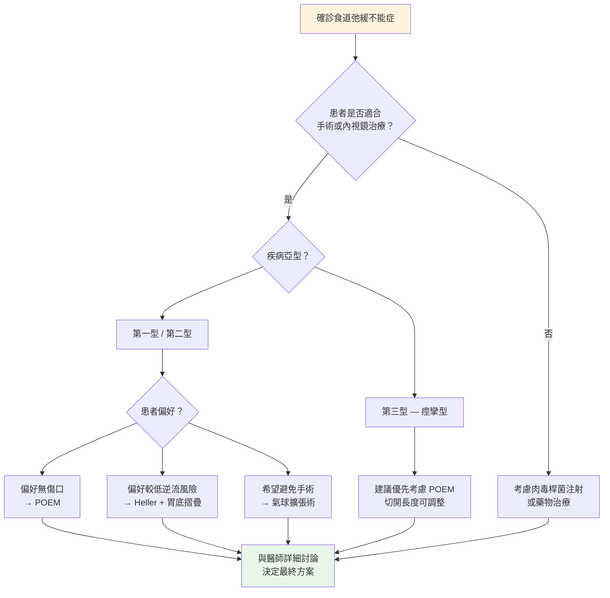

# 食道弛緩不能症（Esophageal Achalasia）— 治療方式

## 治療的目標是什麼？

食道弛緩不能症目前**無法完全治癒**，因為已經退化的神經無法再生。但好消息是，透過治療可以達成以下目標：

- **降低下食道括約肌（LES）的壓力**，讓食物能順利通過
- **改善吞嚥困難**的症狀
- **預防食道進一步擴張**
- **恢復正常飲食**與生活品質

> **重要觀念：** 治療的核心策略是「打開那扇門」— 透過各種方式讓緊閉的下食道括約肌能夠放鬆或被切開。

---

## 治療選項總覽

### 1. 藥物治療（Medical Therapy）

**適用情況：** 症狀輕微、無法接受手術、或作為等待治療期間的過渡

**常用藥物：**
- **鈣離子通道阻斷劑（Calcium Channel Blockers）**：如 Nifedipine，可放鬆食道平滑肌
- **硝酸鹽類（Nitrates）**：如 Isosorbide dinitrate，幫助括約肌放鬆

**效果與限制：**
- 症狀改善有限，通常只能部分緩解
- 副作用包括頭痛、低血壓、頭暈
- **長期效果不佳**，不建議作為主要治療方式
- 適合不適合其他治療的患者

---

### 2. 肉毒桿菌注射（Botulinum Toxin Injection, BTX）

**什麼是這個治療？**
- 透過胃鏡將肉毒桿菌素（Botox）直接注射到下食道括約肌
- 肉毒桿菌素可以暫時麻痺括約肌，使其放鬆

**優點：**
- 操作簡單、風險低
- 不需全身麻醉
- 門診即可完成

**缺點：**
- **效果是暫時的**，通常只維持 6 ~ 12 個月
- 需要反覆注射
- 長期反覆注射可能造成食道壁纖維化，增加日後手術困難度
- 症狀緩解率約 70 ~ 80%，但效果會隨時間遞減

**最適合的對象：**
- 年長者或身體狀況不適合手術者
- 作為診斷性治療（確認症狀是否因括約肌造成）
- 等待手術期間的過渡治療

---

### 3. 氣球擴張術（Pneumatic Dilation, PD）

**什麼是這個治療？**
- 透過胃鏡將一個特殊的氣球（Balloon）放到下食道括約肌處
- 充氣將氣球撐大，藉此**撐裂（Disruption）**緊縮的括約肌纖維

**優點：**
- 不需開刀，屬於內視鏡治療
- 單次治療成功率約 **65 ~ 80%**
- 可重複進行以提高效果
- 住院時間短（通常 1 天或門診即可）

**缺點：**
- 食道穿孔（Esophageal Perforation）的風險約 1 ~ 5%
- 部分患者症狀可能復發，需要再次擴張
- 可能需要多次治療才能達到理想效果

**效果：**
- 單次擴張約 65 ~ 80% 的患者症狀改善
- 多次擴張（分級擴張）可提高到 85 ~ 90% 的成功率

---

### 4. 乙乙乙 腹腔鏡乙乙乙 海勒乙乙乙 肌肉切開術（Laparoscopic Heller Myotomy, LHM）

**什麼是這個手術？**
- 透過腹腔鏡（微創手術）在下食道括約肌處**切開肌肉層**
- 通常會同時加做**胃底摺疊術（Fundoplication）**，以減少術後胃食道逆流

**優點：**
- **長期效果佳**，10 年成功率約 80 ~ 85%
- 單次手術即可達到良好效果
- 微創手術，傷口小、恢復快

**缺點：**
- 需要全身麻醉和住院（通常 1 ~ 3 天）
- 有手術相關風險（出血、感染等）
- 術後可能出現胃食道逆流（GERD），約 10 ~ 30%
- 需要有經驗的外科醫師執行

**效果：**
- 短期症狀緩解率約 85 ~ 95%
- 長期（10 年以上）成功率約 80 ~ 85%

---

### 5. 經口內視鏡肌肉切開術（Peroral Endoscopic Myotomy, POEM）

**什麼是 POEM？**
- 這是近年來最重要的治療創新，於 2010 年左右開始臨床應用
- 透過口腔將內視鏡伸入食道，在食道黏膜下建立一條「隧道」
- 經由這條隧道，**從食道內部切開括約肌**
- 完全不需要在體表開刀

**優點：**
- **完全無體表傷口**（No External Incision）
- 症狀緩解率高達 **80 ~ 95%**
- 住院時間短（通常 1 ~ 2 天）
- 恢復快，多數患者 1 ~ 2 週可恢復正常飲食
- 對第三型（Type III，痙攣型）弛緩不能症效果特別好
- 可依需要調整切開的長度

**缺點：**
- 需要受過專業訓練的醫師執行
- 術後胃食道逆流（GERD）的發生率較高，約 20-50%（依症狀評估）；若以內視鏡檢查，食道炎發生率約 30-60%，多數可透過質子幫浦抑制劑 (PPI) 控制
- 不包含抗逆流手術步驟
- 長期（超過 10 年）的數據仍在累積中

**效果：**
- 短期（1 ~ 2 年）症狀緩解率約 **80 ~ 95%**
- 中期（3 ~ 5 年）效果仍維持良好
- 根據 SAGES 2024 年指引，POEM 已被建議為**優先考慮**的治療選項之一

> **最新進展 (2025-2026)**：部分醫療中心已開始施行「POEM-F」，即在 POEM 手術同時進行內視鏡胃底摺疊術，以減少術後胃食道逆流。早期研究顯示 GERD 緩解率達 86%，但此技術仍在發展階段。

<!-- 📷 待補充：POEM 手術內視鏡畫面 — 建議引用 IJGII Open Access (CC-BY-NC) -->
<!-- 來源：https://www.ijgii.org/journal/view.html?volume=14&number=4&spage=197 -->

---

## 治療方式比較表

| 比較項目 | 藥物治療 | 肉毒桿菌注射 | 氣球擴張術 | Heller 手術 | POEM |
|----------|----------|-------------|-----------|-------------|------|
| 治療方式 | 口服藥 | 胃鏡注射 | 胃鏡氣球 | 腹腔鏡手術 | 內視鏡手術 |
| 麻醉方式 | 不需要 | 鎮靜 | 鎮靜/全麻 | 全身麻醉 | 全身麻醉 |
| 體表傷口 | 無 | 無 | 無 | 小切口 3~5 個 | 無 |
| 住院天數 | 不需住院 | 不需住院 | 0~1 天 | 1~3 天 | 1~2 天 |
| 症狀緩解率 | 低（< 50%） | 中（70~80%） | 中高（65~80%） | 高（85~95%） | 高（80~95%） |
| 效果持續 | 短暫 | 6~12 個月 | 數年 | 長期 | 長期 |
| 術後逆流風險 | 無 | 低 | 低 | 中（10~30%） | 較高（20~50%） |
| 適合對象 | 過渡期 | 高齡/無法手術 | 多數患者 | 多數患者 | 多數患者 |

---

## 治療選擇決策參考

以下流程圖可幫助您與醫師討論最適合的治療方式：

> **重要提醒：** 以上流程僅供參考，實際治療選擇需要根據您的年齡、身體狀況、疾病亞型、個人意願及醫師專業判斷來綜合決定。

---

## 治療後需要注意什麼？

無論接受哪種治療，以下事項都很重要：

### 短期（治療後 1 ~ 4 週）
- 按照醫師指示**漸進恢復飲食**（通常從流質 → 軟食 → 正常飲食）
- 避免刺激性食物
- 注意有無發燒、劇烈胸痛、嘔血等異常狀況
- 按時服藥，尤其是醫師開立的制酸劑

### 長期追蹤
- 定期回診評估症狀改善程度
- 可能需要進行**定時鋇劑排空測試（Timed Barium Esophagram）**追蹤
- 若症狀復發，可與醫師討論後續處理方案
- 長期追蹤食道狀況，監測有無癌變風險

---

## 本院就醫資訊

<!-- 🏥 院內資料區 - 請自行填入 -->
> **📋 請填入貴院資料：**
>
> - 本院負責科別：_______________
> - 聯絡電話 / 分機：_______________
> - 門診時間：_______________
> - 主治醫師：_______________
> - 本院特色 / 年手術量：_______________
<!-- 院內資料區結束 -->

---

## 重點整理

| 重點 | 說明 |
|------|------|
| 治療目標 | 降低下食道括約肌壓力，讓食物順利通過 |
| 效果最持久的治療 | POEM 和 Heller 手術（長期成功率最高） |
| 最新趨勢 | POEM 為近年主流治療選項之一 |
| 術後逆流 | POEM 較高、Heller + 胃底摺疊較低 |
| 決策關鍵 | 需考量亞型、年齡、個人偏好，與醫師共同決定 |

---
## 延伸閱讀
- [想了解更多？請參閱進階版](../進階版/02_POEM_vs_Heller手術比較.md)
- [食道功能檢查介紹](../../食道功能檢查/一般版/01_什麼是食道功能檢查.md)
