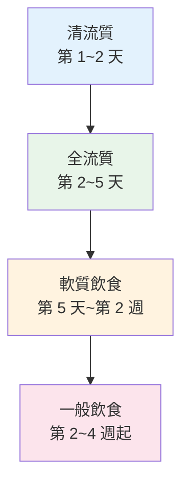

# 食道弛緩不能症（Esophageal Achalasia）— 日常照護與飲食建議

## 前言

食道弛緩不能症是一種需要長期管理的慢性疾病。除了醫療治療之外，**日常的飲食技巧與生活習慣調整**對於改善症狀、維持營養和生活品質同樣重要。

本篇將提供實用的日常照護建議，幫助您在治療前、治療後都能吃得更順暢、過得更舒適。

---

## 飲食基本原則

### 1. 小口慢嚼（Small Bites, Thorough Chewing）

- 每一口食物切成**小塊**，大小約一顆花生米到一顆葡萄
- **充分咀嚼**：每口至少咀嚼 20 ~ 30 下，讓食物變成接近糊狀
- 細嚼慢嚥能減少食物卡在食道的機率
- 不要趕時間用餐，每餐至少安排 **30 分鐘**

### 2. 配水進食（Drink Water with Meals）

- 每吞一口食物後，喝一小口水幫助沖洗食道
- 水的重力可以幫助食物通過括約肌
- 選擇**室溫或微溫的水**，避免冰水（冰水可能使食道痙攣加劇）
- 也可以適度搭配溫湯進食

### 3. 坐直進食（Upright Position）

- 進食時保持**上半身直立或微前傾**
- 利用重力幫助食物向下移動
- **絕對不要躺著吃東西**
- 用餐後至少保持直立 **30 ~ 60 分鐘**再躺下

### 4. 少量多餐（Small, Frequent Meals）

- 將一天三大餐改為 **5 ~ 6 小餐**
- 每餐份量減少，減輕食道的負擔
- 避免一次吃太多造成食物大量堆積在食道
- 兩餐之間可安排小點心

### 5. 睡前禁食（Avoid Eating Before Bed）

- **睡前 3 ~ 4 小時不要進食**
- 減少夜間食物逆流和嗆咳的風險
- 睡覺時可將床頭抬高 15 ~ 20 公分（約 6 ~ 8 吋）
- 使用楔型枕頭（Wedge Pillow）也有幫助

---

## 食物選擇建議

### 推薦的食物（較容易通過食道）

| 類別 | 推薦食物 |
|------|----------|
| 主食 | 稀飯、粥、軟飯、麵線、燕麥粥、吐司（去硬邊） |
| 蛋白質 | 蒸蛋、嫩豆腐、魚肉（去刺）、絞肉、蒸蛋糕 |
| 蔬菜 | 煮軟的蔬菜（南瓜、冬瓜、地瓜葉）、蔬菜泥 |
| 水果 | 香蕉、木瓜、蘋果泥、水蜜桃（去皮）、西瓜 |
| 湯品 | 清湯、濃湯（打碎過濾）、味噌湯 |
| 飲品 | 溫水、果汁（過濾無渣）、豆漿、牛奶 |
| 點心 | 布丁、優格、奶酪、蒸蛋糕 |

### 需要注意或避免的食物

| 類別 | 應避免的食物 | 原因 |
|------|------------|------|
| 硬質食物 | 堅果、生胡蘿蔔、硬糖果 | 不易咀嚼充分，容易卡住 |
| 纖維粗的食物 | 芹菜、竹筍、牛蒡 | 粗纖維不易通過 |
| 黏性食物 | 麻糬、湯圓、年糕 | 黏性高，易附著在食道壁 |
| 大塊肉類 | 牛排、帶骨雞肉 | 不易充分咀嚼 |
| 乾燥食物 | 餅乾、未泡軟的麵包 | 缺少水分，不易通過 |
| 刺激性食物 | 辣椒、過酸食物 | 可能刺激食道黏膜 |
| 碳酸飲料 | 可樂、汽水 | 產氣可能加重脹氣不適 |
| 酒精 | 各類酒精飲品 | 影響食道蠕動功能 |

> **提醒：** 每個人的耐受程度不同。建議記錄「飲食日記」，觀察哪些食物對您來說比較容易通過，哪些容易造成不適。

---

## 進食技巧

### 日常小撇步

1. **溫熱食物通常比冷食容易吞嚥** — 溫度可幫助食道肌肉稍微放鬆
2. **碳酸水偶爾有幫助** — 有些患者發現少量碳酸水可以幫助推動食物（但因人而異）
3. **進食時保持放鬆** — 緊張和焦慮可能加重食道痙攣
4. **試著在吞嚥時稍微抬下巴** — 有些患者覺得這個姿勢有幫助
5. **避免邊吃邊說話** — 可能吞入過多空氣

### 外出用餐建議

- 選擇有**軟質餐點**選項的餐廳
- 不要因為趕時間而匆忙進食
- 隨身攜帶水瓶
- 告知同行友人您的飲食需求，不要覺得不好意思
- 可以先跟餐廳確認是否能調整食物的軟硬度

---

## 生活習慣調整

### 睡眠注意事項

- **抬高床頭 15 ~ 20 公分**：用磚塊或木塊墊高床腳，效果比多墊枕頭好
- **使用楔型枕頭**：維持上半身微微抬高的角度
- **側睡**（左側臥較佳）：減少逆流的機會
- 睡前不要喝大量液體

### 日常活動

- 適度運動是好的，但**避免飯後立刻做劇烈運動或彎腰動作**
- 避免穿過緊的衣物或束腰帶，以免增加腹腔壓力
- 保持健康體重 — 肥胖會增加腹腔壓力
- 戒菸 — 吸菸會影響食道括約肌功能

### 心理健康

食道弛緩不能症可能對心理造成影響，這是完全正常的：

- 無法自在享用美食可能帶來**挫折感和沮喪**
- 社交聚餐時可能感到**焦慮或尷尬**
- 建議加入**病友支持團體**，與有相同經歷的人交流
- 如果情緒困擾嚴重，不要猶豫尋求心理諮商協助

---

## 治療後的飲食恢復計畫

無論您接受的是氣球擴張、POEM 或 Heller 手術，治療後的飲食恢復通常依照以下階段：

### 階段一：清流質飲食（治療後第 1 ~ 2 天）

- 清水、無渣果汁、清湯
- 少量多次，每次約 60 ~ 120 毫升
- 確認吞嚥無問題後進入下一階段

### 階段二：全流質飲食（第 2 ~ 5 天）

- 稀粥、濃湯、豆漿、牛奶、優酪乳
- 營養補充飲品（如安素等）
- 持續少量多餐

### 階段三：軟質飲食（第 5 天 ~ 第 2 週）

- 粥品、蒸蛋、豆腐、魚肉泥
- 煮爛的麵條、燕麥粥
- 水果泥、蒸軟的蔬菜

### 階段四：一般飲食（第 2 ~ 4 週起）

- 逐步恢復正常飲食
- 仍建議維持小口慢嚼、配水進食的習慣
- 觀察有無不適，若有困難退回上一階段

> **重要：** 實際的恢復速度因人而異，請遵照您的主治醫師指示調整。

---

## 定期追蹤與回診

治療後的定期追蹤非常重要：

| 追蹤時間 | 建議項目 |
|----------|----------|
| 治療後 1 ~ 2 週 | 回診確認恢復狀況 |
| 治療後 1 ~ 3 個月 | 症狀評估、可能安排鋇劑排空測試 |
| 治療後 6 個月 | 評估症狀改善程度 |
| 治療後 1 年 | 全面評估，可能安排食道測壓追蹤 |
| 之後每 1 ~ 2 年 | 定期追蹤，監測症狀有無復發 |
| 長期 | 定期胃鏡追蹤（監測食道變化） |

---

## 什麼時候需要緊急就醫？

出現以下狀況請**立即就醫**或撥打急救電話：

- **完全無法吞嚥**，包括口水都吞不下去
- **劇烈胸痛**，尤其合併發燒
- **嘔血**或吐出咖啡色液體
- **高燒不退**（超過 38.5 度C）
- **嚴重脫水**症狀（極度口渴、尿量很少、頭暈）
- 治療後突然出現**劇烈腹痛**
- **呼吸困難**或嚴重嗆咳

> **提醒：** 若有疑慮，寧可就醫確認，不要忍耐等待。

---

## 營養補充建議

由於進食困難，部分患者可能需要額外的營養補充：

- **高熱量營養品**：市售的完整營養飲品（如安素、補體素等）
- **蛋白質補充**：可考慮蛋白粉沖泡飲品
- **維生素與礦物質**：在醫師建議下補充綜合維生素
- **體重監測**：定期量體重，若持續下降應告知醫師

---

## 本院就醫資訊

<!-- 🏥 院內資料區 - 請自行填入 -->
> **📋 請填入貴院資料：**
>
> - 本院負責科別：_______________
> - 聯絡電話 / 分機：_______________
> - 門診時間：_______________
> - 主治醫師：_______________
> - 本院特色 / 年手術量：_______________
<!-- 院內資料區結束 -->

---

## 重點整理

| 重點 | 說明 |
|------|------|
| 進食核心技巧 | 小口慢嚼、配水進食、坐直吃 |
| 餐次安排 | 少量多餐，一天 5 ~ 6 小餐 |
| 睡前注意 | 睡前 3 ~ 4 小時不進食，床頭抬高 |
| 食物選擇 | 選軟質、濕潤食物；避免硬、黏、乾燥食物 |
| 緊急就醫 | 完全無法吞嚥、嘔血、劇烈胸痛合併發燒 |

---
## 延伸閱讀
- [想了解更多？請參閱進階版](../進階版/02_POEM_vs_Heller手術比較.md)
- [食道功能檢查介紹](../../食道功能檢查/一般版/01_什麼是食道功能檢查.md)
