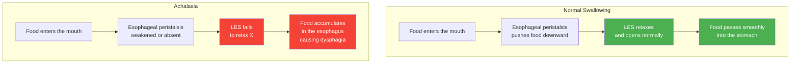

# Esophageal Achalasia — Disease Introduction

## What Is Esophageal Achalasia?

Esophageal achalasia (Achalasia) is a rare esophageal motility disorder. In simple terms, the muscles at the lower end of the esophagus "forget to relax," preventing food from passing smoothly into the stomach.

Normally, when we swallow food, the esophagus pushes food downward in a wave-like motion, and the Lower Esophageal Sphincter (LES) at the bottom of the esophagus opens at the right time to let food enter the stomach. However, in patients with achalasia, this sphincter cannot relax properly, so food gets "stuck" in the esophagus, causing difficulty swallowing.

*Figure: Comparison of a normal esophagus (left) and achalasia (right). In a normal esophagus, the LES relaxes during swallowing to allow food to pass; in achalasia, the LES fails to relax, causing food to accumulate.*

### An Everyday Analogy

Imagine the esophagus as a tunnel leading to the stomach, with a door at the exit (the LES). In a healthy person, this door opens automatically when food arrives; but in a patient with achalasia, the door is "locked" — no matter how hard the food pushes, it can barely open.

---

## Normal Swallowing vs. Achalasia

The following diagram illustrates the difference between normal swallowing and achalasia:

---

## How Common Is This Disease?

Esophageal achalasia is a **rare disease**:

| Item | Data |
|------|------|
| Incidence | Approximately 1 to 1.6 per 100,000 people per year |
| Prevalence | Approximately 10 to 13 per 100,000 people |
| Age of Onset | Most commonly between ages 25 and 60, but can occur at any age |
| Sex Distribution | Roughly equal between males and females |

> **Note:** Although rare, persistent difficulty swallowing should prompt early medical evaluation.

---

## What Causes This Disease?

The **exact cause** of esophageal achalasia is **not fully understood**, but research points to the following possible causes:

### 1. Neurodegeneration
The nerve cells within the esophageal wall that control muscle relaxation gradually degenerate and disappear, preventing the sphincter from receiving the "relax" signal.

### 2. Autoimmune Theory
One of the most supported theories. Research suggests that the body's immune system may mistakenly attack the ganglion cells within the esophagus, causing nerve damage. The fact that some patients also have other autoimmune diseases supports this hypothesis.

### 3. Genetic Factors
A small number of cases show multiple family members affected, but no specific causative gene has been identified.

### 4. Viral Infection Hypothesis
Some studies suggest that certain viral infections may trigger an immune response that indirectly damages esophageal nerves.

> **Important:** Esophageal achalasia is **not** caused by poor dietary habits, stress, or emotional problems. If you have been diagnosed with this condition, please do not blame yourself.

---

## How Does This Disease Progress?

Esophageal achalasia is typically a **chronic and progressive** disease:

1. **Early stage**: Occasional sensation of food "getting stuck," which may be mistaken for GERD or stress
2. **Middle stage**: Dysphagia becomes more frequent, affecting both solid and liquid foods; weight loss begins
3. **Late stage**: The esophagus may dilate due to prolonged food accumulation (called megaesophagus), leading to severe regurgitation and malnutrition

> **Good news:** Although it cannot be completely "cured," with appropriate treatment, **the vast majority of patients can achieve significant symptom improvement** and restore normal eating and quality of life.

---

## Achalasia and Cancer

One of the most common concerns after diagnosis is: "Could this be cancer?"

- Esophageal achalasia itself is **not cancer**
- However, patients with long-term untreated disease have a **slightly increased** risk of esophageal cancer
- Regular treatment and follow-up are therefore recommended

> **Rest assured:** Through regular follow-up visits, your physician can detect any abnormal changes early.

---

## Which Specialist Should I See?

If you suspect you may have esophageal achalasia, consider visiting the following departments:

- **Gastroenterology**: Responsible for diagnosis and evaluation
- **General Surgery / Thoracic Surgery**: If surgical treatment is needed
- **Digestive Surgery**: Physicians specializing in esophageal surgery

---

## Hospital Information

<!-- 🏥 Hospital-Specific Information - Please fill in -->
> **📋 Please enter your hospital information:**
>
> - Department: _______________
> - Contact / Extension: _______________
> - Clinic Hours: _______________
> - Attending Physician(s): _______________
> - Hospital Specialties / Annual Volume: _______________
<!-- End of hospital-specific information -->

---

## Key Points Summary

| Key Point | Explanation |
|-----------|-------------|
| What is esophageal achalasia? | The LES fails to relax, preventing food from entering the stomach |
| Is it common? | Rare disease; approximately 1 per 100,000 people per year |
| Cause | Possibly related to autoimmunity and neurodegeneration; exact cause unknown |
| Can it be cured? | Cannot be completely cured, but treatment can significantly improve symptoms |
| Is it cancer? | Not cancer, but regular follow-up is needed |

---
## Further Reading
- [Want to learn more? See the Advanced Version](../../進階版/EN/01_Pathophysiology_and_Subtypes.md)
- [Introduction to Esophageal Function Testing](../../../食道功能檢查/一般版/EN/01_What_Is_Esophageal_Function_Testing.md)
