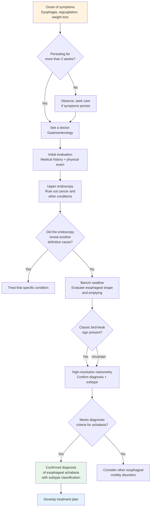

# Esophageal Achalasia — Symptoms and Diagnosis

## What Are the Common Symptoms?

Symptoms of esophageal achalasia usually **develop gradually**, may be subtle at first, and are easily overlooked or mistaken for other conditions. The most common symptoms include:

### 1. Dysphagia (Difficulty Swallowing) — The Core Symptom

- This is experienced by nearly **all patients**
- Initially, only solid foods may feel "stuck"
- As the disease progresses, **even liquids such as water and soup become difficult to swallow**
- Patients often describe it as "food stops at the chest and won't go down"

> **A distinguishing feature:** Typical esophageal strictures only affect solid food, but achalasia often causes difficulty with **both solids and liquids** — this is an important diagnostic clue.

### 2. Regurgitation

- Undigested food flows back from the esophagus into the mouth
- Note: This differs from GERD — the regurgitated food has **no sour taste** because it has not reached the stomach
- Often occurs when **lying down or bending over**
- Nighttime regurgitation can lead to coughing and even aspiration pneumonia

### 3. Weight Loss

- Reduced food intake due to difficulty eating
- Can lead to malnutrition over time
- Some patients **subconsciously avoid eating** out of fear of not being able to swallow

### 4. Chest Pain

- Chest discomfort caused by esophageal spasm or food accumulation
- Pain may be mistaken for cardiac problems, but is actually caused by esophageal muscle spasm, requiring differential diagnosis from cardiac disease
- Some patients experience notable chest pain during or after eating

### 5. Cough and Respiratory Symptoms

- Chronic cough caused by food regurgitating into the airway
- Nighttime cough is particularly prominent
- Recurrent pneumonia is a serious complication

### 6. Heartburn

- Some patients experience a burning sensation similar to acid reflux
- Easily misdiagnosed as gastroesophageal reflux disease (GERD)
- However, antacids provide **poor relief**

### Symptom Severity Reference Table

| Symptom | Incidence | Characteristics |
|---------|-----------|-----------------|
| Dysphagia | > 90% | Affects both solids and liquids |
| Regurgitation | 60–90% | Undigested food with no sour taste |
| Weight Loss | 30–60% | Progressive, can reach several kilograms |
| Chest Pain | 25–50% | Occurs during or after meals |
| Cough | 20–40% | More prominent at night |
| Heartburn | 20–40% | Poor response to antacids |

---

## When Should I See a Doctor?

You should seek medical attention promptly if you experience any of the following:

- **Dysphagia lasting more than 2 weeks**, whether with solids or liquids
- Frequent food regurgitation, especially **nighttime regurgitation or choking**
- Unexplained **persistent weight loss**
- Recurrent **chest pain** while eating
- Previously diagnosed with GERD but medications are **not effective**
- Recurrent pneumonia or unexplained chronic cough

> **Note:** On average, it takes **2 to 5 years** for achalasia to be correctly diagnosed. If you have persistent swallowing problems, proactively share your complete symptoms with your doctor to help shorten the diagnostic timeline.

---

## What Tests Will the Doctor Perform?

Confirming a diagnosis of esophageal achalasia typically requires the following tests:

### 1. Barium Swallow / Esophagram

**What is this test?**
- You drink a white liquid containing barium
- X-ray imaging tracks how the barium flows through the esophagus

**What will it show?**
- The classic "bird-beak sign": the lower esophagus narrows like a bird's beak
- The upper esophagus may be dilated, with barium pooling and slow emptying
- In severe cases, the esophagus may be markedly enlarged with an "S-shape" or "sigmoid" appearance

**What to expect:**
- Painless and non-invasive
- Takes approximately 15 to 30 minutes
- You simply drink the barium liquid

<!-- 📷 Image placeholder -->
> **🖼️ Please insert image:**
> - Suggested image: Barium swallow showing "bird-beak appearance"
> - File location: `../images/barium_bird_beak.png`
> - Source: De-identified institutional case image

<!-- End of image placeholder -->

### 2. High-Resolution Manometry (HRM)

**What is this test?**
- A thin pressure-sensing catheter is inserted through the nose into the esophagus
- It measures pressure changes and peristaltic function along the esophagus

**Why is it important?**
- This is the **"gold standard"** for diagnosing esophageal achalasia
- It can precisely determine whether the LES fails to relax
- It can distinguish between different subtypes, which is critical for treatment selection

**What to expect:**
- Brief discomfort during catheter insertion, but most people tolerate it well
- You will be asked to take a few sips of water during the test to observe pressure changes during swallowing
- The entire procedure takes approximately 20 to 30 minutes

<!-- 📷 Image placeholder -->
> **🖼️ Please insert image:**
> - Suggested image: High-Resolution Manometry (HRM) Clouse Plot showing achalasia features
> - File location: `../images/hrm_achalasia_clouse_plot.png`
> - Source: De-identified institutional test report

<!-- End of image placeholder -->

### 3. Upper Endoscopy / Esophagogastroduodenoscopy (EGD)

**What is this test?**
- A flexible tube with a camera is inserted through the mouth into the esophagus and stomach
- Direct visualization of the inside of the esophagus

**Purpose:**
- **Rule out other diseases**: such as esophageal cancer, esophageal stricture, etc.
- Examine for inflammation, erosion, or retained food in the esophagus
- Rule out "pseudoachalasia," which may be caused by a tumor producing similar symptoms

**What to expect:**
- Sedation is available so you can sleep through the procedure
- Without sedation, you may experience nausea
- Takes approximately 10 to 20 minutes

### 4. CT Scan or Endoscopic Ultrasound (EUS)

When pseudoachalasia is suspected, your doctor may arrange a CT scan or endoscopic ultrasound:

- **Pseudoachalasia**: Accounts for approximately 2-4% of all cases presenting as achalasia, usually caused by tumors at the esophagogastric junction, with symptoms very similar to true achalasia
- **When to suspect**: Age > 55 years with symptom duration < 1 year, rapid weight loss, rapidly worsening dysphagia
- **Purpose**: Rule out malignant tumors at the esophagus or gastric cardia

### 5. Other Possible Supplementary Tests

| Test | Purpose |
|------|---------|
| Chest X-ray | Initial screening; may show a dilated esophagus |
| CT Scan | Rule out tumors or other structural abnormalities |
| Endoscopic Ultrasound (EUS) | Further rule out pseudoachalasia |
| Timed Barium Esophagram (TBE) | Assess esophageal emptying; also used for post-treatment follow-up |

---

## Diagnostic Flowchart

The following is the typical pathway from symptoms to confirmed diagnosis of esophageal achalasia:

---

## Commonly Misdiagnosed Conditions

Because its symptoms are non-specific, achalasia is often mistaken for other diseases:

| Commonly Confused Condition | Similarities | How to Differentiate |
|-----------------------------|--------------|----------------------|
| GERD | Heartburn, regurgitation | Achalasia regurgitant has no sour taste; antacids are ineffective |
| Esophageal Cancer | Dysphagia, weight loss | Endoscopy can differentiate; cancer mainly affects solids |
| Cardiac Disease | Chest pain | ECG and cardiac workup can rule it out |
| Anxiety / Stress | Sensation of a lump when swallowing | Achalasia shows objective test abnormalities |
| Eosinophilic Esophagitis (EoE) | Dysphagia | Endoscopic biopsy can differentiate |

> **Note:** If you have been diagnosed with GERD but treatment is not effective, consider requesting further evaluation.

---

## Hospital Information

<!-- 🏥 Hospital-Specific Information - Please fill in -->
> **📋 Please enter your hospital information:**
>
> - Department: _______________
> - Contact / Extension: _______________
> - Clinic Hours: _______________
> - Attending Physician(s): _______________
> - Hospital Specialties / Annual Volume: _______________
<!-- End of hospital-specific information -->

---

## Key Points Summary

| Key Point | Explanation |
|-----------|-------------|
| Most common symptom | Dysphagia (affecting both solids and liquids) |
| Distinguishing symptom | Regurgitation of food with no sour taste |
| When to see a doctor | Dysphagia lasting more than 2 weeks; unexplained weight loss |
| Most critical test | High-resolution manometry (gold standard) |
| Essential test | Upper endoscopy (to rule out cancer and other causes) |

---
## Further Reading
- [Want to learn more? See the Advanced Version](../../進階版/EN/01_Pathophysiology_and_Subtypes.md)
- [Introduction to Esophageal Function Testing](../../../食道功能檢查/一般版/EN/01_What_Is_Esophageal_Function_Testing.md)
