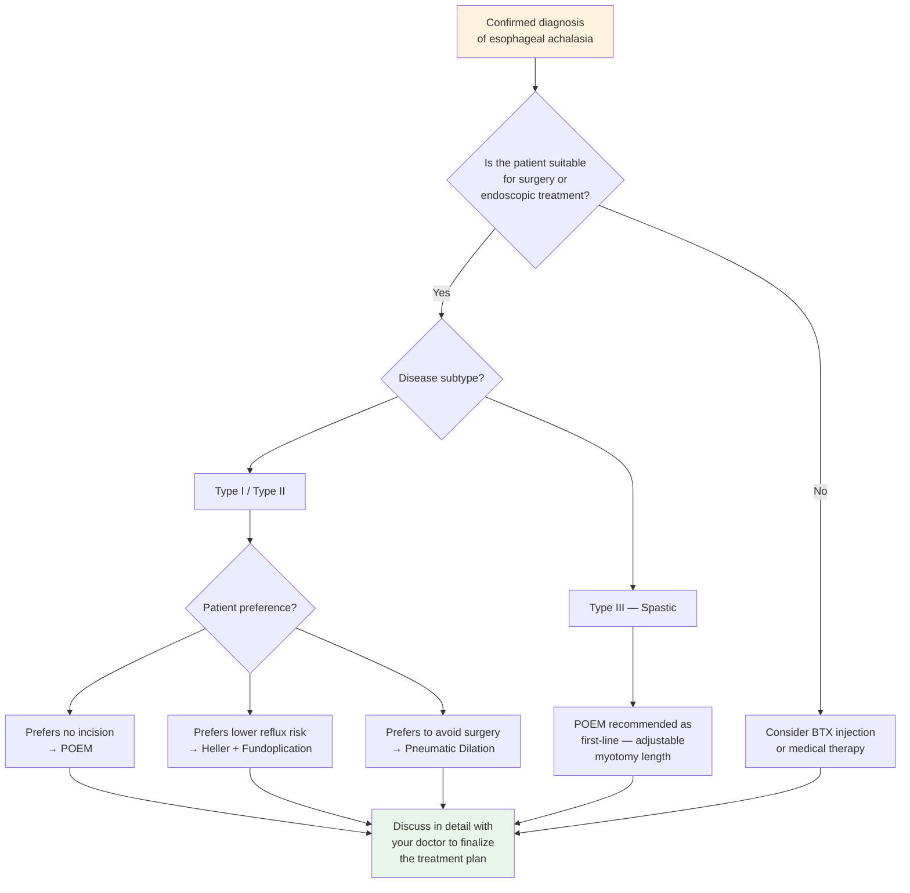

# Esophageal Achalasia — Treatment Options

## What Are the Goals of Treatment?

Esophageal achalasia currently **cannot be completely cured** because the degenerated nerves cannot regenerate. However, the good news is that treatment can achieve the following goals:

- **Reduce the pressure of the Lower Esophageal Sphincter (LES)** to allow food to pass through
- **Improve dysphagia** symptoms
- **Prevent further esophageal dilation**
- **Restore normal eating** and quality of life

> **Key concept:** The core treatment strategy is to "open the door" — using various methods to relax or cut the tightly closed LES.

---

## Overview of Treatment Options

### 1. Medical Therapy

**Indications:** Mild symptoms, patients unable to undergo surgery, or as a bridge while awaiting definitive treatment

**Common medications:**
- **Calcium Channel Blockers**: e.g., Nifedipine, which relaxes esophageal smooth muscle
- **Nitrates**: e.g., Isosorbide dinitrate, which helps relax the sphincter

**Efficacy and limitations:**
- Limited symptom improvement, usually only partial relief
- Side effects include headache, hypotension, dizziness
- **Long-term efficacy is poor**; not recommended as primary treatment
- Suitable for patients who are not candidates for other treatments

---

### 2. Botulinum Toxin Injection (BTX)

**What is this treatment?**
- Botulinum toxin (Botox) is injected directly into the LES via endoscopy
- The toxin temporarily paralyzes the sphincter, allowing it to relax

**Advantages:**
- Simple procedure with low risk
- Does not require general anesthesia
- Can be performed on an outpatient basis

**Disadvantages:**
- **Effect is temporary**, typically lasting only 6 to 12 months
- Requires repeated injections
- Long-term repeated injections may cause esophageal wall fibrosis, increasing difficulty of future surgery
- Symptom relief rate is approximately 70–80%, but effect diminishes over time

**Best suited for:**
- Elderly patients or those not fit for surgery
- As a diagnostic treatment (to confirm whether symptoms are caused by the sphincter)
- Bridge therapy while awaiting surgery

---

### 3. Pneumatic Dilation (PD)

**What is this treatment?**
- A special balloon is placed at the LES via endoscopy
- The balloon is inflated to **disrupt** the tight sphincter muscle fibers

**Advantages:**
- No surgical incisions; endoscopic treatment
- Single-treatment success rate of approximately **65–80%**
- Can be repeated to improve results
- Short hospital stay (usually 1 day or outpatient)

**Disadvantages:**
- Risk of esophageal perforation: approximately 1–5%
- Symptoms may recur in some patients, requiring repeat dilation
- Multiple treatments may be needed for optimal results

**Efficacy:**
- Single dilation: approximately 65–80% symptom improvement
- Multiple (graded) dilations: success rate can increase to 85–90%

---

### 4. Laparoscopic Heller Myotomy (LHM)

**What is this surgery?**
- The muscle layer at the LES is **cut open** using laparoscopy (minimally invasive surgery)
- A **fundoplication** is usually performed simultaneously to reduce post-operative gastroesophageal reflux

**Advantages:**
- **Excellent long-term results**: 10-year success rate of approximately 80–85%
- Good results with a single procedure
- Minimally invasive with small incisions and fast recovery

**Disadvantages:**
- Requires general anesthesia and hospitalization (usually 1 to 3 days)
- Surgical risks (bleeding, infection, etc.)
- Post-operative GERD may occur, approximately 10–30%
- Requires an experienced surgeon

**Efficacy:**
- Short-term symptom relief rate: approximately 85–95%
- Long-term (>10 years) success rate: approximately 80–85%

---

### 5. Peroral Endoscopic Myotomy (POEM)

**What is POEM?**
- The most important treatment innovation in recent years, introduced clinically around 2010
- An endoscope is inserted through the mouth into the esophagus, creating a "tunnel" beneath the esophageal mucosa
- Through this tunnel, the **sphincter muscle is cut from inside the esophagus**
- No external incisions are required

**Advantages:**
- **Completely incision-free** (No External Incision)
- Symptom relief rate of **80–95%**
- Short hospital stay (usually 1 to 2 days)
- Fast recovery; most patients resume normal eating within 1 to 2 weeks
- Particularly effective for Type III (spastic) achalasia
- Myotomy length can be adjusted as needed

**Disadvantages:**
- Requires a specially trained physician
- Higher post-operative GERD rate: approximately 20-50% (symptomatic); 30-60% (endoscopic esophagitis); most controllable with PPI
- Does not include an anti-reflux procedure
- Long-term (>10 years) data is still accumulating

**Efficacy:**
- Short-term (1–2 years) symptom relief rate: approximately **80–95%**
- Medium-term (3–5 years) results remain favorable
- Per the SAGES 2024 guidelines, POEM is recommended as a **preferred** treatment option

<!-- 📷 Image placeholder -->
> **🖼️ Please insert image:**
> - Suggested image: POEM endoscopic view (submucosal tunnel or myotomy)
> - File location: `../images/poem_endoscopic_view.png`
> - Source: De-identified institutional surgical image

<!-- End of image placeholder -->

---

## Treatment Comparison Table

| Category | Medical Therapy | BTX Injection | Pneumatic Dilation | Heller Myotomy | POEM |
|----------|----------------|---------------|-------------------|----------------|------|
| Method | Oral medication | Endoscopic injection | Endoscopic balloon | Laparoscopic surgery | Endoscopic surgery |
| Anesthesia | Not required | Sedation | Sedation / GA | General anesthesia | General anesthesia |
| External incision | None | None | None | 3–5 small incisions | None |
| Hospital stay | Not required | Not required | 0–1 day | 1–3 days | 1–2 days |
| Symptom relief rate | Low (< 50%) | Moderate (70–80%) | Moderate–High (65–80%) | High (85–95%) | High (80–95%) |
| Duration of effect | Short-lived | 6–12 months | Several years | Long-term | Long-term |
| Post-procedure reflux risk | None | Low | Low | Moderate (10–30%) | Higher (20–50% symptomatic; 30–60% endoscopic esophagitis) |
| Suitable for | Bridge therapy | Elderly / unfit for surgery | Most patients | Most patients | Most patients |

---

## Treatment Decision Guide

The following flowchart can help you discuss the most suitable treatment option with your doctor:

> **Important reminder:** The above flowchart is for reference only. The actual treatment choice should be based on your age, physical condition, disease subtype, personal preferences, and your physician's professional judgment.

---

## What to Watch for After Treatment?

Regardless of which treatment you receive, the following points are important:

### Short-term (1 to 4 weeks after treatment)
- Follow your doctor's instructions to **gradually resume eating** (typically: clear liquids → soft foods → regular diet)
- Avoid irritating foods
- Watch for fever, severe chest pain, hematemesis, or other warning signs
- Take medications on schedule, especially acid-suppressing medications prescribed by your doctor

### Long-term Follow-up
- Regular follow-up visits to assess symptom improvement
- You may need a **Timed Barium Esophagram (TBE)** for monitoring
- If symptoms recur, discuss further management options with your doctor
- Long-term monitoring of the esophagus for any cancer risk

---

## Hospital Information

<!-- 🏥 Hospital-Specific Information - Please fill in -->
> **📋 Please enter your hospital information:**
>
> - Department: _______________
> - Contact / Extension: _______________
> - Clinic Hours: _______________
> - Attending Physician(s): _______________
> - Hospital Specialties / Annual Volume: _______________
<!-- End of hospital-specific information -->

---

## Key Points Summary

| Key Point | Explanation |
|-----------|-------------|
| Treatment goal | Reduce LES pressure to allow food to pass |
| Most durable treatments | POEM and Heller myotomy (highest long-term success rates) |
| Latest trend | POEM is one of the mainstream treatment options in recent years |
| Post-operative reflux | Higher with POEM; lower with Heller + fundoplication |
| Key to decision-making | Consider subtype, age, personal preference; decide together with your doctor |

---
## Further Reading
- [Want to learn more? See the Advanced Version](../../進階版/EN/02_POEM_vs_Heller_Comparison.md)
- [Introduction to Esophageal Function Testing](../../../食道功能檢查/一般版/EN/01_What_Is_Esophageal_Function_Testing.md)
