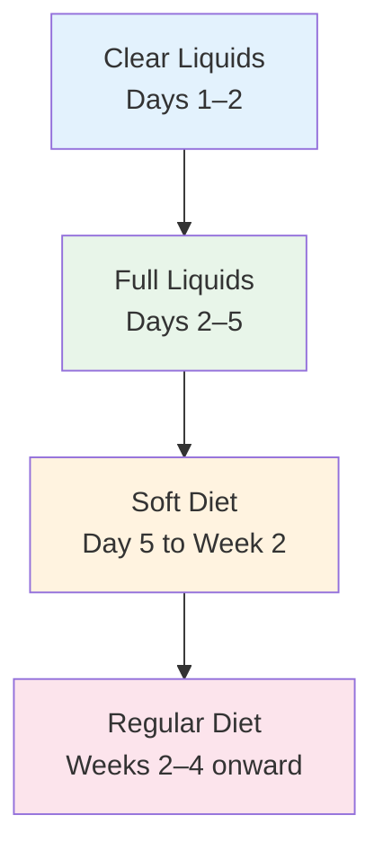

# Esophageal Achalasia — Daily Care and Dietary Recommendations

## Introduction

Esophageal achalasia is a chronic condition that requires long-term management. In addition to medical treatment, **daily dietary techniques and lifestyle adjustments** are equally important for improving symptoms, maintaining nutrition, and preserving quality of life.

This article provides practical daily care recommendations to help you eat more comfortably and live better, both before and after treatment.

---

## Basic Dietary Principles

### 1. Small Bites, Thorough Chewing

- Cut each piece of food into **small portions**, roughly the size of a peanut to a grape
- **Chew thoroughly**: at least 20 to 30 times per bite, until the food reaches a near-paste consistency
- Careful chewing reduces the chance of food getting stuck in the esophagus
- Do not rush meals; allow at least **30 minutes** per meal

### 2. Drink Water with Meals

- Take a small sip of water after each bite of food to help flush the esophagus
- The weight of water helps food pass through the sphincter
- Choose **room temperature or slightly warm water**; avoid ice water (which may worsen esophageal spasms)
- Warm soup can also be helpful during meals

### 3. Eat in an Upright Position

- Keep your **upper body upright or slightly leaning forward** during meals
- Use gravity to help food move downward
- **Never eat while lying down**
- Remain upright for at least **30 to 60 minutes** after eating before lying down

### 4. Small, Frequent Meals

- Replace three large meals with **5 to 6 smaller meals** per day
- Smaller portions reduce the burden on the esophagus
- Avoid eating too much at once, which causes food to accumulate in the esophagus
- Schedule snacks between meals

### 5. Avoid Eating Before Bed

- **Do not eat for 3 to 4 hours before bedtime**
- Reduces the risk of nighttime food regurgitation and choking
- Elevate the head of the bed by 15 to 20 cm (approximately 6 to 8 inches)
- A wedge pillow can also be helpful

---

## Food Selection Guide

### Recommended Foods (Easier to Pass Through the Esophagus)

| Category | Recommended Foods |
|----------|-------------------|
| Staples | Porridge, congee, soft rice, thin noodles, oatmeal, toast (crust removed) |
| Protein | Steamed eggs, soft tofu, fish (boneless), ground meat, steamed egg cake |
| Vegetables | Well-cooked vegetables (pumpkin, winter melon, sweet potato leaves), vegetable puree |
| Fruits | Banana, papaya, applesauce, peach (peeled), watermelon |
| Soups | Clear broth, cream soup (blended and strained), miso soup |
| Beverages | Warm water, strained fruit juice, soy milk, milk |
| Snacks | Pudding, yogurt, panna cotta, steamed cake |

### Foods to Limit or Avoid

| Category | Foods to Avoid | Reason |
|----------|----------------|--------|
| Hard foods | Nuts, raw carrots, hard candy | Difficult to chew thoroughly; easily gets stuck |
| High-fiber foods | Celery, bamboo shoots, burdock root | Coarse fiber is hard to pass |
| Sticky foods | Mochi, glutinous rice balls, rice cake | Highly adhesive; sticks to the esophageal wall |
| Large pieces of meat | Steak, bone-in chicken | Difficult to chew thoroughly |
| Dry foods | Crackers, un-moistened bread | Lack of moisture makes passage difficult |
| Spicy / acidic foods | Chili peppers, highly acidic foods | May irritate the esophageal mucosa |
| Carbonated beverages | Cola, sparkling drinks | Gas production may worsen bloating |
| Alcohol | All alcoholic beverages | Impairs esophageal motility |

> **Tip:** Tolerance varies from person to person. Consider keeping a "food diary" to track which foods pass easily and which cause discomfort.

---

## Eating Tips

### Daily Practical Tips

1. **Warm food is generally easier to swallow than cold food** — warmth helps the esophageal muscles relax slightly
2. **Carbonated water occasionally helps** — some patients find that a small amount of carbonated water helps push food through (varies by individual)
3. **Stay relaxed during meals** — tension and anxiety can worsen esophageal spasms
4. **Try raising your chin slightly when swallowing** — some patients find this posture helpful
5. **Avoid talking while eating** — this can lead to swallowing excess air

### Dining Out Recommendations

- Choose restaurants that offer **soft food options**
- Do not rush through meals due to time constraints
- Carry a water bottle with you
- Let dining companions know about your dietary needs — there is no need to feel embarrassed
- Check with the restaurant in advance whether they can adjust food texture

---

## Lifestyle Adjustments

### Sleep Considerations

- **Elevate the head of the bed by 15 to 20 cm**: use bricks or blocks under the bed legs — this is more effective than stacking pillows
- **Use a wedge pillow**: maintains a slightly elevated angle for the upper body
- **Sleep on your side** (left side is preferable): reduces the chance of regurgitation
- Avoid drinking large amounts of liquids before bed

### Daily Activities

- Moderate exercise is beneficial, but **avoid vigorous exercise or bending over immediately after meals**
- Avoid wearing overly tight clothing or belts that increase abdominal pressure
- Maintain a healthy weight — obesity increases abdominal pressure
- Quit smoking — smoking impairs LES function

### Mental Health

Esophageal achalasia can have a psychological impact, and this is completely normal:

- Inability to freely enjoy food can cause **frustration and depression**
- Social dining situations may trigger **anxiety or embarrassment**
- Consider joining a **patient support group** to connect with others who share similar experiences
- If emotional distress becomes significant, do not hesitate to seek psychological counseling

---

## Post-Treatment Dietary Recovery Plan

Whether you have undergone pneumatic dilation, POEM, or Heller myotomy, dietary recovery after treatment generally follows these stages:

### Phase 1: Clear Liquids (Days 1–2 post-treatment)

- Water, strained fruit juice, clear broth
- Small amounts at frequent intervals, approximately 60–120 mL each time
- Advance to the next phase once swallowing is confirmed to be unproblematic

### Phase 2: Full Liquids (Days 2–5)

- Thin porridge, cream soup, soy milk, milk, yogurt drinks
- Nutritional supplement beverages (e.g., Ensure)
- Continue small, frequent meals

### Phase 3: Soft Diet (Day 5 to Week 2)

- Porridge, steamed eggs, tofu, pureed fish
- Well-cooked noodles, oatmeal
- Fruit puree, steamed soft vegetables

### Phase 4: Regular Diet (Weeks 2–4 onward)

- Gradually return to a normal diet
- Continue to maintain small bites, thorough chewing, and drinking water with meals
- Monitor for discomfort; if difficulty arises, revert to the previous phase

> **Important:** The actual pace of recovery varies by individual. Please follow your attending physician's instructions for adjustments.

---

## Regular Follow-Up and Clinic Visits

Regular follow-up after treatment is very important:

| Follow-Up Timing | Recommended Items |
|-------------------|-------------------|
| 1–2 weeks post-treatment | Clinic visit to confirm recovery status |
| 1–3 months post-treatment | Symptom assessment; possible timed barium esophagram |
| 6 months post-treatment | Evaluate degree of symptom improvement |
| 1 year post-treatment | Comprehensive evaluation; possible manometry follow-up |
| Every 1–2 years thereafter | Regular follow-up to monitor for symptom recurrence |
| Long-term | Periodic upper endoscopy (monitor esophageal changes) |

---

## When to Seek Emergency Care

Seek **immediate medical attention** or call emergency services if you experience any of the following:

- **Complete inability to swallow**, including saliva
- **Severe chest pain**, especially with fever
- **Vomiting blood** or coffee-ground-like fluid
- **Persistent high fever** (above 38.5°C / 101.3°F)
- Symptoms of **severe dehydration** (extreme thirst, very low urine output, dizziness)
- Sudden onset of **severe abdominal pain** after treatment
- **Difficulty breathing** or severe choking

> **Reminder:** When in doubt, seek medical attention rather than waiting and enduring symptoms.

---

## Nutritional Supplementation

Due to difficulty eating, some patients may need additional nutritional support:

- **High-calorie nutritional supplements**: commercially available complete nutrition drinks (e.g., Ensure, Boost)
- **Protein supplementation**: protein powder mixed into beverages
- **Vitamins and minerals**: take a multivitamin as recommended by your doctor
- **Weight monitoring**: weigh yourself regularly; if weight continues to decline, inform your doctor

---

## Hospital Information

<!-- 🏥 Hospital-Specific Information - Please fill in -->
> **📋 Please enter your hospital information:**
>
> - Department: _______________
> - Contact / Extension: _______________
> - Clinic Hours: _______________
> - Attending Physician(s): _______________
> - Hospital Specialties / Annual Volume: _______________
<!-- End of hospital-specific information -->

---

## Key Points Summary

| Key Point | Explanation |
|-----------|-------------|
| Core eating techniques | Small bites, thorough chewing, drink water with meals, eat upright |
| Meal schedule | Small, frequent meals — 5 to 6 per day |
| Before bed | No eating 3–4 hours before sleep; elevate head of bed |
| Food choices | Choose soft, moist foods; avoid hard, sticky, dry foods |
| Emergency care | Complete inability to swallow, hematemesis, severe chest pain with fever |

---
## Further Reading
- [Want to learn more? See the Advanced Version](../../進階版/EN/02_POEM_vs_Heller_Comparison.md)
- [Introduction to Esophageal Function Testing](../../../食道功能檢查/一般版/EN/01_What_Is_Esophageal_Function_Testing.md)
