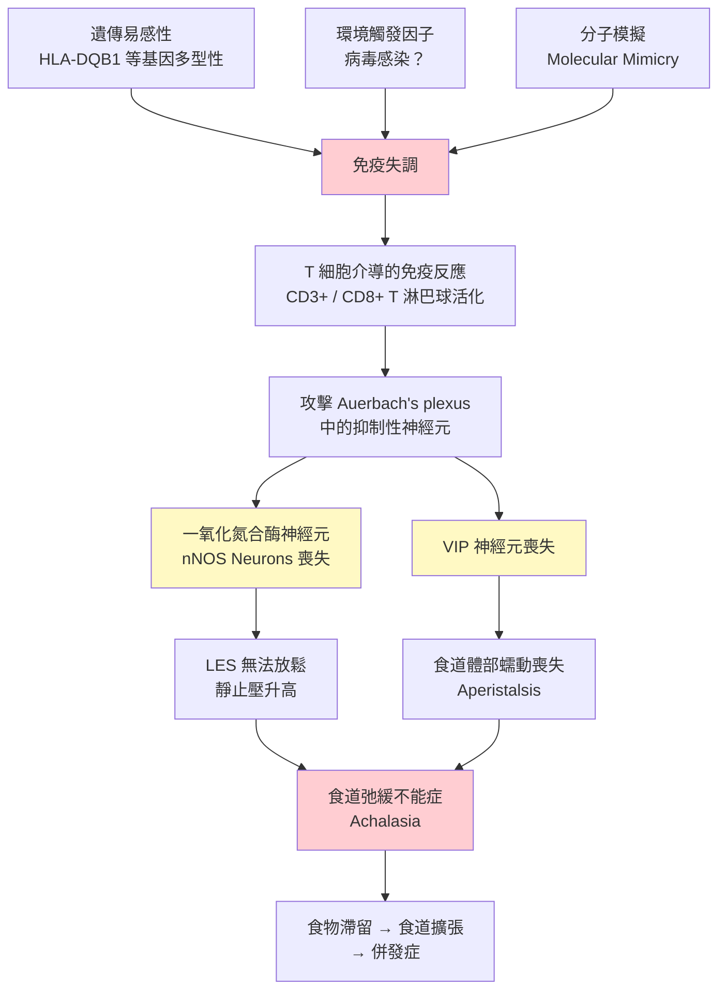
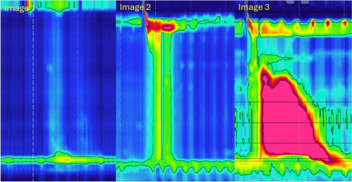
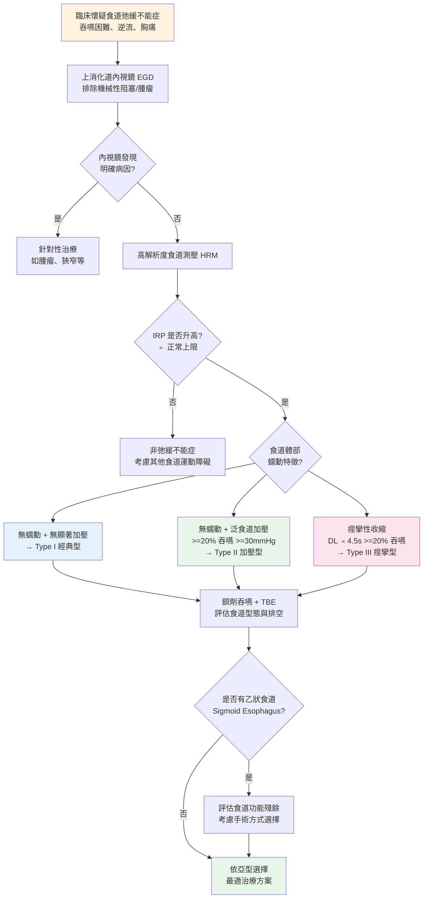

# 食道弛緩不能症（Esophageal Achalasia）— 病理機轉與亞型分類

## 病理生理學（Pathophysiology）

### 核心病變：抑制性神經元喪失

食道弛緩不能症的根本病理變化是食道壁**肌層間神經叢（Auerbach's Plexus / Myenteric Plexus）**中抑制性神經元（Inhibitory Neurons）的選擇性退化與喪失。

**正常食道的神經控制：**
- 食道蠕動（Peristalsis）由興奮性和抑制性神經元協調控制
- **興奮性神經元**：釋放乙醯膽鹼（Acetylcholine, ACh）和 P 物質（Substance P），引起肌肉收縮
- **抑制性神經元**：釋放一氧化氮（Nitric Oxide, NO）和血管活性腸肽（Vasoactive Intestinal Peptide, VIP），引起肌肉放鬆
- 正常的吞嚥需要兩者的精確協調：先抑制（放鬆）→ 再興奮（收縮），形成有序的蠕動波

**弛緩不能症的病變：**
- 抑制性神經元（尤其是產生 NO 的神經元）**選擇性喪失**
- 興奮性膽鹼能神經元相對保留或較晚受影響
- 結果：下食道括約肌（Lower Esophageal Sphincter, LES）失去抑制性訊號 → 無法放鬆
- 食道體部（Esophageal Body）的蠕動功能也受損 → 缺乏有效的推進蠕動

### 組織病理學發現（Histopathological Findings）

| 病理特徵 | 描述 |
|----------|------|
| 神經節細胞減少（Ganglion Cell Loss） | Auerbach's plexus 中神經節細胞數量顯著減少至缺如 |
| 淋巴球浸潤（Lymphocytic Infiltration） | 以 CD3+ / CD8+ T 淋巴球為主的發炎浸潤 |
| 神經纖維化（Neural Fibrosis） | 肌層間神經叢周圍纖維化 |
| Cajal 間質細胞減少 | Interstitial Cells of Cajal (ICC) 數量減少 |
| 肌肉層肥厚 | 環狀肌（Circular Muscle）在 LES 區域可見肥厚 |

### 致病機轉假說

目前最受支持的致病模型為**自體免疫介導的神經退化（Autoimmune-mediated Neurodegeneration）**：

**支持自體免疫理論的證據：**
- 神經叢中有活化 T 淋巴球浸潤
- 患者血清中可檢測到抗肌層間神經叢抗體（Anti-myenteric Antibodies）
- 與 HLA-DQB1 基因型有關聯
- 部分患者合併其他自體免疫疾病
- 少數病例報告與病毒感染（如 HSV-1、麻疹病毒）有時間關聯

---

## 芝加哥分類（Chicago Classification）— 亞型分類

### 概述

根據**芝加哥分類第 4 版（Chicago Classification v4.0, CCv4.0）**，食道弛緩不能症依照高解析度食道測壓（High-Resolution Manometry, HRM）的特徵分為三個亞型。分型對於**預測治療反應**至關重要。

### 診斷必要條件

所有亞型共同的診斷標準：

- **整合鬆弛壓力（Integrated Relaxation Pressure, IRP）升高**：> 正常值上限（通常 > 15 mmHg）
- IRP 是在吞嚥後 10 秒內，4 秒累積最低食道胃交界處（EGJ）壓力的平均值
- 需排除機械性阻塞（如食道癌、術後狹窄等）

### 三個亞型的詳細比較

| 特徵 | 第一型（Type I） | 第二型（Type II） | 第三型（Type III） |
|------|-----------------|-----------------|------------------|
| 別名 | 經典型（Classic） | 具泛食道加壓型 | 痙攣型（Spastic） |
| 食道體部蠕動 | 缺乏蠕動（Absent Peristalsis） | 缺乏蠕動但有泛食道加壓 | 痙攣性收縮（Spastic Contractions） |
| 食道體部壓力特徵 | 無顯著壓力化（Minimal Pressurization） | 泛食道加壓（Panesophageal Pressurization）≥ 30 mmHg，在 ≥ 20% 的吞嚥中出現 | 早發型收縮（Premature / Spastic Contractions），DL < 4.5 秒，≥ 20% 的吞嚥 |
| IRP | 升高 | 升高 | 升高 |
| 食道擴張 | 常見，可有巨食道症 | 可能有中度擴張 | 較不明顯 |
| 鋇劑攝影特徵 | 顯著擴張，鳥嘴徵象 | 中度擴張，鳥嘴徵象 | 不規則收縮，螺旋狀（Corkscrew） |
| 佔比 | 約 20 ~ 40% | 約 50 ~ 70%（最常見） | 約 5 ~ 15% |
| 治療反應 | 中等 | **最佳** | 較差（對傳統治療） |
| 最佳治療 | POEM / LHM / PD | POEM / LHM / PD（皆有良好反應） | **POEM 為首選**（可延長肌肉切開長度） |

*圖：弛緩不能症三種亞型的 HRM Clouse Plot 比較。Type I（經典型）：無明顯食道加壓；Type II（加壓型）：全食道加壓；Type III（痙攣型）：早發性痙攣收縮。圖片來源：Wienbeck S, et al. Abdominal Radiology. 2024. CC-BY 4.0. 原文：[PMC11947050](https://pmc.ncbi.nlm.nih.gov/articles/PMC11947050/)*

### 各亞型的測壓圖譜特徵（Manometric Patterns）

**第一型（Type I）— 經典型：**
- 食道體部完全缺乏蠕動收縮
- 食道壁壓力低，呈現「無壓力化」（Failed Peristalsis with Minimal Pressurization）
- 通常表示疾病進展較久，食道已明顯擴張
- 吞嚥時食道腔內壓力不超過 30 mmHg

**第二型（Type II）— 泛食道加壓型：**
- 食道體部同樣缺乏正常蠕動
- 但吞嚥時出現**整個食道同步加壓**（Panesophageal Pressurization），壓力 ≥ 30 mmHg
- 這種加壓代表食道壁仍有一定的肌肉功能
- 是三型中治療反應最好的，因為括約肌一旦打開，食道的壓力可以推動食物通過
- 佔所有弛緩不能症的最大比例

**第三型（Type III）— 痙攣型：**
- 食道體部出現**異常的痙攣性收縮**
- 收縮具有**過早發生（Premature）**的特徵：遠端潛伏期（Distal Latency, DL）< 4.5 秒
- 可能合併高振幅收縮
- 食道不會像第一、二型那樣明顯擴張
- 對氣球擴張和 Heller 手術的治療反應較差
- POEM 可透過延長食道體部的肌肉切開長度來處理痙攣區段

---

## 診斷演算法

---

## 特殊考量

### EGJ 出口阻塞（EGJ Outflow Obstruction, EGJOO）

- IRP 升高但食道體部蠕動保留的情況
- 可能是弛緩不能症的早期表現，或其他原因造成
- 需結合臨床症狀、鋇劑攝影和功能性管腔成像探針（Functional Lumen Imaging Probe, FLIP）綜合判斷
- CCv4.0 將 EGJOO 進一步細分為臨床相關和不確定的類別

### 巨食道症（Megaesophagus）與乙狀食道（Sigmoid Esophagus）

- 長期未治療的弛緩不能症，食道可能進行性擴張
- 食道直徑 > 6 cm 稱為巨食道症
- 食道彎曲呈 S 型稱為乙狀食道
- 這些患者的治療更具挑戰性
- 嚴重者可能需考慮食道切除術（Esophagectomy）作為最後手段

### FLIP（Functional Lumen Imaging Probe）的角色

- FLIP 是一種新型的食道功能評估工具
- 可測量 EGJ 的擴張性（Distensibility）和食道體部的收縮模式
- 對於 HRM 結果不確定的病例，FLIP 可提供額外的診斷資訊
- 也可用於治療中（如 POEM 術中）評估肌肉切開的充分性

---

## 鑑別診斷（Differential Diagnosis）

| 疾病 | 與弛緩不能症的鑑別要點 |
|------|----------------------|
| 假性弛緩不能症（Pseudoachalasia） | 約占所有弛緩不能症表現的 2-4%；由腫瘤（尤其是 EGJ 腺癌）引起；病程短（< 1 年）、年齡 > 55 歲、體重快速減輕；**需安排 CT 掃描或內視鏡超音波 (EUS) 排除惡性腫瘤** |
| EGJ 出口阻塞（EGJOO） | IRP 升高但食道蠕動保留；可能是早期弛緩不能症或其他原因 |
| 嗜酸性食道炎（Eosinophilic Esophagitis, EoE） | 內視鏡有典型環狀皺褶；切片見嗜酸性球浸潤；測壓通常正常或 EGJOO |
| 遠端食道痙攣（Distal Esophageal Spasm, DES） | IRP 正常；出現早發型收縮但 < 20% 的吞嚥 |
| 高收縮食道 / 胡桃鉗食道（Hypercontractile / Jackhammer Esophagus） | IRP 正常；DCI 極高（> 8000 mmHg·s·cm） |
| 查加斯病（Chagas Disease） | 流行於中南美洲；由錐蟲（Trypanosoma cruzi）感染引起；症狀類似但有流行病學背景 |
| 硬皮症食道（Scleroderma Esophagus） | LES 壓力低（非高）；食道遠端蠕動喪失但近端正常 |

---

## 重點整理

| 重點 | 說明 |
|------|------|
| 核心病變 | Auerbach's plexus 抑制性神經元（NO/VIP 神經元）喪失 |
| 致病機轉 | 最可能為自體免疫介導的神經退化 |
| 診斷金標準 | 高解析度食道測壓（HRM），以 IRP 升高為核心 |
| 最常見亞型 | Type II（泛食道加壓型），約佔 50 ~ 70% |
| 治療反應最佳 | Type II > Type I > Type III（對傳統治療） |
| Type III 首選治療 | POEM（可延長切開長度處理痙攣段） |
