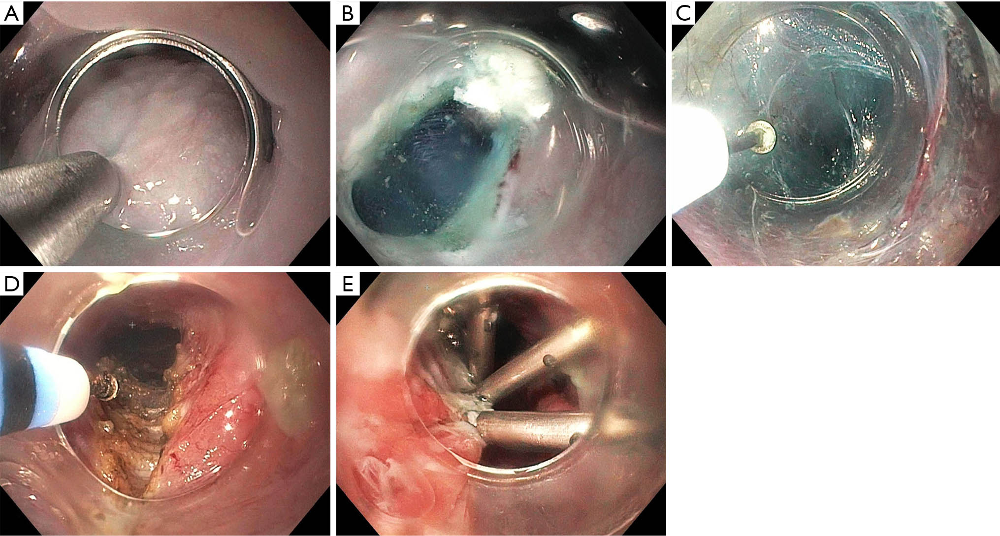
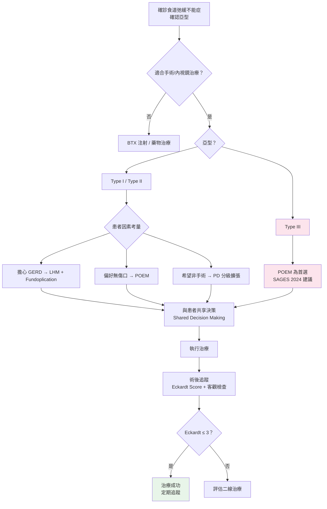

# 食道弛緩不能症（Esophageal Achalasia）— POEM vs Heller 手術比較

## 前言

經口內視鏡肌肉切開術（Peroral Endoscopic Myotomy, POEM）和腹腔鏡海勒肌肉切開術（Laparoscopic Heller Myotomy, LHM）是目前食道弛緩不能症最主要的兩種確定性治療方式。氣球擴張術（Pneumatic Dilation, PD）作為非手術選項，在特定患者群中仍有其角色。

本篇將依據現有臨床證據與國際指引（特別是 SAGES 2024 POEM Update），詳細比較這三種治療。

---

## 三大治療方式詳細比較

### 完整比較表

| 比較項目 | POEM | LHM + Fundoplication | 氣球擴張術（PD） |
|----------|------|---------------------|-----------------|
| **手術入路** | 經口（Transoral），黏膜下隧道 | 腹腔鏡，3~5 個 trocar 切口 | 經口內視鏡引導 |
| **麻醉方式** | 全身麻醉（General Anesthesia） | 全身麻醉 | 鎮靜（Conscious Sedation）或全身麻醉 |
| **體表傷口** | 無 | 3~5 個 0.5~1.2 cm 切口 | 無 |
| **手術時間** | 60~120 分鐘 | 90~180 分鐘 | 15~30 分鐘/次 |
| **切開方式** | 內環狀肌（可選前壁或後壁） | 外環狀肌 + 縱肌（前壁 Heller 切口） | 機械性撐裂括約肌纖維 |
| **切開長度可調性** | 高（可向食道近端延長至 > 10 cm） | 有限（標準 6~8 cm 食道端 + 2~3 cm 胃端） | 不適用 |
| **抗逆流措施** | 無（目前尚無標準化併行方案） | 同時加做部分胃底摺疊（通常 Dor 或 Toupet） | 不適用 |
| **住院天數** | 1~3 天 | 1~3 天 | 門診或 1 天 |
| **恢復正常飲食** | 1~2 週 | 2~4 週 | 1~2 天 |
| **恢復正常活動** | 3~7 天 | 2~4 週 | 1~2 天 |

*圖：POEM（經口內視鏡）與 Heller Myotomy（腹腔鏡）的手術入路比較。圖片來源：Sanaei O, et al. Annals of Laparoscopic and Endoscopic Surgery. 2024. CC-BY-NC. 原文：[AME](https://ales.amegroups.org/article/view/10072/html)*

---

### 療效比較（按亞型）

| 亞型 | POEM 成功率 | LHM 成功率 | PD 成功率 |
|------|-----------|-----------|----------|
| **Type I（經典型）** | 80~90% | 80~85% | 65~75% |
| **Type II（加壓型）** | 90~95% | 90~95% | 75~80% |
| **Type III（痙攣型）** | **85~95%** | 60~70% | 40~50% |
| **整體** | 80~95% | 85~95% | 65~80% |

> **關鍵發現：** Type III（痙攣型）弛緩不能症中，POEM 的療效明顯優於 LHM 和 PD。SAGES 2024 指引明確建議 POEM 為 Type III 的首選治療。

---

### 併發症比較

| 併發症 | POEM | LHM | PD |
|--------|------|-----|-----|
| **術後 GERD（胃食道逆流）** | 20~50%（臨床症狀）；內視鏡食道炎 30~60% | 10~30%（有胃底摺疊） | 5~15% |
| **食道穿孔** | < 0.5%（黏膜穿孔較常見，多術中處理） | 1~5% | 1~5% |
| **出血** | 1~2% | 1~2% | < 1% |
| **氣腹/氣胸/皮下氣腫** | 5~15%（多自行吸收） | < 1% | 極少 |
| **黏膜損傷** | 2~5%（術中可修補） | < 1% | 不適用 |
| **感染** | < 1% | 1~2% | 極少 |
| **死亡率** | < 0.1% | < 0.1% | < 0.1% |
| **需再手術處理併發症** | < 1% | 1~2% | 1~3%（穿孔時） |

---

### 術後 GERD 的深入比較

術後胃食道逆流（Gastroesophageal Reflux Disease, GERD）是比較 POEM 與 LHM 時最關鍵的差異：

| GERD 指標 | POEM | LHM + Fundoplication |
|-----------|------|---------------------|
| 主觀反流症狀 | 15~30% | 10~20% |
| 異常酸暴露（pH 監測） | 30~60% | 15~30% |
| 內視鏡食道炎（Los Angeles 分級） | 20~50%（多為 LA-A/B） | 10~20% |
| 嚴重食道炎（LA-C/D） | 2~5% | < 2% |
| Barrett's 食道（長期追蹤） | 數據有限，需長期觀察 | 罕見 |
| PPI 使用率 | 30~50% | 15~25% |
| GERD 相關的生活品質影響 | 多數用 PPI 可控制 | 較低 |

> **臨床意義：** 雖然 POEM 術後 GERD 的發生率較高，但絕大多數屬於輕至中度，可用 PPI 有效控制。嚴重且難以控制的 GERD 較為少見。長期（> 10 年）是否會增加 Barrett's 食道風險仍需追蹤數據。

---

### 長期療效與再介入

| 長期指標 | POEM | LHM | PD |
|----------|------|-----|-----|
| 2 年症狀緩解率 | 85~93% | 85~93% | 60~75% |
| 5 年症狀緩解率 | 80~90% | 80~88% | 50~70% |
| 10 年症狀緩解率 | 數據累積中（初步良好） | 75~85% | 40~60% |
| 再治療率（5 年內） | 5~15% | 10~15% | 25~40% |
| 再治療選項 | 重複 POEM、PD、LHM | PD、POEM | 重複 PD、POEM、LHM |

### 2025 長期追蹤統合分析

2025 年發表的系統性回顧與統合分析（9 研究，1,099 名患者，平均追蹤 34.2 個月）顯示：

- **POEM vs LHM 長期治療成功率無顯著差異**
- POEM 組 583 名患者的臨床成功率與 LHM 組相當
- 另一項大型世代研究（319 名患者，中位追蹤 73 個月）顯示 POEM 長期成功率達 **92.6%**
- 長期追蹤中，症狀性 GERD 發生率 28.9%，逆流性食道炎 35.3%

> **結論**：POEM 的長期療效已獲更充分驗證，與 LHM 相當，但 GERD 管理仍為重要課題。

---

### 學習曲線（Learning Curve）

| 項目 | POEM | LHM |
|------|------|-----|
| 達到熟練所需例數 | 20~40 例 | 20~50 例 |
| 所需基礎技能 | 進階內視鏡技術（ESD 經驗有利） | 腹腔鏡手術基礎 |
| 培訓科別 | 消化內科 / 內視鏡介入 | 一般外科 / 消化外科 |
| 手術量與療效關聯 | 高手術量中心效果顯著較佳 | 高手術量中心效果較佳 |
| 併發症率與經驗關聯 | 初期併發症率較高，隨經驗下降 | 類似趨勢 |

---

## SAGES 2024 POEM Update 關鍵建議

美國消化內視鏡外科醫師學會（Society of American Gastrointestinal and Endoscopic Surgeons, SAGES）於 2024 年發布的 POEM 更新指引中，提出以下重要建議：

### 核心建議

| 建議內容 | 證據等級（GRADE） | 建議強度 |
|----------|-------------------|----------|
| POEM 可作為弛緩不能症的一線治療選項 | 中等（Moderate） | 有條件建議（Conditional） |
| POEM 優先於氣球擴張術（PD） | 低至中等 | 有條件建議 |
| Type III 弛緩不能症建議首選 POEM | 低 | 有條件建議 |
| POEM 術後應常規評估 GERD 並考慮 PPI | 低至中等 | 有條件建議 |
| POEM 應在有經驗的中心執行 | 專家共識 | 強烈建議（Strong） |

### POEM vs LHM 的定位

- SAGES 2024 指出 POEM 與 LHM 的**短中期療效相當**
- 對於 **Type III 弛緩不能症**，POEM 因可延長肌肉切開範圍而被推薦為首選
- LHM + Fundoplication 在**降低術後 GERD** 方面有優勢
- **最終選擇應基於**：患者亞型、術者經驗、患者偏好及 GERD 風險的權衡

---

### POEM-F：POEM 合併胃底摺疊術（2025-2026 新進展）

POEM-F (Peroral Endoscopic Myotomy with Fundoplication) 是針對 POEM 術後逆流問題的創新解決方案，在同一次內視鏡手術中完成肌肉切開術與胃底摺疊術。

#### 2026 統合分析結果（9 研究，202 名患者）

| 指標 | POEM-F 結果 |
|------|------------|
| 技術成功率 | 94.8% |
| 弛緩不能症臨床成功率 | 96.4% |
| GERD 緩解率 | 86.2% |
| 平均手術時間 | 115.7 分鐘（摺疊術約 55 分鐘） |
| 需再次介入比例 | 0%（6 個月追蹤） |

#### 與標準 POEM 比較

| 指標 | 標準 POEM | POEM-F |
|------|----------|--------|
| 術後 GERD（症狀） | 20-50% | 顯著降低 |
| 異常酸暴露 | 43-47% | 約 11% (1 年追蹤) |
| 食道炎 | 13-19% | 顯著降低 |

> **臨床意義**：POEM-F 可能解決 POEM 最大的缺點——術後逆流，同時保留內視鏡微創的優勢。目前證據仍以小型研究為主，需要更大規模 RCT 驗證。此技術在少數專精中心施行。

---

## 特殊情境的治療選擇

### 初次治療失敗後的二線選擇

| 初次治療 | 建議二線治療 | 說明 |
|----------|-------------|------|
| PD 失敗 | POEM 或 LHM | 兩者皆可 |
| POEM 失敗 | 重複 POEM、PD 或 LHM | 依失敗原因決定 |
| LHM 失敗 | POEM 或 PD | POEM 的優勢在於可從不同方向切開 |
| 多次治療失敗 | 評估食道切除術（Esophagectomy） | 最後手段 |

### Heller 術後再治療中 POEM 的優勢

- LHM 通常從**前壁（Anterior）**進行肌肉切開
- POEM 可選擇從**後壁（Posterior）**進入，避開先前的手術區域
- 減少沾黏相關併發症的風險
- 對於 LHM 後復發的患者，POEM 是有效的救援治療選項

### 乙狀食道（Sigmoid Esophagus）的考量

- 嚴重的乙狀食道增加 POEM 和 LHM 的技術難度
- 需要有豐富經驗的術者
- 術前需仔細評估食道排空功能
- 部分患者可能最終需要食道切除術

---

## 術後追蹤建議

| 時間點 | 建議追蹤項目 |
|--------|-------------|
| 術後 1 天 | 鋇劑攝影確認無滲漏（依醫師判斷） |
| 術後 1~3 個月 | 症狀評估（Eckardt Score）、TBE |
| 術後 6 個月 | 症狀評估 |
| 術後 1 年 | HRM、pH 監測（尤其 POEM 後）、上消化道內視鏡 |
| 術後 2~3 年 | 症狀評估、考慮 TBE |
| 長期（每 1~3 年） | 上消化道內視鏡（監測 GERD 相關黏膜變化） |

### Eckardt Score（臨床症狀評分）

| 分數 | 吞嚥困難 | 逆流 | 胸痛 | 體重減輕 |
|------|----------|------|------|----------|
| 0 | 無 | 無 | 無 | 無 |
| 1 | 偶爾 | 偶爾 | 偶爾 | < 5 kg |
| 2 | 每天 | 每天 | 每天 | 5~10 kg |
| 3 | 每餐 | 每餐 | 每餐 | > 10 kg |

- 總分 0~12 分
- **Eckardt Score ≤ 3** 定義為治療成功
- 用於術前基線評估和術後追蹤比較

---

## 臨床決策摘要

---

## 重點整理

| 重點 | 說明 |
|------|------|
| POEM vs LHM 療效 | 短中期療效相當，Type III 中 POEM 明顯優勢 |
| 最大差異 | 術後 GERD：POEM 較高，LHM+Fundoplication 較低 |
| Type III 首選 | POEM（SAGES 2024 有條件建議） |
| GERD 管理 | POEM 術後多數可用 PPI 控制 |
| 學習曲線 | 兩者皆需 20~50 例達到熟練 |
| 長期數據 | LHM 有 > 10 年數據；POEM 仍在累積中 |
