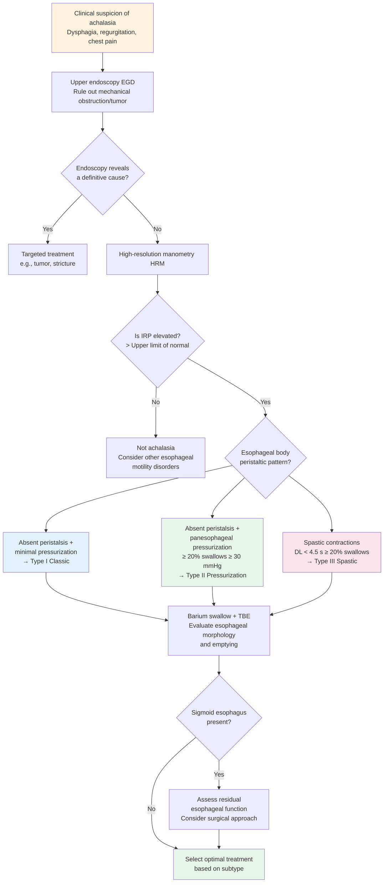

# Esophageal Achalasia — Pathophysiology and Subtype Classification

## Pathophysiology

### Core Pathology: Loss of Inhibitory Neurons

The fundamental pathological change in esophageal achalasia is the selective degeneration and loss of inhibitory neurons within the **myenteric plexus (Auerbach's plexus)** of the esophageal wall.

**Normal esophageal neural control:**
- Esophageal peristalsis is coordinated by excitatory and inhibitory neurons
- **Excitatory neurons**: release acetylcholine (ACh) and Substance P, causing muscle contraction
- **Inhibitory neurons**: release nitric oxide (NO) and vasoactive intestinal peptide (VIP), causing muscle relaxation
- Normal swallowing requires precise coordination of both: inhibition (relaxation) first → then excitation (contraction), forming an orderly peristaltic wave

**Pathological changes in achalasia:**
- **Selective loss** of inhibitory neurons (particularly NO-producing neurons)
- Excitatory cholinergic neurons are relatively preserved or affected later
- Result: the LES loses inhibitory signals → fails to relax
- Esophageal body peristalsis is also impaired → absence of effective propulsive peristalsis

### Histopathological Findings

| Pathological Feature | Description |
|----------------------|-------------|
| Ganglion Cell Loss | Marked reduction to absence of ganglion cells in Auerbach's plexus |
| Lymphocytic Infiltration | Predominantly CD3+ / CD8+ T lymphocyte inflammatory infiltration |
| Neural Fibrosis | Fibrosis surrounding the myenteric plexus |
| Loss of Interstitial Cells of Cajal | Decreased number of ICC |
| Muscle Layer Hypertrophy | Circular muscle hypertrophy in the LES region |

### Pathogenesis Hypothesis

The most widely supported pathogenic model is **autoimmune-mediated neurodegeneration**:

```mermaid
flowchart TD
    A[Genetic susceptibility<br/>HLA-DQB1 and other<br/>gene polymorphisms] --> D[Immune dysregulation]
    B[Environmental triggers<br/>Viral infection?] --> D
    C[Molecular mimicry] --> D

    D --> E[T cell-mediated immune response<br/>CD3+ / CD8+ T lymphocyte activation]
    E --> F[Attack on inhibitory neurons<br/>in Auerbach's plexus]

    F --> G[Loss of nNOS neurons<br/>(nitric oxide synthase)]
    F --> H[Loss of VIP neurons]

    G --> I[LES fails to relax<br/>Elevated resting pressure]
    H --> J[Loss of esophageal body<br/>peristalsis — Aperistalsis]

    I --> K[Achalasia]
    J --> K

    K --> L[Food retention → Esophageal dilation<br/>→ Complications]

    style D fill:#FFCDD2
    style K fill:#FFCDD2
    style G fill:#FFF9C4
    style H fill:#FFF9C4
```

**Evidence supporting the autoimmune theory:**
- Activated T lymphocyte infiltration in the myenteric plexus
- Anti-myenteric antibodies detectable in patient serum
- Association with HLA-DQB1 genotype
- Some patients have concurrent autoimmune diseases
- Rare case reports link viral infections (e.g., HSV-1, measles virus) temporally

---

## Chicago Classification — Subtype Classification

### Overview

According to the **Chicago Classification v4.0 (CCv4.0)**, esophageal achalasia is classified into three subtypes based on high-resolution manometry (HRM) characteristics. Subtype classification is critical for **predicting treatment response**.

### Diagnostic Criteria

Common diagnostic criteria across all subtypes:

- **Elevated Integrated Relaxation Pressure (IRP)**: > upper limit of normal (typically > 15 mmHg)
- IRP is the mean of the 4-second cumulative lowest EGJ pressure within 10 seconds after swallowing
- Mechanical obstruction must be excluded (e.g., esophageal cancer, post-surgical stricture)

### Detailed Comparison of the Three Subtypes

| Feature | Type I | Type II | Type III |
|---------|--------|---------|----------|
| Alias | Classic | With panesophageal pressurization | Spastic |
| Esophageal body peristalsis | Absent peristalsis | Absent peristalsis but with panesophageal pressurization | Spastic contractions |
| Esophageal body pressure pattern | Minimal pressurization | Panesophageal pressurization ≥ 30 mmHg in ≥ 20% of swallows | Premature / spastic contractions, DL < 4.5 s in ≥ 20% of swallows |
| IRP | Elevated | Elevated | Elevated |
| Esophageal dilation | Common; megaesophagus possible | Possible moderate dilation | Less prominent |
| Barium swallow features | Significant dilation, bird-beak sign | Moderate dilation, bird-beak sign | Irregular contractions, corkscrew pattern |
| Proportion | Approximately 20–40% | Approximately 50–70% (most common) | Approximately 5–15% |
| Treatment response | Moderate | **Best** | Poorer (to conventional treatment) |
| Optimal treatment | POEM / LHM / PD | POEM / LHM / PD (all with good response) | **POEM preferred** (myotomy length can be extended) |

<!-- 📷 Image placeholder -->
> **🖼️ Please insert image:**
> - Suggested image: HRM Clouse Plot comparison of three subtypes (Type I, II, III)
> - File location: `../images/achalasia_subtypes_hrm.png`
> - Source: De-identified institutional report or licensed medical literature image (cite source)


<!-- End of image placeholder -->

### Manometric Patterns of Each Subtype

**Type I — Classic:**
- Complete absence of peristaltic contractions in the esophageal body
- Low esophageal wall pressure, presenting as "failed peristalsis with minimal pressurization"
- Usually indicates longer disease duration with significant esophageal dilation
- Intra-esophageal pressure does not exceed 30 mmHg during swallowing

**Type II — Panesophageal Pressurization:**
- Esophageal body also lacks normal peristalsis
- However, **pan-esophageal simultaneous pressurization** (≥ 30 mmHg) occurs during swallowing
- This pressurization indicates that the esophageal wall retains some muscle function
- Best treatment response among the three types, because once LES resistance is removed, esophageal cavity pressure can effectively propel food through
- Accounts for the largest proportion of all achalasia cases

**Type III — Spastic:**
- Esophageal body exhibits **abnormal spastic contractions**
- Contractions have a **premature** characteristic: Distal Latency (DL) < 4.5 seconds
- May be accompanied by high-amplitude contractions
- Esophagus does not dilate as prominently as in Types I and II
- Poorer treatment response to pneumatic dilation and Heller myotomy
- POEM can address the spastic segment by extending the esophageal body myotomy length

---

## Diagnostic Algorithm



---

## Special Considerations

### EGJ Outflow Obstruction (EGJOO)

- Elevated IRP with preserved esophageal body peristalsis
- May represent early achalasia or other etiologies
- Requires integration of clinical symptoms, barium esophagram, and Functional Lumen Imaging Probe (FLIP) for comprehensive assessment
- CCv4.0 further subdivides EGJOO into clinically relevant and inconclusive categories

### Megaesophagus and Sigmoid Esophagus

- Long-term untreated achalasia can lead to progressive esophageal dilation
- Esophageal diameter > 6 cm is termed megaesophagus
- S-shaped esophageal curvature is termed sigmoid esophagus
- These patients present greater treatment challenges
- Severe cases may require esophagectomy as a last resort

### Role of FLIP (Functional Lumen Imaging Probe)

- FLIP is a newer esophageal function assessment tool
- Measures EGJ distensibility and esophageal body contraction patterns
- For cases with inconclusive HRM results, FLIP can provide additional diagnostic information
- Can also be used intraoperatively (e.g., during POEM) to assess adequacy of myotomy

---

## Differential Diagnosis

| Condition | Key Differentiating Features from Achalasia |
|-----------|---------------------------------------------|
| Pseudoachalasia | Accounts for approximately 2-4% of all achalasia presentations; caused by tumor (especially EGJ adenocarcinoma); short disease course (< 1 year), age > 55, rapid weight loss; **CT scan or EUS workup required to rule out malignancy** |
| EGJ Outflow Obstruction (EGJOO) | Elevated IRP but preserved esophageal peristalsis; may be early achalasia or other etiology |
| Eosinophilic Esophagitis (EoE) | Typical ring-like ridges on endoscopy; eosinophilic infiltration on biopsy; manometry usually normal or EGJOO |
| Distal Esophageal Spasm (DES) | Normal IRP; premature contractions present but in < 20% of swallows |
| Hypercontractile / Jackhammer Esophagus | Normal IRP; extremely high DCI (> 8,000 mmHg·s·cm) |
| Chagas Disease | Endemic in Central and South America; caused by Trypanosoma cruzi; similar symptoms but with epidemiological context |
| Scleroderma Esophagus | Low LES pressure (not elevated); absent distal peristalsis but normal proximal peristalsis |

---

## Key Points Summary

| Key Point | Explanation |
|-----------|-------------|
| Core pathology | Loss of inhibitory neurons (NO/VIP neurons) in Auerbach's plexus |
| Pathogenesis | Most likely autoimmune-mediated neurodegeneration |
| Diagnostic gold standard | High-resolution manometry (HRM); elevated IRP is the core finding |
| Most common subtype | Type II (panesophageal pressurization), approximately 50–70% |
| Best treatment response | Type II > Type I > Type III (for conventional treatment) |
| Preferred treatment for Type III | POEM (myotomy can be extended to cover the spastic segment) |
