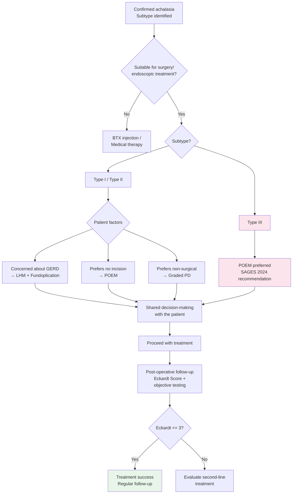

# Esophageal Achalasia — POEM vs Heller Myotomy Comparison

## Introduction

Peroral Endoscopic Myotomy (POEM) and Laparoscopic Heller Myotomy (LHM) are currently the two primary definitive treatment modalities for esophageal achalasia. Pneumatic Dilation (PD), as a non-surgical option, still has a role in selected patient populations.

This article provides a detailed comparison of these three treatments based on available clinical evidence and international guidelines (particularly the SAGES 2024 POEM Update).

---

## Detailed Comparison of the Three Major Treatment Modalities

### Comprehensive Comparison Table

| Category | POEM | LHM + Fundoplication | Pneumatic Dilation (PD) |
|----------|------|---------------------|------------------------|
| **Surgical approach** | Transoral, submucosal tunnel | Laparoscopic, 3–5 trocar incisions | Transoral, endoscopically guided |
| **Anesthesia** | General anesthesia | General anesthesia | Conscious sedation or general anesthesia |
| **External incision** | None | 3–5 incisions, 0.5–1.2 cm each | None |
| **Procedure time** | 60–120 minutes | 90–180 minutes | 15–30 minutes per session |
| **Myotomy method** | Inner circular muscle (anterior or posterior wall) | Outer circular + longitudinal muscle (anterior Heller incision) | Mechanical disruption of sphincter fibers |
| **Myotomy length adjustability** | High (can extend proximally > 10 cm) | Limited (standard: 6–8 cm esophageal + 2–3 cm gastric) | Not applicable |
| **Anti-reflux measure** | None (no standardized concurrent procedure) | Concurrent partial fundoplication (usually Dor or Toupet) | Not applicable |
| **Hospital stay** | 1–3 days | 1–3 days | Outpatient or 1 day |
| **Return to normal diet** | 1–2 weeks | 2–4 weeks | 1–2 days |
| **Return to normal activity** | 3–7 days | 2–4 weeks | 1–2 days |

<!-- 📷 Image placeholder -->
> **🖼️ Please insert image:**
> - Suggested image: POEM vs Heller Myotomy surgical approach comparison diagram
> - File location: `../images/poem_vs_heller_approach.png`
> - Source: Original illustration or licensed medical literature image

<!-- End of image placeholder -->

---

### Efficacy Comparison (by Subtype)

| Subtype | POEM Success Rate | LHM Success Rate | PD Success Rate |
|---------|-------------------|-------------------|-----------------|
| **Type I (Classic)** | 80–90% | 80–85% | 65–75% |
| **Type II (Pressurization)** | 90–95% | 90–95% | 75–80% |
| **Type III (Spastic)** | **85–95%** | 60–70% | 40–50% |
| **Overall** | 80–95% | 85–95% | 65–80% |

> **Key finding:** In Type III (spastic) achalasia, POEM efficacy is significantly superior to LHM and PD. The SAGES 2024 guidelines explicitly recommend POEM as the first-line treatment for Type III.

---

### Complication Comparison

| Complication | POEM | LHM | PD |
|-------------|------|-----|-----|
| **Post-operative GERD** | 20–50% (clinical symptoms); endoscopic esophagitis 30–60% | 10–30% (with fundoplication) | 5–15% |
| **Esophageal perforation** | < 0.5% (mucosal perforation more common; usually managed intraoperatively) | 1–5% | 1–5% |
| **Bleeding** | 1–2% | 1–2% | < 1% |
| **Pneumoperitoneum / pneumothorax / subcutaneous emphysema** | 5–15% (most self-resolving) | < 1% | Very rare |
| **Mucosal injury** | 2–5% (repairable intraoperatively) | < 1% | Not applicable |
| **Infection** | < 1% | 1–2% | Very rare |
| **Mortality** | < 0.1% | < 0.1% | < 0.1% |
| **Need for re-operation to manage complications** | < 1% | 1–2% | 1–3% (in cases of perforation) |

---

### In-Depth Comparison of Post-Operative GERD

Post-operative GERD is the most critical difference when comparing POEM and LHM:

| GERD Indicator | POEM | LHM + Fundoplication |
|----------------|------|---------------------|
| Subjective reflux symptoms | 15–30% | 10–20% |
| Abnormal acid exposure (pH monitoring) | 30–60% | 15–30% |
| Endoscopic esophagitis (Los Angeles classification) | 20–50% (mostly LA-A/B) | 10–20% |
| Severe esophagitis (LA-C/D) | 2–5% | < 2% |
| Barrett's esophagus (long-term follow-up) | Limited data; long-term observation needed | Rare |
| PPI usage rate | 30–50% | 15–25% |
| GERD-related quality of life impact | Most controllable with PPI | Lower |

> **Clinical significance:** Although the incidence of post-POEM GERD is higher, the vast majority of cases are mild to moderate and can be effectively controlled with PPIs. Severe, refractory GERD is uncommon. Whether long-term (>10 years) risk of Barrett's esophagus increases still requires follow-up data.

---

### Long-Term Efficacy and Re-Intervention

| Long-Term Indicator | POEM | LHM | PD |
|---------------------|------|-----|-----|
| 2-year symptom relief rate | 85–93% | 85–93% | 60–75% |
| 5-year symptom relief rate | 80–90% | 80–88% | 50–70% |
| 10-year symptom relief rate | Data accumulating (preliminary results favorable) | 75–85% | 40–60% |
| Re-treatment rate (within 5 years) | 5–15% | 10–15% | 25–40% |
| Re-treatment options | Repeat POEM, PD, LHM | PD, POEM | Repeat PD, POEM, LHM |

### 2025 Long-Term Follow-Up Meta-Analysis

A 2025 systematic review and meta-analysis (9 studies, 1,099 patients, mean follow-up 34.2 months) demonstrated:

- **No significant difference in long-term treatment success between POEM and LHM**
- Clinical success rate of 583 POEM patients was comparable to LHM
- A separate large cohort study (319 patients, median follow-up 73 months) showed a long-term POEM success rate of **92.6%**
- During long-term follow-up, symptomatic GERD incidence was 28.9% and reflux esophagitis was 35.3%

> **Conclusion**: Long-term efficacy of POEM has been more thoroughly validated, comparable to LHM, though GERD management remains an important consideration.

---

### Learning Curve

| Item | POEM | LHM |
|------|------|-----|
| Cases needed to achieve proficiency | 20–40 | 20–50 |
| Required foundational skills | Advanced endoscopic techniques (ESD experience advantageous) | Laparoscopic surgery fundamentals |
| Training specialty | Gastroenterology / Interventional endoscopy | General surgery / Digestive surgery |
| Volume–outcome relationship | Significantly better outcomes at high-volume centers | Better outcomes at high-volume centers |
| Complication rate and experience | Higher initially; decreases with experience | Similar trend |

---

## SAGES 2024 POEM Update — Key Recommendations

The Society of American Gastrointestinal and Endoscopic Surgeons (SAGES) published the POEM Update guidelines in 2024, with the following key recommendations:

### Core Recommendations

| Recommendation | Evidence Level (GRADE) | Strength |
|----------------|------------------------|----------|
| POEM can serve as a first-line definitive treatment for achalasia | Moderate | Conditional |
| POEM is recommended over pneumatic dilation (PD) | Low to Moderate | Conditional |
| POEM is recommended as the first-line treatment for Type III achalasia | Low | Conditional |
| Post-POEM GERD should be routinely assessed; PPI should be considered | Low to Moderate | Conditional |
| POEM should be performed at experienced centers | Expert consensus | **Strong** |

### Positioning of POEM vs LHM

- SAGES 2024 notes that POEM and LHM have **comparable short- to medium-term efficacy**
- For **Type III achalasia**, POEM is recommended as first-line due to the ability to extend the myotomy
- LHM + Fundoplication has an advantage in **reducing post-operative GERD**
- **The final choice should be based on**: patient subtype, operator experience, patient preference, and GERD risk assessment

---

### POEM-F: POEM with Fundoplication (2025-2026 New Development)

POEM-F (Peroral Endoscopic Myotomy with Fundoplication) is an innovative solution targeting post-POEM reflux, completing both myotomy and fundoplication in a single endoscopic procedure.

#### 2026 Meta-Analysis Results (9 Studies, 202 Patients)

| Indicator | POEM-F Results |
|-----------|---------------|
| Technical success rate | 94.8% |
| Achalasia clinical success rate | 96.4% |
| GERD resolution rate | 86.2% |
| Mean procedure time | 115.7 minutes (fundoplication portion approximately 55 minutes) |
| Re-intervention rate | 0% (at 6-month follow-up) |

#### Comparison with Standard POEM

| Indicator | Standard POEM | POEM-F |
|-----------|--------------|--------|
| Post-operative GERD (symptomatic) | 20-50% | Significantly reduced |
| Abnormal acid exposure | 43-47% | Approximately 11% (1-year follow-up) |
| Esophagitis | 13-19% | Significantly reduced |

> **Clinical significance**: POEM-F may address POEM's primary drawback -- post-operative reflux -- while preserving the advantages of endoscopic minimally invasive approach. Current evidence is primarily from small-scale studies; larger RCTs are needed for validation. This technique is performed at select specialized centers.

---

## Treatment Selection in Special Scenarios

### Second-Line Options After Initial Treatment Failure

| Initial Treatment | Recommended Second-Line | Notes |
|-------------------|------------------------|-------|
| PD failure | POEM or LHM | Both are viable options |
| POEM failure | Repeat POEM (different direction), PD, or LHM | Depends on the reason for failure |
| LHM failure | POEM (posterior approach) or PD | POEM advantage: can cut from a different direction |
| Multiple treatment failures | Consider esophagectomy | Last resort |

### Advantages of POEM as Salvage Therapy After Heller Myotomy

- LHM typically involves an **anterior** myotomy
- POEM can utilize a **posterior** approach, avoiding the prior surgical field
- Reduces the risk of adhesion-related complications
- For patients with recurrence after LHM, POEM is an effective rescue option

### Considerations for Sigmoid Esophagus

- Severe sigmoid esophagus increases the technical difficulty of both POEM and LHM
- Requires experienced operators
- Careful preoperative assessment of esophageal emptying function is needed
- Some patients may ultimately require esophagectomy

---

## Post-Operative Follow-Up Recommendations

| Time Point | Recommended Follow-Up Items |
|------------|----------------------------|
| Post-op day 1 | Barium study to confirm no leak (at physician's discretion) |
| 1–3 months post-op | Symptom assessment (Eckardt Score), TBE |
| 6 months post-op | Symptom assessment |
| 1 year post-op | HRM, pH monitoring (especially after POEM), upper endoscopy |
| 2–3 years post-op | Symptom assessment, consider TBE |
| Long-term (every 1–3 years) | Upper endoscopy (monitor GERD-related mucosal changes) |

### Eckardt Score (Clinical Symptom Score)

| Score | Dysphagia | Regurgitation | Chest Pain | Weight Loss |
|-------|-----------|---------------|------------|-------------|
| 0 | None | None | None | None |
| 1 | Occasional | Occasional | Occasional | < 5 kg |
| 2 | Daily | Daily | Daily | 5–10 kg |
| 3 | Every meal | Every meal | Every meal | > 10 kg |

- Total score range: 0–12
- **Eckardt Score ≤ 3** defines treatment success
- Used for pre-treatment baseline assessment and post-treatment follow-up comparison

---

## Clinical Decision Summary

---

## Key Points Summary

| Key Point | Explanation |
|-----------|-------------|
| POEM vs LHM efficacy | Comparable short- to medium-term efficacy; POEM clearly superior in Type III |
| Key difference | Post-operative GERD: higher with POEM; lower with LHM + Fundoplication |
| Type III first-line | POEM (SAGES 2024 conditional recommendation) |
| GERD management | Post-POEM GERD is mostly controllable with PPI |
| Learning curve | Both require 20–50 cases to achieve proficiency |
| Long-term data | LHM has >10 years of data; POEM data still accumulating |
