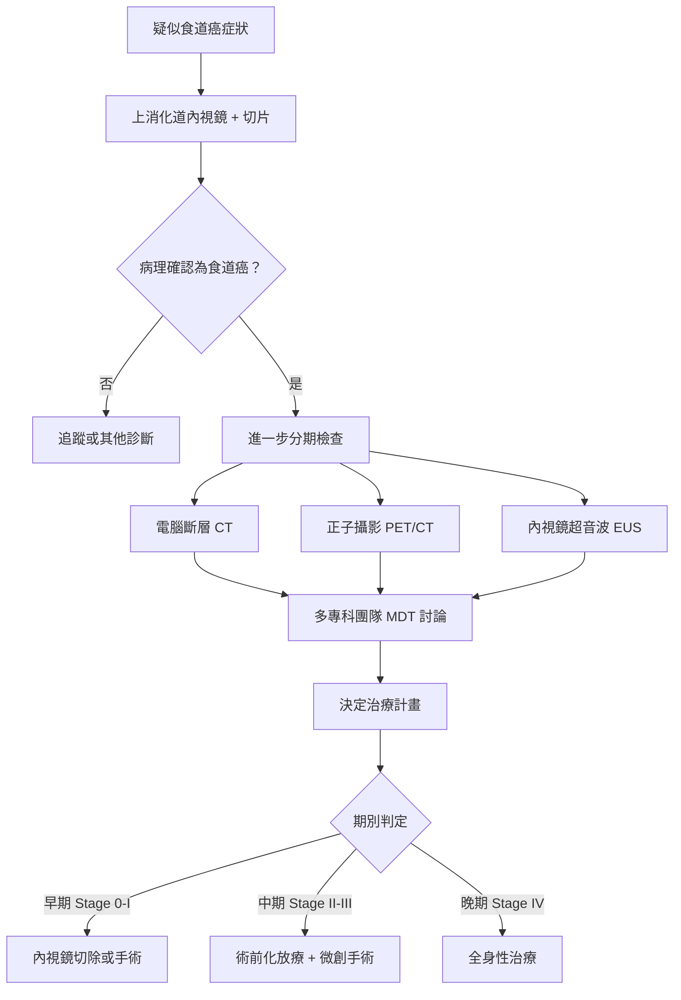

# 食道癌疾病介紹

## 什麼是食道癌 (Esophageal Cancer)？

食道 (esophagus) 是連接咽喉與胃的管狀器官，長約 25 公分，負責將食物從口腔輸送到胃部。當食道內壁的細胞發生不正常的增生與變異，就可能形成惡性腫瘤 (malignant tumor)，也就是食道癌。

食道癌是全球常見的消化道癌症之一，在台灣則長期位居男性癌症死因的前十名。由於食道癌早期症狀不明顯，許多患者在確診時已經是中晚期，因此了解疾病的基本知識、危險因子及早期警訊非常重要。

---

## 食道癌的類型

食道癌主要分為兩大類型：

### 1. 鱗狀細胞癌 (Squamous Cell Carcinoma, SCC)

- 起源於食道內壁的鱗狀上皮細胞 (squamous epithelial cells)
- 通常發生在食道的**上段或中段**
- 在亞洲地區（包括台灣）是最常見的食道癌類型
- 與抽菸、飲酒、食用過熱飲食密切相關

### 2. 腺癌 (Adenocarcinoma, EAC)

- 起源於食道下段的腺體細胞 (glandular cells)
- 通常發生在食道的**下段**，靠近胃的交界處
- 在歐美國家較為常見，且發生率持續上升
- 與胃食道逆流 (gastroesophageal reflux disease, GERD) 及巴雷特食道 (Barrett's esophagus) 密切相關

| 比較項目 | 鱗狀細胞癌 (SCC) | 腺癌 (EAC) |
|---------|-----------------|------------|
| 好發位置 | 食道上段、中段 | 食道下段 |
| 主要區域 | 亞洲、非洲 | 歐美國家 |
| 主要危險因子 | 菸酒、過熱飲食 | 胃食道逆流、肥胖 |
| 前驅病變 | 食道黏膜異常增生 | 巴雷特食道 |

---

## 危險因子 (Risk Factors)

以下因素可能增加罹患食道癌的風險：

### 生活習慣相關
- **吸菸 (smoking)**：吸菸者罹患食道癌的風險比不吸菸者高出數倍
- **飲酒 (alcohol consumption)**：尤其大量飲用烈酒，若同時吸菸則風險更高
- **食用過熱飲食 (hot beverages/food)**：長期飲用超過 65°C 的熱飲已被世界衛生組織列為可能致癌因子
- **嚼食檳榔**：在台灣為重要的危險因子，特別是與菸酒併用

### 疾病相關
- **胃食道逆流 (GERD)**：胃酸長期逆流刺激食道下段黏膜
- **巴雷特食道 (Barrett's esophagus)**：食道下段黏膜因長期胃酸刺激而產生變化，為腺癌的前驅病變 (precancerous condition)
- **食道弛緩不能症 (achalasia)**：食道下端肌肉無法正常放鬆

### 其他因素
- **年齡**：好發於 50 歲以上
- **性別**：男性發生率明顯高於女性（約 3-4 倍）
- **肥胖 (obesity)**：特別增加腺癌風險
- **營養缺乏**：長期缺乏蔬果攝取

---

## 常見症狀 (Symptoms)

食道癌的症狀往往在疾病進展到一定程度後才會出現，常見症狀包括：

### 主要症狀
1. **吞嚥困難 (dysphagia)**：這是最常見的症狀。一開始可能只是吞嚥固體食物時感覺卡卡的，隨著腫瘤變大，連喝水都可能困難
2. **體重減輕 (weight loss)**：因為吃不下導致體重在短時間內明顯下降（例如數週內減少 5 公斤以上）
3. **胸口疼痛或不適 (chest pain)**：吞嚥時感覺胸骨後方疼痛或有灼熱感

### 其他可能症狀
- 聲音沙啞 (hoarseness)
- 持續性咳嗽 (chronic cough)
- 消化不良或胃灼熱 (heartburn)
- 食物逆流
- 嘔血或解黑便
- 疲倦無力

> **重要提醒：** 以上症狀也可能由其他疾病引起。但若您有持續兩週以上的吞嚥困難或不明原因的體重減輕，請儘速就醫檢查。

---

## 如何診斷食道癌？

醫師會透過以下檢查來確認是否為食道癌：

<!-- 📷 圖片佔位 -->
> **🖼️ 請插入圖片：**
> - 建議圖片：食道癌內視鏡影像
> - 檔案放置：`../images/esophageal_cancer_endoscopy.png`
> - 來源：院內病例影像（需去識別化）

<!-- 圖片佔位結束 -->

### 主要診斷工具

1. **上消化道內視鏡 (upper GI endoscopy / esophagogastroduodenoscopy, EGD)**
   - 最重要的診斷工具
   - 醫師將一條細軟的管子（內視鏡）經口放入食道，直接觀察食道內壁
   - 可同時做切片 (biopsy) 取得組織送病理化驗
   - 國際指引建議至少取 6 個以上的組織切片

2. **電腦斷層掃描 (computed tomography, CT)**
   - 了解腫瘤的大小、位置及是否侵犯周圍組織
   - 評估是否有淋巴結 (lymph node) 或遠端器官轉移 (metastasis)

3. **正子攝影 (positron emission tomography, PET/CT)**
   - 利用癌細胞代謝活躍的特性，偵測全身是否有癌細胞擴散

4. **內視鏡超音波 (endoscopic ultrasound, EUS)**
   - 評估腫瘤侵犯食道壁的深度
   - 檢查食道周圍淋巴結是否有異常

---

## 食道癌的分期 (Staging)

分期是用來描述癌症嚴重程度的方式，醫師會依據腫瘤侵犯的深度、淋巴結轉移的數目、以及是否有遠端轉移來判定期別。簡單來說：

| 期別 | 簡易說明 | 治療方向 |
|------|---------|---------|
| 第零期 (Stage 0) | 癌細胞只在食道最表面 | 內視鏡治療即可 |
| 第一期 (Stage I) | 腫瘤侷限在食道壁淺層 | 手術為主，早期可用內視鏡切除 (endoscopic resection, ER) |
| 第二期 (Stage II) | 腫瘤侵犯較深或少數淋巴結轉移 | 手術搭配化療/放療 |
| 第三期 (Stage III) | 腫瘤侵犯更深或多個淋巴結轉移 | 術前化放療 (neoadjuvant chemoradiation) + 手術 |
| 第四期 (Stage IV) | 癌症已轉移至遠端器官 | 以全身性治療為主（化療、免疫治療） |

### 分期檢查流程

---

## 多專科團隊的重要性 (Multidisciplinary Team, MDT)

食道癌的治療需要多個科別的醫師共同合作，包括：

- **胸腔外科 / 消化外科醫師**：負責手術
- **腫瘤內科醫師**：負責化學治療 (chemotherapy) 與免疫治療 (immunotherapy)
- **放射腫瘤科醫師**：負責放射治療 (radiation therapy)
- **肝膽腸胃科醫師**：負責內視鏡檢查與早期治療
- **病理科醫師**：判讀組織檢體
- **營養師**：提供營養支持計畫
- **個案管理師**：協調各項治療與檢查

根據國際指引（NCCN 2025、ESMO 2022），多專科團隊討論 (MDT conference) 是食道癌治療的標準流程，能確保每位患者獲得最適合的個人化治療方案。

---

## 治療選項概覽

食道癌的治療會依據期別、腫瘤類型、患者健康狀態等因素來決定，主要治療方式包括：

1. **內視鏡切除 (Endoscopic Resection, ER)**：適用於極早期的食道癌
2. **手術切除 (Esophagectomy)**：食道癌治療的核心，目前以微創手術 (minimally invasive esophagectomy, MIE) 為趨勢
3. **化學治療 (Chemotherapy)**：使用藥物殺滅癌細胞
4. **放射治療 (Radiation Therapy)**：利用高能量射線消滅癌細胞
5. **免疫治療 (Immunotherapy)**：幫助免疫系統辨識並攻擊癌細胞
6. **標靶治療 (Targeted Therapy)**：針對癌細胞特定分子進行攻擊

> 在接下來的章節中，我們將詳細介紹**微創手術**的方式、術前準備及術後照護。

---

<!-- 🏥 院內資料區 - 請自行填入 -->
> **📋 請填入貴院資料：**
>
> - 本院負責科別：_______________
> - 聯絡電話 / 分機：_______________
> - 門診時間：_______________
> - 主治醫師：_______________
> - 本院手術特色 / 年手術量：_______________
<!-- 院內資料區結束 -->

---
## 延伸閱讀
- [想了解更多？請參閱進階版](../進階版/01_流行病學與分期.md)
- [食道功能檢查介紹](../../食道功能檢查/一般版/01_什麼是食道功能檢查.md)
