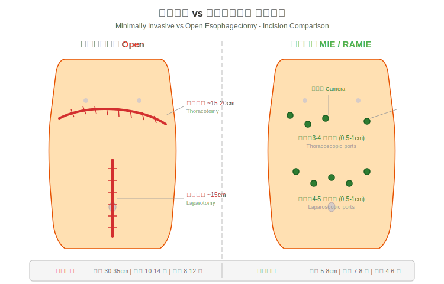

# 食道癌微創手術說明

## 什麼是微創手術 (Minimally Invasive Surgery)？

傳統的食道癌手術（開放式手術，open surgery）需要在胸部和腹部各切一道大傷口（通常 15-20 公分以上），將肋骨撐開才能進行操作。這樣的手術雖然有效，但對身體的傷害較大，術後疼痛明顯，恢復時間也較長。

**微創食道切除手術 (minimally invasive esophagectomy, MIE)** 則是透過數個小切口（通常每個約 1-2 公分），將高畫質攝影鏡頭 (camera) 和特殊的手術器械伸入體內進行操作。醫師在螢幕上觀看放大的手術影像，精確地切除腫瘤並重建消化道。


*圖：傳統開胸手術需要 30-35cm 的大切口，微創手術僅需數個 0.5-1cm 的小孔。*

---

## 微創手術的類型

### 1. 胸腔鏡/腹腔鏡手術 (Thoracoscopic/Laparoscopic MIE)

- 使用內視鏡 (endoscope) 搭配細長的手術器械
- 在胸部和腹部各開 3-5 個約 1-2 公分的小孔
- 醫師透過螢幕觀看手術視野進行操作
- 是目前最常見的微創食道手術方式

### 2. 機器人輔助手術 (Robot-Assisted Minimally Invasive Esophagectomy, RAMIE)

- 使用手術機器人系統（如達文西手術系統，da Vinci Surgical System）
- 醫師坐在操控台前，透過機械手臂進行手術
- 機器手臂可做到人手無法達到的精細旋轉動作（540 度旋轉）
- 提供 3D 立體高畫質影像，放大 10-15 倍
- 手部顫抖會被自動過濾，操作更加穩定精確

### 3. 單孔微創手術 (Single-Port MIE)

- 僅透過一個切口完成手術
- 傷口更小，美觀度更佳
- 技術難度較高，目前僅少數醫學中心可執行
- 台大醫院在此領域有先驅性的經驗

---

## 常見的手術路徑 (Surgical Approaches)

無論是傳統開放手術或微創手術，食道切除手術有幾種常見的路徑：

### Ivor Lewis 手術（經腹-經胸路徑）
- 先從**腹部**進行胃的游離與準備
- 再從**右側胸部**進行食道切除與吻合
- 適用於食道中下段腫瘤
- 是目前最常使用的手術路徑之一

### McKeown 手術（三切口路徑）
- 分別從**右側胸部、腹部、頸部**三個區域進行
- 可以切除較大範圍的食道
- 適用於食道上段或中段腫瘤
- 頸部吻合若發生滲漏，處理上較胸部安全

### 經裂孔手術 (Transhiatal Esophagectomy)
- 從**腹部**和**頸部**進行，不需打開胸腔
- 避免了胸腔手術的肺部併發症風險
- 適用於特定的食道下段腫瘤

---

## 微創手術 vs 傳統開放手術：比較表

| 比較項目 | 微創手術 (MIE) | 傳統開放手術 |
|---------|---------------|------------|
| **切口大小** | 數個 1-2 公分小孔 | 15-20 公分以上大傷口 |
| **手術時間** | 約 4-6 小時 | 約 4-6 小時（相近） |
| **術中出血量** | 較少 | 較多 |
| **術後疼痛** | 明顯較輕 | 較為劇烈 |
| **住院天數** | 約 8 天 | 約 10-14 天 |
| **加護病房 (ICU) 天數** | 較短 | 較長 |
| **肺部併發症** | 減少 14-65% | 較高 |
| **生活品質恢復** | 術後 6 週明顯較佳 | 恢復較慢 |
| **傷口美觀** | 疤痕小而隱蔽 | 明顯大疤痕 |
| **腫瘤切除效果** | 與開放手術相當 | 標準治療 |
| **淋巴結清除數目** | 相當或更多 | 標準 |

---

## 微創手術的優點

### 對患者的直接好處

1. **疼痛減輕**
   - 小傷口意味著較少的組織損傷
   - 不需撐開肋骨，避免了肋間神經的傷害
   - 術後止痛藥物使用量明顯減少

2. **恢復更快**
   - 平均住院天數約 8 天（傳統手術約 10-14 天）
   - 可更早開始下床走動
   - 更快回歸日常生活與工作

3. **肺部併發症降低**
   - 研究顯示可減少 14-65% 的肺部併發症 (pulmonary complications)
   - 這對食道癌患者特別重要，因為許多患者有吸菸病史

4. **出血量減少**
   - 精確的微創器械可減少術中失血
   - 降低需要輸血的可能性

5. **生活品質較佳**
   - 術後 6 週的生活品質評估 (quality of life, QoL) 顯示，微創手術患者的恢復明顯優於傳統手術

6. **腫瘤治療效果不打折**
   - 根據 MIRO 試驗 (MIRO trial) 結果，微創手術的完整切除率 (R0 resection rate) 與傳統手術相當
   - 微創手術的淋巴結清除數目甚至更多（平均 18 顆 vs 15 顆）
   - 三年整體存活率 (3-year overall survival) 達 58.4%

---

## 什麼情況適合做微創手術？

### 適合的情況
- 食道癌 Stage I 至 Stage III（經過適當的術前治療後）
- 患者整體健康狀態允許接受全身麻醉 (general anesthesia) 和手術
- 心肺功能 (cardiopulmonary function) 評估通過
- 腫瘤未侵犯重要的鄰近器官（如主動脈、氣管）

### 可能不適合的情況
- 腫瘤已有遠端轉移 (distant metastasis)（Stage IV）
- 腫瘤嚴重侵犯周圍重要器官
- 患者心肺功能不足以承受手術
- 曾接受過胸部或腹部大手術導致嚴重沾黏

> **注意：** 適不適合微創手術需由您的主治醫師根據完整評估後決定。每位患者的情況不同，醫師會為您量身選擇最安全、最適合的手術方式。

---

## 手術團隊與醫院選擇的重要性

食道切除手術是複雜度極高的手術之一。研究顯示：

- **醫院手術量與治療結果高度相關**
  - 高手術量醫院（每年 25 例以上）的手術死亡率為 3-8%
  - 低手術量醫院的手術死亡率可高達 16-23%
  - 每年執行 60 例以上的醫院治療成績最佳

- **醫師經驗同樣關鍵**
  - 微創食道手術有明確的學習曲線 (learning curve)
  - 經驗豐富的團隊能有效處理術中突發狀況

### 選擇醫院時可以詢問的問題：
1. 貴院每年執行多少例食道切除手術？
2. 其中微創手術的比例是多少？
3. 手術團隊的經驗有多久？
4. 術後併發症發生率及死亡率為何？
5. 是否有完整的多專科團隊照護？

---

## 手術的基本流程

```
手術前一晚
  ↓ 禁食、術前準備
手術當天
  ↓ 全身麻醉
  ↓ 腹部操作：游離胃部，製作胃管 (gastric conduit)
  ↓ 胸部操作：切除食道及周圍淋巴結
  ↓ 重建消化道：將胃管拉上與剩餘食道接合
  ↓ 放置引流管及空腸造口餵食管
  ↓ 手術結束，送往加護病房觀察
手術後
  ↓ 加護病房 1-2 天
  ↓ 轉至一般病房
  ↓ 逐步恢復飲食與活動
```

整個手術過程約 4-6 小時，手術中醫師會將切除的食道及淋巴結送往病理科做詳細的檢驗，以確認癌細胞的擴散範圍。

---

<!-- 🏥 院內資料區 - 請自行填入 -->
> **📋 請填入貴院資料：**
>
> - 本院負責科別：_______________
> - 聯絡電話 / 分機：_______________
> - 門診時間：_______________
> - 主治醫師：_______________
> - 本院手術特色 / 年手術量：_______________
<!-- 院內資料區結束 -->

---
## 延伸閱讀
- [想了解更多？請參閱進階版](../進階版/02_手術方式比較_MIE_vs_Open.md)
- [食道功能檢查介紹](../../食道功能檢查/一般版/01_什麼是食道功能檢查.md)
