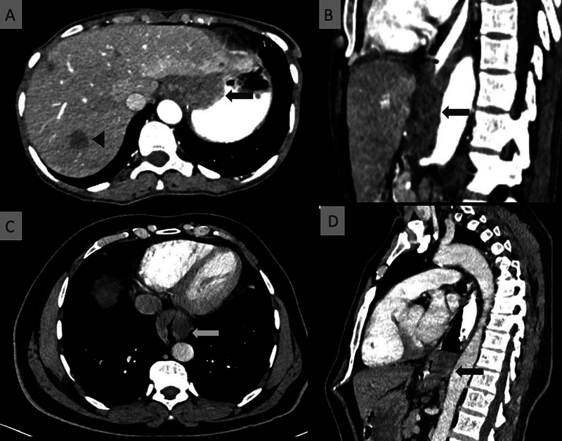
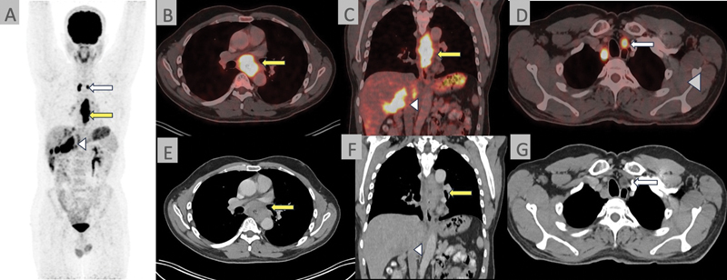
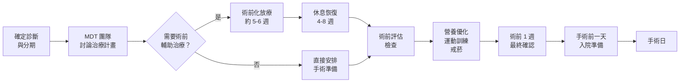

# 術前準備

## 前言

食道癌微創手術是一項大型手術，良好的術前準備可以顯著降低手術風險並促進術後恢復。本章將帶您了解從確定手術到進入手術室之前，您需要完成的各項準備工作。

---

## 術前檢查項目

在決定手術之前，醫療團隊需要透過一系列檢查來全面評估您的身體狀況：

*圖：電腦斷層 (CT) 顯示局部晚期食道癌，可見食道壁不對稱增厚。圖片來源：Talasila P, et al. Indian Journal of Medical and Paediatric Oncology. 2024. CC-BY. 原文：[PMC11651834](https://pmc.ncbi.nlm.nih.gov/articles/PMC11651834/)*

*圖：F18-FDG PET-CT 顯示食道癌原發腫瘤、淋巴結及遠端轉移。圖片來源：同上。*

### 1. 腫瘤相關檢查

| 檢查項目 | 目的 | 說明 |
|---------|------|------|
| 上消化道內視鏡 (EGD) | 確認腫瘤位置與範圍 | 同時做切片確認病理型態 |
| 電腦斷層 (CT) | 評估腫瘤侵犯範圍 | 包含胸部及腹部掃描 |
| 正子攝影 (PET/CT) | 偵測全身是否有轉移 | 對治療計畫非常重要 |
| 內視鏡超音波 (EUS) | 評估腫瘤深度 | 判斷 T 分期的重要依據 |

### 2. 心肺功能評估

由於手術需要全身麻醉 (general anesthesia) 且涉及胸腔操作，心肺功能的評估格外重要：

- **肺功能檢查 (pulmonary function test, PFT)**：評估您的肺活量與呼吸功能
- **心電圖 (electrocardiogram, ECG)**：確認心臟節律是否正常
- **心臟超音波 (echocardiography)**：視需要評估心臟功能
- **動脈血氣體分析 (arterial blood gas, ABG)**：視需要進行

### 3. 一般術前檢驗

- 血液常規檢查 (complete blood count, CBC)
- 肝腎功能 (liver and renal function tests)
- 凝血功能 (coagulation profile)
- 血型及交叉試驗 (blood type and crossmatch)
- 胸部 X 光 (chest X-ray)
- 營養狀態評估（白蛋白 albumin、前白蛋白 prealbumin）

---

## 術前輔助治療 (Neoadjuvant Therapy)

### 什麼是術前輔助治療？

對於中期的食道癌（Stage II-III），目前的國際指引（NCCN 2025、ESMO 2022）建議在手術之前先接受**術前輔助治療**，目的是：

1. **縮小腫瘤**：讓手術更容易完整切除
2. **消滅微小轉移**：殺滅肉眼看不見的微小癌細胞擴散
3. **提高存活率**：研究證實術前治療可改善長期治療成果

### 術前治療的方式

根據癌症的類型與分期，醫師可能建議：

- **術前同步化學放射治療 (neoadjuvant chemoradiation therapy, nCRT)**
  - 同時進行化學治療 (chemotherapy) 和放射治療 (radiation therapy)
  - NCCN 2025 指引建議此為局部進展型腺癌 (adenocarcinoma) 的首選方案
  - 療程通常約 5-6 週

- **術前化學治療 (neoadjuvant chemotherapy)**
  - 僅使用化學治療藥物
  - ESMO 指引建議周術期化療 (perioperative chemotherapy) 為選項之一
  - 療程通常 2-3 個月

- **術前免疫治療合併化療 (neoadjuvant immunotherapy + chemotherapy)**
  - 較新的治療模式，特別適用於鱗狀細胞癌 (SCC)
  - 目前多項臨床試驗顯示令人鼓舞的結果

### 術前治療期間的注意事項
- 規律接受治療，不要自行中斷
- 若出現嚴重副作用（如高燒、嚴重嘔吐），立即聯繫醫療團隊
- 維持均衡飲食，補充足夠營養
- 療程結束後約 4-8 週安排手術

---

## 營養優化 (Nutrition Optimization)

食道癌患者常因吞嚥困難而營養不良，但良好的營養狀態是手術成功的重要基礎：

### 營養評估指標
- 體重變化趨勢
- 血清白蛋白 (serum albumin) 數值
- 身體質量指數 (body mass index, BMI)

### 營養支持策略

1. **口服營養補充 (oral nutritional supplements, ONS)**
   - 高蛋白、高熱量的營養品
   - 少量多餐，選擇質地柔軟或流質的食物

2. **管灌營養 (enteral nutrition)**
   - 若口服進食量嚴重不足，醫師可能建議放置鼻胃管 (nasogastric tube) 或空腸造口管 (jejunostomy tube) 來補充營養

3. **靜脈營養 (parenteral nutrition)**
   - 在極端情況下，透過靜脈輸注營養

### 飲食建議
- 選擇高蛋白食物：魚、蛋、豆腐、雞肉
- 少量多餐（每天 6-8 小餐）
- 避免太硬、太乾或太大塊的食物
- 細嚼慢嚥
- 必要時將食物打成泥狀或流質
- 每天記錄飲食量，回診時告知營養師

---

## 戒菸 (Smoking Cessation)

如果您目前仍有吸菸習慣，**戒菸是術前最重要的準備之一**：

### 為什麼必須戒菸？
- 吸菸會損害肺部功能，增加術後肺炎 (pneumonia) 和呼吸衰竭的風險
- 影響傷口癒合
- 增加麻醉併發症的風險
- 持續吸菸會降低化療和放療的效果

### 理想的戒菸時間
- **最好在手術前至少 4-8 週完全戒菸**
- 即使是手術前 2 週戒菸，也能部分降低併發症風險
- 醫師可開立戒菸藥物或轉介戒菸門診協助您

---

## 術前運動訓練 (Prehabilitation)

術前運動訓練是近年來越來越受重視的準備項目，研究顯示能有效改善術後恢復：

### 呼吸訓練
- **誘發性肺量計 (incentive spirometry)** 練習：每小時做 10 次深呼吸
- **腹式呼吸 (diaphragmatic breathing)**：深吸氣讓腹部鼓起，緩慢吐氣
- **有效咳嗽練習**：學會如何在術後正確地咳痰

### 體能訓練
- 每天步行至少 30 分鐘
- 簡單的上下肢肌力訓練
- 視體能狀況循序漸進增加運動量

### 心理準備
- 了解手術流程，減少未知的焦慮
- 若感到焦慮或憂鬱，可向醫療團隊尋求心理支持
- 與家人討論術後的照護安排

---

## 術前準備時間表

---

## 手術前一天的準備

### 入院當天
- 辦理住院手續
- 麻醉科醫師術前訪視，說明麻醉方式與風險
- 護理師說明術後照護注意事項
- 確認手術同意書已簽署

### 飲食
- 依醫囑時間開始**禁食 (NPO)**（通常是手術前 6-8 小時）
- 手術前 2 小時可能允許喝少量清水（依各院規定）

### 其他準備
- 依指示進行腸道準備（視醫囑而定）
- 沐浴清潔
- 移除指甲油、首飾、假牙、隱形眼鏡
- 穿著寬鬆舒適的衣物

---

## 住院需要攜帶的物品

### 必要物品
- 身分證、健保卡
- 個人藥物清單（目前正在服用的所有藥物）
- 過敏史紀錄
- 事前填寫好的醫療文件

### 日常用品
- 個人盥洗用品（牙刷、毛巾、衛生紙）
- 舒適的拖鞋或防滑鞋
- 寬鬆的換洗衣物（前開式較方便）
- 面紙、濕紙巾

### 恢復輔助用品
- 手機與充電器
- 小枕頭（術後咳嗽時可抱住胸口減少疼痛）
- 簡單的娛樂物品（書、平板）

### 不建議攜帶
- 貴重物品
- 大量現金
- 食物或飲料（入院後依醫囑進食）

---

## 術前用藥注意事項

請務必在術前門診時告知醫師您目前使用的所有藥物，包括：

- 處方藥物
- 保健食品與中藥
- 抗凝血藥物 (anticoagulants)（如：阿斯匹靈 aspirin、華法林 warfarin）
  - 通常需要在手術前 5-7 天停用
- 降血糖藥物（手術當天可能需要調整劑量）
- 降血壓藥物（通常手術當天早晨照常服用，配少量水）

> **重要提醒：** 請勿自行停藥或調整藥物劑量，務必遵照醫師指示。

---

## 術前一日檢查清單

- [ ] 已完成所有術前檢查
- [ ] 已簽署手術同意書與麻醉同意書
- [ ] 已告知醫師目前使用的所有藥物
- [ ] 已依指示停用抗凝血藥物
- [ ] 已安排術後照護人力（家屬或看護）
- [ ] 已了解禁食時間
- [ ] 已準備住院物品
- [ ] 已練習深呼吸與有效咳嗽
- [ ] 已安排交通方式（出院時需要人接送）
- [ ] 已告知工作單位請假事宜

---

<!-- 🏥 院內資料區 - 請自行填入 -->
> **📋 請填入貴院資料：**
>
> - 本院負責科別：_______________
> - 聯絡電話 / 分機：_______________
> - 門診時間：_______________
> - 主治醫師：_______________
> - 本院手術特色 / 年手術量：_______________
<!-- 院內資料區結束 -->

---
## 延伸閱讀
- [想了解更多？請參閱進階版](../進階版/03_國際指引摘要_NCCN_ESMO.md)
- [食道功能檢查介紹](../../食道功能檢查/一般版/01_什麼是食道功能檢查.md)
