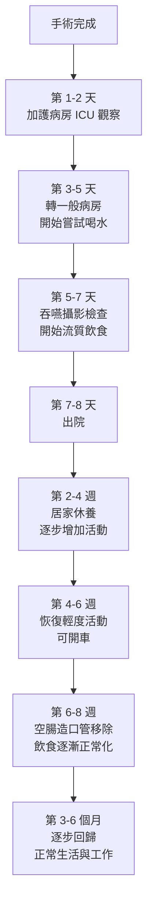

# 術後照護與恢復

## 前言

食道癌微創手術後的恢復是一個循序漸進的過程。了解每個階段的重點照護事項，能幫助您和家屬做好準備，安心度過恢復期。本章將按時間順序說明從手術結束到回歸日常生活的完整恢復歷程。

---

## 術後恢復時間表

---

## 第一階段：加護病房 (ICU)（術後第 1-2 天）

### 為什麼需要住加護病房？
食道切除手術是大型手術，術後前 1-2 天需要在加護病房 (intensive care unit, ICU) 進行密切監控，確保生命徵象穩定。

### 這個階段您會經歷什麼？

- **各種管路**
  - 氣管內管 (endotracheal tube)：可能在術後當天或隔天拔除
  - 胸腔引流管 (chest drain)：引流胸腔內的液體
  - 鼻胃管 (nasogastric tube, NG tube)：減壓並引流胃液
  - 空腸造口餵食管 (jejunostomy feeding tube)：直接從小腸提供營養
  - 尿管 (urinary catheter)：監測尿量
  - 靜脈點滴 (intravenous line, IV)：輸注藥物與液體

- **疼痛控制 (pain management)**
  - 硬膜外止痛 (epidural analgesia) 或靜脈自控式止痛 (patient-controlled analgesia, PCA)
  - 微創手術的疼痛通常比傳統手術輕很多
  - 護理人員會定時評估疼痛程度並調整用藥

- **早期活動**
  - 醫療團隊會鼓勵您在術後第一天就開始在床上做簡單的肢體活動
  - 盡早坐起（在護理人員協助下）
  - 早期活動有助於預防血栓 (thrombosis) 和肺炎 (pneumonia)

### 家屬須知
- ICU 探視時間有限制，請配合院方規定
- 護理人員會定期更新患者狀況
- 看到許多管路不要驚慌，這些都是暫時性的監測與治療工具

---

## 第二階段：一般病房（術後第 3-7 天）

### 轉至一般病房的條件
- 生命徵象穩定
- 不需要呼吸器輔助
- 疼痛控制良好

### 這個階段的重點

#### 逐步拔除管路
- 尿管通常在第 2-3 天拔除
- 胸腔引流管在引流量減少後拔除（約第 3-5 天）
- 鼻胃管在確認腸胃功能恢復後拔除

#### 開始恢復進食
- **先以空腸造口管 (jejunostomy tube) 灌注營養**
- 約第 5-7 天會安排**吞嚥攝影檢查 (swallow study)**
  - 確認食道與胃的接合處（吻合口 anastomosis）沒有滲漏
- 檢查通過後，開始嘗試少量清水
- 逐步進展到清流質飲食 (clear liquid diet)

#### 活動與復健
- 每天目標：在走廊步行 2-4 次
- 持續練習深呼吸與咳痰
- 使用誘發性肺量計 (incentive spirometry) 鍛鍊肺功能
- 坐姿時間逐漸延長

#### 疼痛管理
- 逐漸轉換為口服止痛藥
- 微創手術患者的疼痛通常在第 3-5 天明顯改善
- 若疼痛加劇或改變型態，立即告知護理人員

---

## 第三階段：出院準備（約術後第 7-8 天）

### 出院條件
- 能自行行走
- 口服止痛藥可控制疼痛
- 能耐受流質或軟質飲食
- 空腸造口管照護已由家屬學會
- 沒有發燒 (fever) 或感染跡象
- 胸腔引流管已拔除

### 出院時會帶回家的東西
- **空腸造口管 (jejunostomy tube)**：通常需使用 6-8 週
- 口服止痛藥處方
- 出院藥物（包括胃酸抑制劑等）
- 回診預約單
- 居家照護說明書

---

## 第四階段：居家恢復（出院後 2-8 週）

### 飲食進展

術後的飲食恢復需要**循序漸進**，千萬不能操之過急：

| 時期 | 飲食型態 | 說明 |
|------|---------|------|
| 第 1-2 週 | 清流質 (clear liquids) | 水、清湯、稀釋果汁、茶 |
| 第 2-3 週 | 全流質 (full liquids) | 米漿、豆漿、優格、營養補充品 |
| 第 3-4 週 | 軟質飲食 (soft diet) | 稀飯、蒸蛋、豆腐、魚肉泥 |
| 第 5-6 週 | 半固體飲食 | 軟飯、細碎的肉類、煮軟的蔬菜 |
| 第 6-8 週以後 | 漸趨正常飲食 | 質地柔軟的一般食物，避免過硬食材 |

### 飲食注意事項

1. **少量多餐 (small frequent meals)**
   - 每天 6-8 小餐，每餐分量約原本的 1/3 到 1/2
   - 胃容量變小是正常的，慢慢就會適應

2. **細嚼慢嚥**
   - 每口食物至少咀嚼 20-30 次
   - 用餐時間至少 30 分鐘

3. **進食姿勢**
   - 用餐時坐直，餐後保持上半身直立至少 30-60 分鐘
   - 睡覺時將頭部墊高 15-30 度，避免逆流

4. **避免的食物**
   - 碳酸飲料（容易脹氣）
   - 過甜或高糖食物（可能引發傾倒症候群 dumping syndrome）
   - 太硬、太乾或纖維太粗的食物
   - 酒精
   - 辛辣刺激食物

5. **水分攝取**
   - 每天至少 1500-2000 毫升
   - 避免在用餐時大量喝水（飯前或飯後 30 分鐘再喝）

### 空腸造口管照護

空腸造口管 (jejunostomy tube) 是術後重要的營養補充管道：

- **使用期間**：通常 6-8 週，直到口服進食量足夠
- **日常照護**：
  - 每天清潔造口周圍皮膚
  - 保持敷料乾燥
  - 灌食前後用溫水沖洗管路
  - 若管路阻塞或脫出，立即聯繫醫療團隊
- **灌食方式**：依營養師指示，通常一天灌食 4-6 次或持續滴注

### 傷口照護

- 微創手術的小傷口通常癒合良好
- 保持傷口清潔乾燥
- 術後約 7-10 天拆線（或使用可吸收縫線）
- 傷口癒合後可淋浴，避免泡澡
- 若傷口出現紅腫、滲液、異味或發燒，立即就醫

### 活動與運動

| 時間 | 建議活動 |
|------|---------|
| 出院後第 1-2 週 | 室內走動、簡單家務、短距離散步 |
| 第 2-4 週 | 每天戶外散步 20-30 分鐘，逐漸增加 |
| 第 4-6 週 | 可恢復開車（確認止痛藥不影響注意力） |
| 第 6-8 週 | 恢復輕度運動（如快走、瑜伽） |
| 第 3 個月以後 | 視恢復情況逐步增加運動強度 |

**注意事項：**
- 術後 6 週內避免提超過 5 公斤的重物
- 避免劇烈運動或腹部用力的動作
- 若活動時感到胸痛或呼吸急促，立即休息並告知醫師

---

## 傾倒症候群 (Dumping Syndrome)

這是食道手術後常見的情形，因食物太快進入小腸所引起：

### 早期傾倒症候群（進食後 15-30 分鐘）
- 腹脹、腹痛、噁心
- 腹瀉
- 冒冷汗、心悸
- 頭暈

### 晚期傾倒症候群（進食後 1-3 小時）
- 低血糖症狀：手抖、冒汗、虛弱、頭暈

### 預防方法
- 少量多餐
- 避免高糖食物和飲料
- 進食時不要大量喝水
- 用餐後平躺 20-30 分鐘

> 傾倒症候群通常會隨著時間逐漸改善，多數患者在數月後症狀會明顯減輕。

---

## 需要立即就醫的警示症狀

出院後若出現以下任何症狀，請立即聯繫您的醫療團隊或前往急診：

- **發燒**：體溫超過 38°C
- **傷口異常**：紅腫、化膿、異味或傷口裂開
- **呼吸困難**：呼吸急促或胸痛
- **嚴重噁心嘔吐**：無法進食或喝水
- **吞嚥困難加劇**：比出院時更嚴重
- **持續性腹痛**
- **黑便或吐血**
- **空腸造口管脫出或阻塞**
- **心跳過快或過慢**
- **持續高燒不退或寒顫**

---

## 術後追蹤計畫 (Follow-up Schedule)

定期回診追蹤非常重要，可以及早發現復發或處理術後問題：

| 時間 | 追蹤項目 |
|------|---------|
| 術後 2 週 | 傷口檢查、拆線、飲食評估 |
| 術後 1 個月 | 整體恢復評估、營養狀態 |
| 術後 3 個月 | 血液檢查、CT 掃描、營養追蹤 |
| 術後 6 個月 | 內視鏡檢查、CT 掃描、腫瘤指數 |
| 術後 1 年 | 完整影像學檢查 |
| 之後每 6-12 個月 | 定期追蹤至少 5 年 |

### 術後輔助治療
- 依據手術後的病理報告結果，醫師可能建議進行術後輔助化療 (adjuvant chemotherapy) 或免疫治療 (immunotherapy)
- 這些治療有助於降低癌症復發的風險
- 請與您的腫瘤科醫師詳細討論

---

## 長期併發症管理

食道切除術後可能出現以下長期狀況，需要持續追蹤與管理：

### 吻合口狹窄 (Anastomotic Stricture)
- **發生率**：約 10-20% 的病人可能出現
- **症狀**：吞嚥固體食物逐漸困難
- **處理**：內視鏡氣球擴張術，通常可有效改善
- **追蹤**：如有吞嚥困難加重，應及早回診

### 胃食道逆流 (Gastroesophageal Reflux)
- **原因**：術後食道結構改變，抗逆流機制減弱
- **處理**：長期服用氫離子幫浦抑制劑 (PPI)
- **生活調整**：抬高床頭 15-20 公分、避免睡前進食

### 營養缺乏
- **常見缺乏**：維生素 B12、鐵質、鈣質、維生素 D
- **原因**：胃容量減少、吸收面積改變
- **處理**：定期抽血檢查、必要時口服補充劑
- **建議**：每 3-6 個月追蹤營養指標

### 傾食症候群 (Dumping Syndrome)
- **早期傾食**：進食後 15-30 分鐘出現腹脹、腹瀉、冒冷汗
- **晚期傾食**：進食後 1-3 小時出現低血糖症狀
- **處理**：少量多餐、避免高糖食物、進食時減少液體攝取

---

## 心理調適與支持

手術後的心理調適同樣重要：

- **給自己時間**：恢復是漸進的過程，不要急於恢復到手術前的狀態
- **設定合理期望**：飲食習慣改變是正常的，身體會慢慢適應
- **尋求支持**：
  - 與家人朋友分享您的感受
  - 加入病友支持團體
  - 必要時尋求專業心理諮商
- **維持正向態度**：專注於每天的小進步

---

<!-- 🏥 院內資料區 - 請自行填入 -->
> **📋 請填入貴院資料：**
>
> - 本院負責科別：_______________
> - 聯絡電話 / 分機：_______________
> - 門診時間：_______________
> - 主治醫師：_______________
> - 本院手術特色 / 年手術量：_______________
<!-- 院內資料區結束 -->

---
## 延伸閱讀
- [想了解更多？請參閱進階版](../進階版/04_頂尖醫院與治療成果.md)
- [食道功能檢查介紹](../../食道功能檢查/一般版/01_什麼是食道功能檢查.md)
