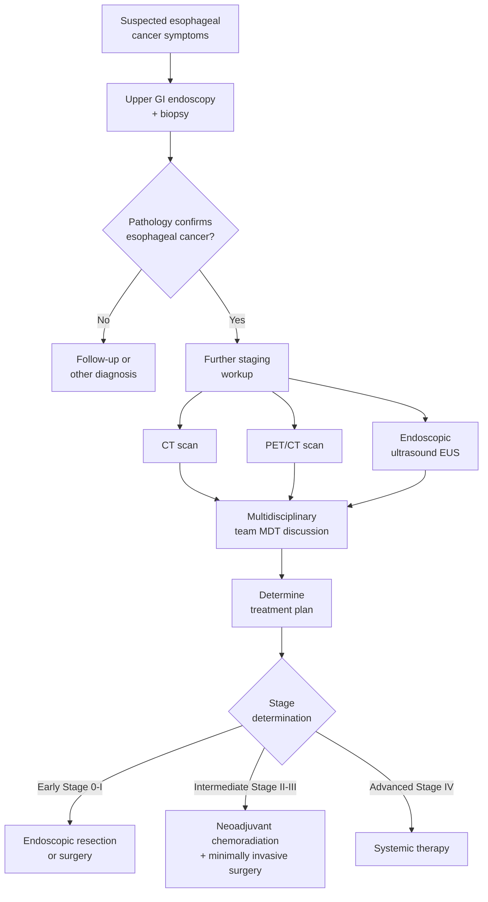

# Introduction to Esophageal Cancer

## What Is Esophageal Cancer?

The esophagus is a tube-shaped organ approximately 25 cm long that connects the throat to the stomach and is responsible for transporting food from the mouth to the stomach. When cells lining the inner wall of the esophagus undergo abnormal growth and mutations, a malignant tumor may form -- this is esophageal cancer.

Esophageal cancer is one of the most common gastrointestinal cancers worldwide. In Taiwan, it has consistently ranked among the top ten causes of cancer death in men. Because early-stage esophageal cancer often presents with no obvious symptoms, many patients are already at an intermediate or advanced stage at the time of diagnosis. Understanding the basics of the disease, risk factors, and early warning signs is therefore critically important.

---

## Types of Esophageal Cancer

Esophageal cancer is primarily classified into two major types:

### 1. Squamous Cell Carcinoma (SCC)

- Originates from the squamous epithelial cells lining the esophagus
- Usually occurs in the **upper or middle** esophagus
- The most common type of esophageal cancer in Asia (including Taiwan)
- Closely associated with smoking, alcohol consumption, and intake of very hot foods and beverages

### 2. Adenocarcinoma (EAC)

- Originates from the glandular cells in the lower esophagus
- Usually occurs in the **lower** esophagus, near the gastroesophageal junction
- More common in Western countries, with a continuously rising incidence
- Closely associated with gastroesophageal reflux disease (GERD) and Barrett's esophagus

| Feature | Squamous Cell Carcinoma (SCC) | Adenocarcinoma (EAC) |
|---------|-------------------------------|----------------------|
| Common location | Upper and middle esophagus | Lower esophagus |
| Predominant regions | Asia, Africa | Western countries |
| Major risk factors | Tobacco, alcohol, hot foods/beverages | GERD, obesity |
| Precursor lesion | Esophageal mucosal dysplasia | Barrett's esophagus |

---

## Risk Factors

The following factors may increase the risk of developing esophageal cancer:

### Lifestyle-Related
- **Smoking**: Smokers have a several-fold higher risk of esophageal cancer compared to non-smokers
- **Alcohol consumption**: Especially heavy consumption of spirits; the risk is even higher when combined with smoking
- **Consumption of very hot foods/beverages**: Long-term intake of beverages above 65 degrees C has been classified by the WHO as a probable carcinogen
- **Betel nut chewing**: An important risk factor in Taiwan, particularly when combined with tobacco and alcohol use

### Disease-Related
- **Gastroesophageal reflux disease (GERD)**: Chronic reflux of stomach acid irritates the lower esophageal mucosa
- **Barrett's esophagus**: A precancerous condition in which the lower esophageal mucosa undergoes changes due to chronic acid exposure
- **Achalasia**: The lower esophageal sphincter fails to relax properly

### Other Factors
- **Age**: Most commonly occurs after age 50
- **Sex**: Incidence in men is significantly higher than in women (approximately 3-4 times)
- **Obesity**: Particularly increases the risk of adenocarcinoma
- **Nutritional deficiencies**: Long-term inadequate intake of fruits and vegetables

---

## Common Symptoms

Symptoms of esophageal cancer often do not appear until the disease has progressed significantly. Common symptoms include:

### Primary Symptoms
1. **Dysphagia (difficulty swallowing)**: This is the most common symptom. Initially, it may feel like food gets stuck when swallowing solids; as the tumor grows, even drinking water may become difficult
2. **Weight loss**: Inability to eat leads to significant weight loss over a short period (e.g., more than 5 kg within a few weeks)
3. **Chest pain or discomfort**: Pain or a burning sensation behind the sternum when swallowing

### Other Possible Symptoms
- Hoarseness
- Chronic cough
- Heartburn or indigestion
- Food regurgitation
- Vomiting blood or black stools
- Fatigue and weakness

> **Important Reminder:** The symptoms listed above may also be caused by other conditions. However, if you experience persistent difficulty swallowing for more than two weeks or unexplained weight loss, please seek medical attention promptly.

---

## How Is Esophageal Cancer Diagnosed?

Physicians use the following examinations to determine whether esophageal cancer is present:

### Primary Diagnostic Tools

1. **Upper GI Endoscopy (Esophagogastroduodenoscopy, EGD)**
   - The most important diagnostic tool
   - A thin, flexible tube (endoscope) is inserted through the mouth into the esophagus to directly examine the esophageal lining
   - Tissue biopsies can be taken simultaneously and sent for pathological analysis
   - International guidelines recommend obtaining at least 6 tissue biopsies

2. **Computed Tomography (CT)**
   - Assesses tumor size, location, and whether it has invaded surrounding tissues
   - Evaluates for lymph node or distant organ metastasis

3. **Positron Emission Tomography (PET/CT)**
   - Uses the high metabolic activity of cancer cells to detect cancer spread throughout the body

4. **Endoscopic Ultrasound (EUS)**
   - Evaluates the depth of tumor invasion into the esophageal wall
   - Examines whether perilesional lymph nodes are abnormal

---

## Staging of Esophageal Cancer

Staging describes the severity of cancer. Physicians determine the stage based on the depth of tumor invasion, the number of lymph node metastases, and whether distant metastasis is present. In simple terms:

| Stage | Brief Description | Treatment Approach |
|-------|-------------------|--------------------|
| Stage 0 | Cancer cells are only on the outermost surface of the esophagus | Endoscopic treatment |
| Stage I | Tumor confined to the superficial layers of the esophageal wall | Primarily surgery; early cases may be treated with endoscopic resection (ER) |
| Stage II | Deeper tumor invasion or limited lymph node metastasis | Surgery combined with chemotherapy/radiation |
| Stage III | Even deeper tumor invasion or multiple lymph node metastases | Neoadjuvant chemoradiation + surgery |
| Stage IV | Cancer has metastasized to distant organs | Primarily systemic therapy (chemotherapy, immunotherapy) |

### Staging Workup Flowchart

---

## Importance of the Multidisciplinary Team (MDT)

The treatment of esophageal cancer requires collaboration among physicians from multiple specialties, including:

- **Thoracic / Gastrointestinal Surgeons**: Responsible for surgery
- **Medical Oncologists**: Responsible for chemotherapy and immunotherapy
- **Radiation Oncologists**: Responsible for radiation therapy
- **Gastroenterologists**: Responsible for endoscopic examination and early-stage treatment
- **Pathologists**: Interpret tissue specimens
- **Dietitians**: Provide nutritional support plans
- **Case Managers**: Coordinate treatments and examinations

According to international guidelines (NCCN 2025, ESMO 2022), multidisciplinary team discussion (MDT conference) is the standard of care for esophageal cancer, ensuring that each patient receives the most appropriate individualized treatment plan.

---

## Overview of Treatment Options

Treatment for esophageal cancer is determined based on the stage, tumor type, and the patient's overall health. The main treatment modalities include:

1. **Endoscopic Resection (ER)**: Suitable for very early-stage esophageal cancer
2. **Esophagectomy**: The cornerstone of esophageal cancer treatment; minimally invasive esophagectomy (MIE) is the current trend
3. **Chemotherapy**: Uses drugs to destroy cancer cells
4. **Radiation Therapy**: Uses high-energy beams to eliminate cancer cells
5. **Immunotherapy**: Helps the immune system recognize and attack cancer cells
6. **Targeted Therapy**: Attacks specific molecules on cancer cells

> In the following chapters, we will provide detailed information about **minimally invasive surgery**, pre-surgery preparation, and post-surgery care.

---

<!-- 🏥 Hospital-Specific Information - Please fill in -->
> **📋 Please enter your hospital information:**
>
> - Department: _______________
> - Contact / Extension: _______________
> - Clinic Hours: _______________
> - Attending Physician(s): _______________
> - Hospital Specialties / Annual Volume: _______________
<!-- End of hospital-specific information -->

---
## Further Reading
- [For more details, see the Advanced Version](../../進階版/EN/01_Epidemiology_and_Staging.md)
- [Introduction to Esophageal Function Tests](../../../食道功能檢查/一般版/01_什麼是食道功能檢查.md)
