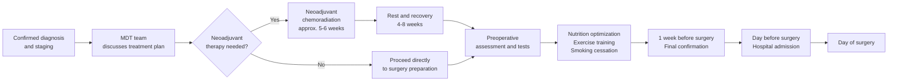

# Pre-Surgery Preparation

## Introduction

Minimally invasive esophageal cancer surgery is a major procedure. Thorough preoperative preparation can significantly reduce surgical risk and promote postoperative recovery. This chapter will guide you through everything you need to complete from the time surgery is decided to the moment you enter the operating room.

---

## Preoperative Examinations

Before surgery, the medical team needs to comprehensively assess your physical condition through a series of tests:

### 1. Tumor-Related Tests

| Test | Purpose | Notes |
|------|---------|-------|
| Upper GI Endoscopy (EGD) | Confirm tumor location and extent | Biopsies taken to determine pathological type |
| CT Scan | Evaluate extent of tumor invasion | Includes chest and abdominal scanning |
| PET/CT Scan | Detect systemic metastasis | Very important for treatment planning |
| Endoscopic Ultrasound (EUS) | Assess tumor depth | Key for determining T stage |

### 2. Cardiopulmonary Function Assessment

Because surgery requires general anesthesia and involves thoracic manipulation, cardiopulmonary evaluation is especially important:

- **Pulmonary function test (PFT)**: Evaluates lung capacity and respiratory function
- **Electrocardiogram (ECG)**: Confirms normal cardiac rhythm
- **Echocardiography**: Assesses cardiac function as needed
- **Arterial blood gas (ABG)**: Performed as needed

### 3. General Preoperative Tests

- Complete blood count (CBC)
- Liver and renal function tests
- Coagulation profile
- Blood type and crossmatch
- Chest X-ray
- Nutritional status assessment (serum albumin, prealbumin)

---

## Neoadjuvant Therapy

### What Is Neoadjuvant Therapy?

For intermediate-stage esophageal cancer (Stage II-III), current international guidelines (NCCN 2025, ESMO 2022) recommend receiving **neoadjuvant therapy** before surgery. The goals are:

1. **Shrink the tumor**: Making complete surgical resection easier
2. **Eliminate micrometastases**: Destroying microscopic cancer cells that have spread beyond the primary site
3. **Improve survival**: Studies have confirmed that neoadjuvant therapy improves long-term outcomes

### Types of Neoadjuvant Therapy

Depending on the cancer type and stage, your physician may recommend:

- **Neoadjuvant chemoradiation therapy (nCRT)**
  - Chemotherapy and radiation therapy administered simultaneously
  - NCCN 2025 guidelines recommend this as the preferred approach for locally advanced adenocarcinoma
  - Treatment course typically lasts approximately 5-6 weeks

- **Neoadjuvant chemotherapy**
  - Chemotherapy drugs only
  - ESMO guidelines recommend perioperative chemotherapy as one option
  - Treatment course typically lasts 2-3 months

- **Neoadjuvant immunotherapy combined with chemotherapy**
  - A newer treatment approach, particularly suitable for squamous cell carcinoma (SCC)
  - Multiple clinical trials are currently showing encouraging results

### Precautions During Neoadjuvant Therapy
- Attend all scheduled treatments; do not stop on your own
- If severe side effects occur (e.g., high fever, severe vomiting), contact your medical team immediately
- Maintain a balanced diet and ensure adequate nutrition
- Surgery is typically scheduled 4-8 weeks after therapy completion

---

## Nutrition Optimization

Esophageal cancer patients often suffer from malnutrition due to difficulty swallowing, but good nutritional status is an essential foundation for successful surgery:

### Nutritional Assessment Indicators
- Weight change trends
- Serum albumin level
- Body mass index (BMI)

### Nutritional Support Strategies

1. **Oral nutritional supplements (ONS)**
   - High-protein, high-calorie supplements
   - Small, frequent meals; choose soft-textured or liquid foods

2. **Enteral nutrition**
   - If oral intake is severely inadequate, your physician may recommend placement of a nasogastric tube or jejunostomy tube for nutritional supplementation

3. **Parenteral nutrition**
   - In extreme cases, nutrition is provided intravenously

### Dietary Recommendations
- Choose high-protein foods: fish, eggs, tofu, chicken
- Small, frequent meals (6-8 small meals per day)
- Avoid foods that are too hard, dry, or large
- Chew thoroughly and eat slowly
- Blend or puree foods if necessary
- Record daily food intake and report to your dietitian at follow-up visits

---

## Smoking Cessation

If you currently smoke, **quitting is one of the most important preoperative preparations**:

### Why Is Quitting Necessary?
- Smoking impairs lung function and increases the risk of postoperative pneumonia and respiratory failure
- Impairs wound healing
- Increases the risk of anesthesia-related complications
- Continued smoking reduces the effectiveness of chemotherapy and radiation therapy

### Ideal Timeline for Quitting
- **Complete cessation at least 4-8 weeks before surgery** is best
- Even quitting 2 weeks before surgery can partially reduce complication risk
- Your physician can prescribe smoking cessation medications or refer you to a cessation clinic

---

## Prehabilitation (Preoperative Exercise Training)

Prehabilitation has become increasingly recognized as an important preparation. Studies show it effectively improves postoperative recovery:

### Breathing Exercises
- **Incentive spirometry** practice: 10 deep breaths per hour
- **Diaphragmatic breathing**: Inhale deeply to expand the abdomen, then exhale slowly
- **Effective coughing practice**: Learn how to properly clear secretions after surgery

### Physical Training
- Walk at least 30 minutes daily
- Simple upper and lower extremity strengthening exercises
- Gradually increase exercise intensity based on your physical condition

### Psychological Preparation
- Understand the surgical process to reduce anxiety from the unknown
- If you feel anxious or depressed, seek psychological support from your medical team
- Discuss postoperative care arrangements with your family

---

## Preoperative Preparation Timeline

---

## Preparation the Day Before Surgery

### On the Day of Admission
- Complete hospital admission procedures
- Anesthesiologist preoperative visit: explanation of anesthesia method and risks
- Nursing staff review of postoperative care instructions
- Confirm that surgical consent forms have been signed

### Diet
- Begin **fasting (NPO)** at the time instructed by your physician (typically 6-8 hours before surgery)
- A small amount of clear water may be allowed up to 2 hours before surgery (per hospital protocol)

### Other Preparations
- Bowel preparation as directed (if ordered)
- Shower and clean yourself
- Remove nail polish, jewelry, dentures, and contact lenses
- Wear loose, comfortable clothing

---

## Items to Bring for Your Hospital Stay

### Essential Items
- Identification card, health insurance card
- Complete list of current medications
- Allergy history records
- Pre-completed medical documents

### Daily Necessities
- Personal toiletries (toothbrush, towel, tissues)
- Comfortable slippers or non-slip shoes
- Loose-fitting change of clothes (front-opening styles are more convenient)
- Facial tissues, wet wipes

### Recovery Aids
- Mobile phone and charger
- Small pillow (to hold against your chest when coughing to reduce pain)
- Simple entertainment items (books, tablet)

### Items Not Recommended
- Valuables
- Large amounts of cash
- Food or beverages (diet will follow physician's orders after admission)

---

## Preoperative Medication Precautions

Be sure to inform your physician at the preoperative clinic visit about all medications you are currently taking, including:

- Prescription medications
- Supplements and herbal medicines
- Anticoagulants (e.g., aspirin, warfarin)
  - Typically need to be stopped 5-7 days before surgery
- Diabetes medications (doses may need adjustment on the day of surgery)
- Blood pressure medications (typically taken as usual on the morning of surgery with a small sip of water)

> **Important Reminder:** Do not stop or adjust medications on your own. Always follow your physician's instructions.

---

## Pre-Surgery Day Checklist

- [ ] All preoperative tests completed
- [ ] Surgical and anesthesia consent forms signed
- [ ] Physician informed of all current medications
- [ ] Anticoagulants discontinued as directed
- [ ] Postoperative caregiving help arranged (family member or caregiver)
- [ ] Fasting time understood
- [ ] Hospital bag packed
- [ ] Deep breathing and effective coughing practiced
- [ ] Transportation arranged (someone needed to take you home at discharge)
- [ ] Work leave arranged

---

<!-- 🏥 Hospital-Specific Information - Please fill in -->
> **📋 Please enter your hospital information:**
>
> - Department: _______________
> - Contact / Extension: _______________
> - Clinic Hours: _______________
> - Attending Physician(s): _______________
> - Hospital Specialties / Annual Volume: _______________
<!-- End of hospital-specific information -->

---
## Further Reading
- [For more details, see the Advanced Version](../../進階版/EN/03_International_Guidelines_NCCN_ESMO.md)
- [Introduction to Esophageal Function Tests](../../../食道功能檢查/一般版/01_什麼是食道功能檢查.md)
