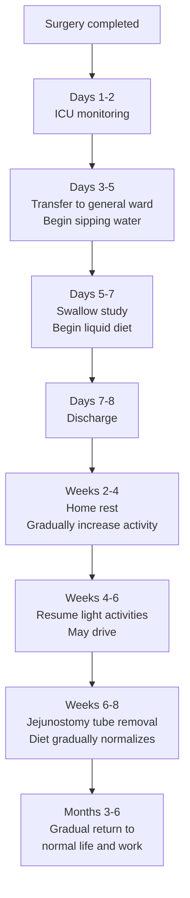

# Post-Surgery Care and Recovery

## Introduction

Recovery after minimally invasive esophageal cancer surgery is a gradual process. Understanding the key care priorities at each stage will help you and your family prepare and navigate the recovery period with confidence. This chapter describes the complete recovery journey from surgery completion to returning to daily life, organized by timeline.

---

## Postoperative Recovery Timeline

---

## Phase 1: Intensive Care Unit (ICU) (Postoperative Days 1-2)

### Why Is ICU Stay Necessary?
Esophagectomy is a major surgery. Close monitoring in the ICU during the first 1-2 days is required to ensure stable vital signs.

### What to Expect During This Phase

- **Various tubes and lines**
  - Endotracheal tube: May be removed on the day of surgery or the following day
  - Chest drain: Drains fluid from the chest cavity
  - Nasogastric tube (NG tube): Decompresses and drains gastric secretions
  - Jejunostomy feeding tube: Provides nutrition directly to the small intestine
  - Urinary catheter: Monitors urine output
  - Intravenous line (IV): Delivers medications and fluids

- **Pain management**
  - Epidural analgesia or patient-controlled analgesia (PCA)
  - Pain from minimally invasive surgery is usually much less than from open surgery
  - Nursing staff will regularly assess pain levels and adjust medications

- **Early mobilization**
  - The medical team will encourage you to begin simple limb exercises in bed on the first postoperative day
  - Sitting up as soon as possible (with nursing assistance)
  - Early mobilization helps prevent thrombosis and pneumonia

### Information for Family Members
- ICU visiting hours are limited; please follow the hospital's regulations
- Nursing staff will provide regular updates on the patient's condition
- Do not be alarmed by the many tubes -- they are all temporary monitoring and treatment tools

---

## Phase 2: General Ward (Postoperative Days 3-7)

### Criteria for Transfer to the General Ward
- Stable vital signs
- No need for ventilator support
- Adequate pain control

### Key Priorities During This Phase

#### Gradual Tube Removal
- Urinary catheter: Typically removed on days 2-3
- Chest drain: Removed after drainage decreases (approximately days 3-5)
- Nasogastric tube: Removed after gastrointestinal function resumes

#### Resuming Oral Intake
- **Nutrition is initially provided through the jejunostomy feeding tube**
- A **swallow study** is usually performed around days 5-7
  - Confirms that the anastomosis (the connection between the esophagus and stomach) is not leaking
- After passing the study, you may begin sipping small amounts of water
- Gradual progression to a clear liquid diet

#### Activity and Rehabilitation
- Daily goal: Walk in the hallway 2-4 times
- Continue deep breathing and coughing exercises
- Use incentive spirometry to strengthen lung function
- Gradually increase sitting time

#### Pain Management
- Gradual transition to oral analgesics
- MIE patients typically experience significant pain improvement by days 3-5
- If pain worsens or changes in character, notify nursing staff immediately

---

## Phase 3: Discharge Preparation (Approximately Postoperative Days 7-8)

### Discharge Criteria
- Able to walk independently
- Pain controlled with oral analgesics
- Tolerating liquid or soft diet
- Family members trained in jejunostomy tube care
- No fever or signs of infection
- Chest drain removed

### Items to Take Home
- **Jejunostomy feeding tube**: Typically used for 6-8 weeks
- Prescription for oral analgesics
- Discharge medications (including acid suppressants, etc.)
- Follow-up appointment cards
- Home care instruction sheets

---

## Phase 4: Home Recovery (Weeks 2-8 After Discharge)

### Dietary Progression

Postoperative dietary recovery must be **gradual** -- do not rush:

| Period | Diet Type | Details |
|--------|-----------|---------|
| Weeks 1-2 | Clear liquids | Water, clear broth, diluted juice, tea |
| Weeks 2-3 | Full liquids | Rice milk, soy milk, yogurt, nutritional supplements |
| Weeks 3-4 | Soft diet | Congee, steamed eggs, tofu, pureed fish |
| Weeks 5-6 | Semi-solid diet | Soft rice, finely minced meat, well-cooked vegetables |
| Weeks 6-8 onward | Approaching normal diet | Soft-textured regular foods; avoid very hard items |

### Dietary Guidelines

1. **Small, frequent meals**
   - 6-8 small meals per day, each approximately 1/3 to 1/2 of your previous portion size
   - Reduced stomach capacity is normal; your body will gradually adapt

2. **Chew thoroughly, eat slowly**
   - Chew each bite at least 20-30 times
   - Allow at least 30 minutes per meal

3. **Eating posture**
   - Sit upright during meals; remain upright for at least 30-60 minutes after eating
   - Elevate the head of the bed 15-30 degrees during sleep to prevent reflux

4. **Foods to avoid**
   - Carbonated beverages (cause bloating)
   - Overly sweet or high-sugar foods (may trigger dumping syndrome)
   - Foods that are too hard, dry, or fibrous
   - Alcohol
   - Spicy or irritating foods

5. **Fluid intake**
   - At least 1,500-2,000 mL per day
   - Avoid drinking large amounts of water during meals (drink 30 minutes before or after meals)

### Jejunostomy Tube Care

The jejunostomy feeding tube is an important nutritional supplement pathway after surgery:

- **Duration of use**: Typically 6-8 weeks, until oral intake is sufficient
- **Daily care**:
  - Clean the skin around the stoma site daily
  - Keep the dressing dry
  - Flush the tube with warm water before and after feeding
  - If the tube becomes blocked or dislodged, contact your medical team immediately
- **Feeding schedule**: Per dietitian instructions, typically 4-6 feedings per day or continuous drip

### Wound Care

- The small incisions from minimally invasive surgery typically heal well
- Keep wounds clean and dry
- Sutures are usually removed approximately 7-10 days postoperatively (or absorbable sutures are used)
- After the wound has healed, you may shower; avoid soaking in baths
- If the wound shows redness, swelling, discharge, odor, or if fever develops, seek medical attention immediately

### Activity and Exercise

| Time | Recommended Activity |
|------|----------------------|
| Weeks 1-2 after discharge | Indoor walking, simple household tasks, short walks |
| Weeks 2-4 | Outdoor walks of 20-30 minutes daily, gradually increasing |
| Weeks 4-6 | May resume driving (ensure analgesics do not impair alertness) |
| Weeks 6-8 | Resume light exercise (e.g., brisk walking, yoga) |
| After 3 months | Gradually increase exercise intensity based on recovery |

**Important Notes:**
- Avoid lifting more than 5 kg for 6 weeks after surgery
- Avoid strenuous exercise or abdominal straining
- If you experience chest pain or shortness of breath during activity, rest immediately and notify your physician

---

## Dumping Syndrome

This is a common condition after esophageal surgery, caused by food entering the small intestine too rapidly:

### Early Dumping Syndrome (15-30 minutes after eating)
- Bloating, abdominal pain, nausea
- Diarrhea
- Cold sweats, palpitations
- Dizziness

### Late Dumping Syndrome (1-3 hours after eating)
- Hypoglycemia symptoms: tremors, sweating, weakness, dizziness

### Prevention
- Small, frequent meals
- Avoid high-sugar foods and drinks
- Do not drink large amounts of water during meals
- Lie down for 20-30 minutes after meals

> Dumping syndrome usually improves over time, and most patients experience significant symptom relief within a few months.

---

## Warning Signs Requiring Immediate Medical Attention

If you experience any of the following symptoms after discharge, contact your medical team or go to the emergency department immediately:

- **Fever**: Temperature above 38 degrees C
- **Wound abnormalities**: Redness, swelling, pus, odor, or wound dehiscence
- **Breathing difficulty**: Shortness of breath or chest pain
- **Severe nausea and vomiting**: Unable to eat or drink
- **Worsening difficulty swallowing**: Worse than at discharge
- **Persistent abdominal pain**
- **Black stools or vomiting blood**
- **Jejunostomy tube dislodgement or blockage**
- **Heart rate too fast or too slow**
- **Persistent high fever or chills**

---

## Follow-Up Schedule

Regular follow-up visits are very important for early detection of recurrence or management of postoperative issues:

| Time | Follow-Up Items |
|------|-----------------|
| 2 weeks postop | Wound check, suture removal, dietary assessment |
| 1 month postop | Overall recovery assessment, nutritional status |
| 3 months postop | Blood tests, CT scan, nutritional follow-up |
| 6 months postop | Endoscopy, CT scan, tumor markers |
| 1 year postop | Comprehensive imaging studies |
| Every 6-12 months thereafter | Regular follow-up for at least 5 years |

### Adjuvant Therapy After Surgery
- Based on the postoperative pathology report, your physician may recommend adjuvant chemotherapy or immunotherapy
- These treatments help reduce the risk of cancer recurrence
- Please discuss in detail with your oncologist

---

## Long-term Complication Management

The following long-term conditions may occur after esophagectomy and require ongoing follow-up and management:

### Anastomotic Stricture

- **Incidence**: Approximately 10-20% of patients may develop this
- **Symptoms**: Progressive difficulty swallowing solid foods
- **Treatment**: Endoscopic balloon dilation, which is usually effective
- **Follow-up**: If swallowing difficulty worsens, seek medical attention promptly

### Gastroesophageal Reflux

- **Cause**: Altered esophageal anatomy after surgery weakens the anti-reflux mechanism
- **Treatment**: Long-term use of proton pump inhibitors (PPI)
- **Lifestyle adjustments**: Elevate the head of the bed 15-20 cm; avoid eating before bedtime

### Nutritional Deficiencies

- **Common deficiencies**: Vitamin B12, iron, calcium, Vitamin D
- **Cause**: Reduced stomach capacity and altered absorption area
- **Treatment**: Regular blood tests and oral supplementation as needed
- **Recommendation**: Monitor nutritional markers every 3-6 months

### Dumping Syndrome

- **Early dumping**: Bloating, diarrhea, cold sweats 15-30 minutes after eating
- **Late dumping**: Hypoglycemia symptoms 1-3 hours after eating
- **Treatment**: Small frequent meals, avoid high-sugar foods, reduce fluid intake during meals

---

## Psychological Adjustment and Support

Psychological adjustment after surgery is equally important:

- **Give yourself time**: Recovery is a gradual process; do not rush to return to your pre-surgery state
- **Set realistic expectations**: Changes in eating habits are normal; your body will gradually adapt
- **Seek support**:
  - Share your feelings with family and friends
  - Join a patient support group
  - Seek professional counseling if needed
- **Maintain a positive attitude**: Focus on small daily improvements

---

<!-- 🏥 Hospital-Specific Information - Please fill in -->
> **📋 Please enter your hospital information:**
>
> - Department: _______________
> - Contact / Extension: _______________
> - Clinic Hours: _______________
> - Attending Physician(s): _______________
> - Hospital Specialties / Annual Volume: _______________
<!-- End of hospital-specific information -->

---
## Further Reading
- [For more details, see the Advanced Version](../../進階版/EN/04_Leading_Hospitals_and_Outcomes.md)
- [Introduction to Esophageal Function Tests](../../../食道功能檢查/一般版/01_什麼是食道功能檢查.md)
