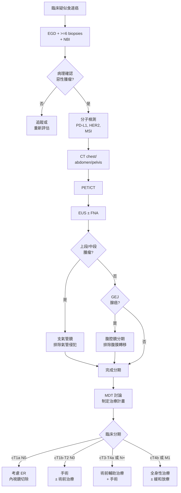

# 流行病學與分期

## 全球流行病學 (Global Epidemiology)

食道癌 (esophageal cancer) 為全球第七常見的惡性腫瘤，亦為癌症死因中排名第六位。全球每年約有超過 60 萬例新診斷個案，且死亡率與發生率之比偏高，反映其預後不佳的特性。

### 地理分布與組織學差異

食道癌的兩大組織學亞型在全球的分布呈現顯著的地理差異：

| 特徵 | 食道鱗狀細胞癌 (ESCC) | 食道腺癌 (EAC) |
|------|----------------------|----------------|
| 全球佔比 | 約 85% | 約 15% |
| 高發地區 | 東亞、中亞（「食道癌帶」）、東非 | 北美、西歐、澳洲 |
| 趨勢 | 全球發生率緩慢下降 | 歐美國家持續上升 |
| 性別比 (M:F) | 約 2-3:1 | 約 7-8:1 |
| 好發位置 | 食道上段、中段 | 食道下段 / 胃食道交界 (GEJ) |
| 主要致癌因子 | 菸、酒、熱飲、醃漬食物 | GERD、Barrett's esophagus、肥胖 |

### 台灣流行病學特徵

- 食道癌為台灣男性癌症死因第九位
- **鱗狀細胞癌 (ESCC)** 佔台灣食道癌約 90% 以上
- 主要危險因子：**菸、酒、檳榔**三重暴露
- 好發年齡：50-70 歲
- 男女比約 10-16:1（與檳榔使用相關）
- 台灣原住民族群發生率較高

### 危險因子詳述

#### 鱗狀細胞癌 (ESCC)
- **吸菸 (smoking)**：相對風險 (relative risk, RR) 約 3-5 倍
- **酒精 (alcohol)**：RR 約 3-5 倍；菸酒合併使用 RR 可達 30 倍以上
- **檳榔 (betel nut)**：台灣特有之重要因子
- **熱飲 (hot beverages)**：> 65°C，IARC 列為 2A 類致癌物
- **營養缺乏**：鋅、硒、維生素缺乏
- **食道弛緩不能症 (achalasia)**：長期食物滯留之慢性刺激
- **腐蝕性食道損傷病史**
- **頭頸部鱗狀細胞癌病史**：field cancerization 效應

#### 腺癌 (EAC)
- **胃食道逆流 (GERD)**：長期逆流為主要致病機轉
- **巴雷特食道 (Barrett's esophagus)**：腸上皮化生 (intestinal metaplasia)，每年惡性轉化率約 0.5-1%
- **肥胖 (obesity)**：BMI > 30，RR 約 2-4 倍
- **吸菸**：RR 約 2 倍
- **幽門螺旋桿菌 (H. pylori) 感染**：可能為保護因子（降低胃酸分泌）

---

## TNM 分期系統 (AJCC 8th Edition)

### T 分期（原發腫瘤深度）

| T 分期 | 定義 |
|--------|------|
| Tis | 高度異生 (high-grade dysplasia, HGD)，原位癌 (carcinoma in situ) |
| T1a | 侵犯黏膜固有層 (lamina propria) 或黏膜肌層 (muscularis mucosae) |
| T1b | 侵犯黏膜下層 (submucosa) |
| T2 | 侵犯固有肌層 (muscularis propria) |
| T3 | 侵犯食道外膜 (adventitia) |
| T4a | 侵犯鄰近可切除之結構（胸膜 pleura、心包膜 pericardium、奇靜脈 azygos vein、橫膈膜 diaphragm、腹膜 peritoneum） |
| T4b | 侵犯鄰近不可切除之結構（主動脈 aorta、椎體 vertebral body、氣管 trachea） |

### N 分期（區域淋巴結轉移）

| N 分期 | 定義 |
|--------|------|
| N0 | 無區域淋巴結轉移 |
| N1 | 1-2 顆淋巴結轉移 |
| N2 | 3-6 顆淋巴結轉移 |
| N3 | ≥ 7 顆淋巴結轉移 |

### M 分期（遠端轉移）

| M 分期 | 定義 |
|--------|------|
| M0 | 無遠端轉移 |
| M1 | 有遠端轉移（常見：肝、肺、骨、腦、腎上腺） |

### 預後分期群組 (Prognostic Stage Groups)

AJCC 第 8 版依據組織學類型（SCC vs. EAC）、分化程度 (grade)、腫瘤位置，將臨床分期 (cStage) 與病理分期 (pStage) 分別制定。以下為簡化的病理分期：

| Stage | SCC | EAC |
|-------|-----|-----|
| 0 | Tis N0 M0 | Tis N0 M0 |
| IA | T1a N0 M0 | T1a N0 M0 |
| IB | T1b N0 M0 | T1b N0 M0 |
| IIA | T2 N0 M0 | T2 N0 M0 |
| IIB | T1 N1 M0, T3 N0 M0 | T1 N1 M0, T3 N0 M0 |
| IIIA | T3 N1 M0 | T3 N1 M0 |
| IIIB | T3 N2 M0, T4a N0-1 M0 | T3 N2 M0, T4a N0-1 M0 |
| IVA | T4b any N M0, any T N3 M0 | T4b any N M0, any T N3 M0 |
| IVB | any T any N M1 | any T any N M1 |

> **臨床意義：** AJCC 8th edition 首次將 SCC 與 EAC 的分期系統分開，反映兩者在生物學行為和預後上的顯著差異。

---

## 組織學亞型與分子標記 (Histological Subtypes & Molecular Markers)

### 組織學分類
- **鱗狀細胞癌 (SCC)**：分化程度（G1 高分化、G2 中分化、G3 低分化）
- **腺癌 (EAC)**：分化程度同上
- **其他少見類型**：
  - 腺鱗癌 (adenosquamous carcinoma)
  - 神經內分泌腫瘤 (neuroendocrine tumor/carcinoma)
  - 未分化癌 (undifferentiated carcinoma)
  - 小細胞癌 (small cell carcinoma)

### 分子標記與生物標記 (Biomarkers)

| 標記 | 臨床意義 | 適用亞型 |
|------|---------|---------|
| PD-L1 (CPS/TPS) | 預測免疫治療 (ICI) 反應 | SCC、EAC |
| HER2 (ERBB2) | 標靶治療適用性 (trastuzumab) | EAC |
| MSI-H / dMMR | 免疫治療適用性 | EAC |
| VEGFR | 抗血管新生治療標的 | EAC |
| EGFR | 潛在治療標的 | SCC |
| TP53 mutation | 預後因子 | SCC、EAC |
| CDKN2A | 巴雷特食道惡性轉化相關 | EAC |

### 風險分層 (Risk Stratification)

依據分期、組織學特徵及分子標記進行風險分層，指導治療決策：

- **低風險**：Tis-T1a N0, well-differentiated, no LVI
  - 可考慮內視鏡治療 (ER)
- **中風險**：T1b-T2 N0
  - 手術切除為主
- **高風險**：T3-T4a 或 N+
  - 術前輔助治療 + 手術
- **極高風險**：T4b 或 M1
  - 以全身性治療為主

---

## 分期檢查流程 (Staging Workup Protocol)

### 必要檢查

1. **上消化道內視鏡 (EGD) + 切片 (biopsy)**
   - ESMO 建議至少 **6 個以上的切片**（包含腫瘤邊緣及正常黏膜）
   - 記錄腫瘤距門齒距離、長度、環周侵犯程度
   - 窄帶成像 (narrow band imaging, NBI) 有助於辨識病灶邊界

2. **胸腹部電腦斷層 (CT chest/abdomen/pelvis)**
   - 含顯影劑之增強掃描
   - 評估 T、N 及遠端轉移

3. **正子斷層掃描 (PET/CT)**
   - 偵測遠端轉移之敏感度高於 CT
   - 可改變約 15-20% 患者的分期與治療計畫

4. **內視鏡超音波 (EUS)**
   - T 分期準確度達 80-90%
   - N 分期準確度約 70-80%
   - 可引導細針穿刺 (FNA) 取得淋巴結組織

### 選擇性檢查

- **支氣管鏡 (bronchoscopy)**：上段/中段食道腫瘤疑似氣管侵犯時
- **腹腔鏡分期 (diagnostic laparoscopy)**：胃食道交界腺癌 (Siewert type II-III) 排除腹膜轉移
- **腦部 MRI**：有神經學症狀時

### 診斷分期演算法

---

## 預後因子 (Prognostic Factors)

### 獨立預後因子
1. **病理分期 (pTNM)**：最重要的預後因子
2. **R 狀態 (resection margin)**：R0（完全切除）vs R1/R2
3. **淋巴結比率 (lymph node ratio)**：陽性淋巴結數/總清除淋巴結數
4. **術前治療反應 (pathologic response)**：完全病理反應 (pCR) 預後最佳
5. **淋巴血管侵犯 (lymphovascular invasion, LVI)**
6. **神經周圍侵犯 (perineural invasion, PNI)**
7. **組織分化程度 (histologic grade)**

### 充分淋巴結取樣

- 建議至少清除 **15 顆以上**的淋巴結以確保準確分期
- MIRO 試驗顯示微創手術平均淋巴結清除數為 **18 顆**（vs. 開放手術 15 顆）
- 淋巴結清除數目影響分期準確度與長期存活

---
