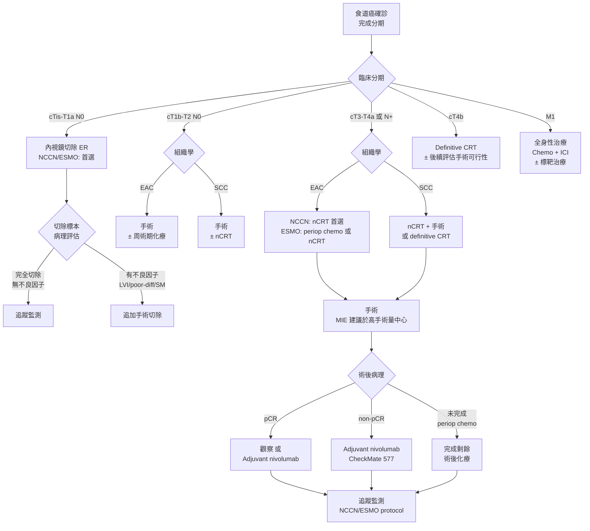

# 國際指引摘要：NCCN、ESMO、JSMO

## 指引版本一覽

| 指引 | 版本 | 發布機構 | 適用範圍 |
|------|------|---------|---------|
| **NCCN** | 2025 v1 | National Comprehensive Cancer Network (美國) | 全球廣泛引用 |
| **ESMO** | 2022 正式版 + 2025 臨時更新 | European Society for Medical Oncology (歐洲) | 歐洲及國際 |
| **JSMO Pan-Asian** | 改編自 ESMO | Japanese Society of Medical Oncology | 亞太地區 |

---

## 分期檢查建議 (Staging Workup Recommendations)

| 檢查項目 | NCCN 2025 | ESMO 2022/2025 | JSMO Pan-Asian |
|---------|-----------|----------------|----------------|
| EGD + biopsy | 必要 | 必要（≥6 切片） | 必要（≥6 切片） |
| CT chest/abdomen | 必要 | 必要 | 必要 |
| PET/CT | 必要（所有 cT1b 以上） | 建議（cT2 以上或 N+） | 建議 |
| EUS | 建議（尤其 T 分期） | 建議 | 建議 |
| 支氣管鏡 | 上段/中段腫瘤 | 上段/中段腫瘤 | 上段/中段腫瘤 |
| 腹腔鏡分期 | GEJ 腺癌建議 | GEJ 腺癌建議 | 選擇性 |
| 分子檢測 | PD-L1, HER2, MSI | PD-L1, HER2, MSI | PD-L1, HER2 |
| 營養評估 | 必要 | 必要 | 必要 |
| 心肺功能評估 | 必要（術前） | 必要（術前） | 必要（術前） |

---

## 早期食道癌治療建議 (cTis-T1)

| 臨床情境 | NCCN 2025 | ESMO 2022/2025 | 證據等級 |
|---------|-----------|----------------|---------|
| Tis / T1a, well-diff, 無 LVI | ER（EMR/ESD）首選 | ER 首選 | **高** |
| T1a + LVI 或 poor-diff | 手術切除或 ER + 密切追蹤 | 手術切除為主 | 中 |
| T1b SM1 (淺層黏膜下) | 考慮 ER（高度選擇性）或手術 | 手術為首選 | 中 |
| T1b SM2-3 (深層黏膜下) | 手術切除 | 手術切除 | **高** |

> **NCCN 2025 重要更新：** 對於極早期食道癌 (early stage)，內視鏡切除 (ER) 的適應症有所擴展，強調在有經驗的中心進行。

---

## 局部進展期治療建議 (cT2-T4a / N+)

### 腺癌 (Adenocarcinoma, EAC)

| 臨床情境 | NCCN 2025 | ESMO 2022/2025 | 證據等級 |
|---------|-----------|----------------|---------|
| cT2 N0 | 手術優先 ± 術後輔助 | 手術優先 或 周術期化療 | 中 |
| cT3-T4a 或 N+ | **術前同步化放療 (nCRT) 為首選** | 周術期化療 (periop chemo) 或 nCRT | **高** |
| nCRT 方案 | CROSS regimen 為標準 (carboplatin + paclitaxel + 41.4 Gy) | CROSS 或 FLOT-type | 高 |
| 周術期化療方案 | FLOT (5-FU, leucovorin, oxaliplatin, docetaxel) | FLOT 首選 | **高** |
| 術前治療後手術時機 | nCRT 後 6-10 週 | 4-8 週 | 中 |

### 鱗狀細胞癌 (Squamous Cell Carcinoma, SCC)

| 臨床情境 | NCCN 2025 | ESMO 2022/2025 | 證據等級 |
|---------|-----------|----------------|---------|
| cT2 N0 | 手術 ± 術前治療 | 手術 或 nCRT + 手術 | 中 |
| cT3-T4a 或 N+ | nCRT + 手術 或 definitive CRT | nCRT + 手術 首選 | **高** |
| nCRT 方案 | CROSS regimen | CROSS 或 cisplatin/5-FU based | 高 |
| 根治性化放療 (dCRT) | 頸段食道癌首選；其他位置為可接受替代方案 | 頸段首選；治療反應良好可不手術 | 高 |

### JSMO Pan-Asian 補充建議

| 議題 | JSMO 建議 | 與 ESMO 差異 |
|------|----------|-------------|
| SCC 為主的族群 | nCRT + 手術為標準 | 同 ESMO |
| 化療方案 | 可使用 cisplatin + 5-FU | 增加亞洲常用方案 |
| 手術方式 | 支持 MIE 於經驗豐富中心 | 同 ESMO |
| 三區域淋巴結清除 | 食道上中段 SCC 可考慮 | 較 ESMO 更積極建議 |

---

## 手術相關建議

| 議題 | NCCN 2025 | ESMO 2022/2025 |
|------|-----------|----------------|
| **手術方式** | MIE 或 open，依外科醫師經驗 | MIE 建議於高手術量中心（evidence-based） |
| **淋巴結清除** | ≥15 顆淋巴結 | ≥15 顆淋巴結（建議 ≥20 顆） |
| **切除邊界** | R0 為目標（近端邊界 ≥3 cm）| R0 為目標 |
| **手術量門檻** | 建議轉介至高手術量中心 | 建議年手術量 ≥20 例 |
| **ERAS 協定** | 建議採用 | 建議採用 |
| **MDT 討論** | **必要** | **必要** |

---

## 術後輔助治療 (Adjuvant Therapy)

| 情境 | NCCN 2025 | ESMO 2022/2025 | 證據等級 |
|------|-----------|----------------|---------|
| nCRT 後手術，non-pCR | 考慮 adjuvant nivolumab (CheckMate 577) | Adjuvant nivolumab 建議 | **高** |
| nCRT 後手術，pCR | Adjuvant nivolumab 可考慮 | 觀察或 nivolumab | 中 |
| 周術期化療 (FLOT) | 完成術後化療療程 | 完成剩餘化療療程 | 高 |
| 未接受術前治療之 pN+ | 術後化放療 或 化療 | 術後化療 | 中 |

> **CheckMate 577 試驗關鍵數據：** nCRT 後手術的食道/GEJ 癌患者，術後使用 nivolumab 輔助免疫治療，中位無病存活期 (median DFS) 為 22.4 個月 vs. 安慰劑組 11.0 個月（HR 0.69）。

---

## 免疫治療角色 (Immunotherapy, ICI)

### 術前免疫治療 (Neoadjuvant ICI)

| 設定 | 藥物 / 試驗 | 證據現況 |
|------|-----------|---------|
| nCRT + ICI (SCC) | Pembrolizumab / Nivolumab + nCRT | 多項 Phase III 進行中 |
| nChemo + ICI (EAC) | FLOT + ICI | 初步數據令人鼓舞 |

### 晚期 / 轉移性食道癌 ICI

| 指引 | 一線治療 (1st line) | 備註 |
|------|-------------------|------|
| NCCN 2025 | Pembrolizumab / Nivolumab + chemo（CPS ≥5 首選） | HER2+ 者加 trastuzumab |
| ESMO 2025 interim | Nivolumab + chemo（SCC 首選）; Pembrolizumab + chemo（EAC, CPS ≥5） | 強調 PD-L1 檢測 |

---

## 追蹤監測建議 (Surveillance Protocol)

| 時間點 | NCCN 2025 | ESMO 2022/2025 |
|--------|-----------|----------------|
| 前 2 年 | 每 3-6 個月：H&P, 營養評估；每 6-12 個月：CT | 每 3-6 個月：H&P；每 6-12 個月：CT |
| 第 3-5 年 | 每 6-12 個月：H&P, CT | 每 6-12 個月：H&P；年度 CT |
| 第 5 年後 | 年度追蹤 | 年度追蹤 |
| 內視鏡 | 依症狀或臨床需要 | 術後 6-12 個月一次，之後依需要 |
| PET/CT | 非常規，依臨床懷疑 | 非常規 |
| 營養追蹤 | 每次回診 | 每次回診（強調長期營養支持） |

---

## 治療演算法

---

## 三大指引比較重點摘要

| 議題 | NCCN 2025 | ESMO 2022/2025 | JSMO Pan-Asian |
|------|-----------|----------------|----------------|
| **EAC 術前首選** | nCRT (CROSS) | Periop chemo (FLOT) 或 nCRT | 依 ESMO |
| **SCC 術前首選** | nCRT (CROSS) | nCRT (CROSS) | nCRT |
| **ICI 在術前角色** | 臨床試驗中 | 臨床試驗中 | 密切關注 |
| **術後 ICI (non-pCR)** | Nivolumab 建議 | Nivolumab 建議 | Nivolumab 建議 |
| **dCRT vs 手術 (SCC)** | 兩者均可（頸段首選 dCRT） | 手術首選，dCRT 為替代 | 手術首選 |
| **MDT 要求** | 必要 | 必要 | 必要 |
| **MIE 建議** | 有經驗中心建議 | 高手術量中心建議 | 支持 |
| **LN 清除數目** | ≥15 | ≥15（建議 ≥20） | ≥15 |
| **切片數** | 充分切片 | ≥6 | ≥6 |

---

## 2025-2026 重大更新

### ESOPEC 試驗結果
- **試驗設計**：隨機對照試驗，比較 FLOT 周術期化療 vs CROSS 術前化放療用於食道腺癌
- **關鍵結果**：FLOT 方案展現更優越的存活率與全身疾病控制
- **影響**：NCCN 已將 **FLOT 周術期化療列為首選 (Preferred)**，取代先前的術前化放療標準
- **適用對象**：可切除之局部晚期食道及食道胃接合處腺癌 (adenocarcinoma)
- **注意**：食道鱗狀細胞癌 (SCC) 仍以術前化放療為首選

### MATTERHORN 試驗 + Durvalumab FDA 核准 (2025.11)
- **試驗結果**：FLOT + Durvalumab (Imfinzi) 周術期免疫治療，改善無事件存活率 (EFS)
- **FDA 核准**：2025 年 11 月，FDA 核准 durvalumab 用於早期胃及食道胃接合處癌，為首個獲准用於此適應症的免疫檢查點抑制劑
- **NCCN 建議**：FLOT + Durvalumab 列為 **Category 1 首選方案**，適用於 PD-L1 CPS ≥ 1 或 TAP Score ≥ 1 的患者
- **證據等級**：Strong recommendation (GRADE)

### Tislelizumab 新增適應症 (NCCN v3.2025)
- NCCN v3.2025 新增 **Tislelizumab** 為食道鱗狀細胞癌 (ESCC) PD-L1 陽性患者的首選一線治療方案
- 提供新的劑量時程選項

---

## 重要臨床試驗參考

| 試驗名稱 | 設計 | 關鍵結論 |
|---------|------|---------|
| **CROSS** | nCRT vs surgery alone (GEJ/esophageal) | nCRT 顯著改善 OS；pCR 率 SCC 49%, EAC 23% |
| **MIRO** | Hybrid MIE vs Open | MIE 減少重大併發症，OS 不劣 |
| **ROBOT** | RAMIE vs Open | RAMIE 降低併發症，改善功能恢復 |
| **TIME** | Total MIE vs Open | MIE 減少肺部感染，改善短期 QoL |
| **CheckMate 577** | Adjuvant nivolumab vs placebo (post-nCRT) | Nivolumab 延長 DFS（22.4 vs 11.0 月） |
| **KEYNOTE-590** | Pembrolizumab + chemo vs chemo (advanced) | 改善 OS，尤其 CPS ≥10 |
| **CheckMate 648** | Nivolumab + chemo vs chemo (advanced SCC) | 改善 OS |
| **FLOT4** | FLOT vs ECF/ECX (periop, GEJ/gastric) | FLOT 改善 OS，成為標準 |

---
