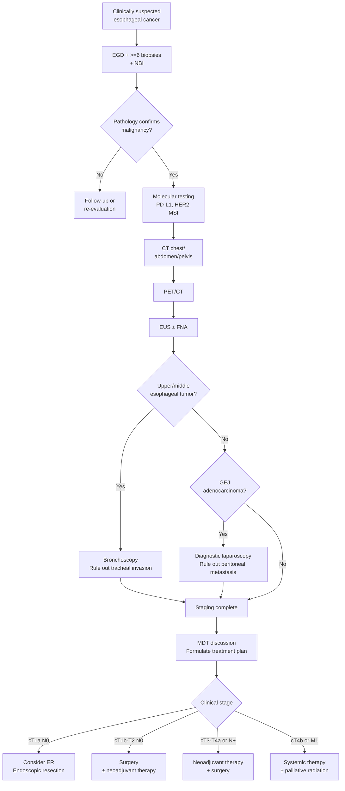

# Epidemiology and Staging

## Global Epidemiology

Esophageal cancer is the seventh most common malignancy worldwide and the sixth leading cause of cancer death. Over 600,000 new cases are diagnosed globally each year, and the high mortality-to-incidence ratio reflects its poor prognosis.

### Geographic Distribution and Histological Differences

The two major histological subtypes of esophageal cancer show striking geographic variation in their global distribution:

| Feature | Esophageal Squamous Cell Carcinoma (ESCC) | Esophageal Adenocarcinoma (EAC) |
|---------|-------------------------------------------|----------------------------------|
| Global proportion | Approximately 85% | Approximately 15% |
| High-incidence regions | East Asia, Central Asia ("esophageal cancer belt"), East Africa | North America, Western Europe, Australia |
| Trends | Global incidence slowly declining | Continuously rising in Western countries |
| Sex ratio (M:F) | Approximately 2-3:1 | Approximately 7-8:1 |
| Common location | Upper and middle esophagus | Lower esophagus / gastroesophageal junction (GEJ) |
| Major carcinogens | Tobacco, alcohol, hot beverages, pickled foods | GERD, Barrett's esophagus, obesity |

### Epidemiological Features in Taiwan

- Esophageal cancer is the ninth leading cause of cancer death among men in Taiwan
- **Squamous cell carcinoma (ESCC)** accounts for over 90% of esophageal cancers in Taiwan
- Major risk factors: **tobacco, alcohol, and betel nut** triple exposure
- Peak age of onset: 50-70 years
- Male-to-female ratio approximately 10-16:1 (associated with betel nut use)
- Higher incidence among Taiwan's indigenous populations

### Detailed Risk Factors

#### Squamous Cell Carcinoma (ESCC)
- **Smoking**: Relative risk (RR) approximately 3-5x
- **Alcohol**: RR approximately 3-5x; combined tobacco and alcohol use: RR can exceed 30x
- **Betel nut**: A uniquely important risk factor in Taiwan
- **Hot beverages**: > 65 degrees C; classified by IARC as a Group 2A carcinogen
- **Nutritional deficiencies**: Zinc, selenium, and vitamin deficiencies
- **Achalasia**: Chronic irritation from prolonged food stasis
- **History of caustic esophageal injury**
- **History of head and neck squamous cell carcinoma**: Field cancerization effect

#### Adenocarcinoma (EAC)
- **Gastroesophageal reflux disease (GERD)**: Chronic reflux is the primary pathogenic mechanism
- **Barrett's esophagus**: Intestinal metaplasia with an annual malignant transformation rate of approximately 0.5-1%
- **Obesity**: BMI > 30, RR approximately 2-4x
- **Smoking**: RR approximately 2x
- **Helicobacter pylori (H. pylori) infection**: May be a protective factor (reduces gastric acid secretion)

---

## TNM Staging System (AJCC 8th Edition)

### T Stage (Primary Tumor Depth)

| T Stage | Definition |
|---------|-----------|
| Tis | High-grade dysplasia (HGD), carcinoma in situ |
| T1a | Invasion into the lamina propria or muscularis mucosae |
| T1b | Invasion into the submucosa |
| T2 | Invasion into the muscularis propria |
| T3 | Invasion into the adventitia |
| T4a | Invasion into adjacent resectable structures (pleura, pericardium, azygos vein, diaphragm, peritoneum) |
| T4b | Invasion into adjacent unresectable structures (aorta, vertebral body, trachea) |

### N Stage (Regional Lymph Node Metastasis)

| N Stage | Definition |
|---------|-----------|
| N0 | No regional lymph node metastasis |
| N1 | 1-2 positive lymph nodes |
| N2 | 3-6 positive lymph nodes |
| N3 | 7 or more positive lymph nodes |

### M Stage (Distant Metastasis)

| M Stage | Definition |
|---------|-----------|
| M0 | No distant metastasis |
| M1 | Distant metastasis present (common sites: liver, lung, bone, brain, adrenal glands) |

### Prognostic Stage Groups

The AJCC 8th edition establishes separate clinical staging (cStage) and pathologic staging (pStage) based on histological type (SCC vs. EAC), differentiation grade, and tumor location. Below is a simplified pathologic staging:

| Stage | SCC | EAC |
|-------|-----|-----|
| 0 | Tis N0 M0 | Tis N0 M0 |
| IA | T1a N0 M0 | T1a N0 M0 |
| IB | T1b N0 M0 | T1b N0 M0 |
| IIA | T2 N0 M0 | T2 N0 M0 |
| IIB | T1 N1 M0, T3 N0 M0 | T1 N1 M0, T3 N0 M0 |
| IIIA | T3 N1 M0 | T3 N1 M0 |
| IIIB | T3 N2 M0, T4a N0-1 M0 | T3 N2 M0, T4a N0-1 M0 |
| IVA | T4b any N M0, any T N3 M0 | T4b any N M0, any T N3 M0 |
| IVB | any T any N M1 | any T any N M1 |

> **Clinical Significance:** The AJCC 8th edition was the first to separate the staging systems for SCC and EAC, reflecting their significant differences in biological behavior and prognosis.

---

## Histological Subtypes and Molecular Markers

### Histological Classification
- **Squamous cell carcinoma (SCC)**: Differentiation grade (G1 well-differentiated, G2 moderately differentiated, G3 poorly differentiated)
- **Adenocarcinoma (EAC)**: Same grading system
- **Other rare types**:
  - Adenosquamous carcinoma
  - Neuroendocrine tumor/carcinoma
  - Undifferentiated carcinoma
  - Small cell carcinoma

### Molecular Markers and Biomarkers

| Marker | Clinical Significance | Applicable Subtype |
|--------|----------------------|-------------------|
| PD-L1 (CPS/TPS) | Predicts response to immune checkpoint inhibitors (ICI) | SCC, EAC |
| HER2 (ERBB2) | Targeted therapy eligibility (trastuzumab) | EAC |
| MSI-H / dMMR | Immunotherapy eligibility | EAC |
| VEGFR | Anti-angiogenic therapy target | EAC |
| EGFR | Potential therapeutic target | SCC |
| TP53 mutation | Prognostic factor | SCC, EAC |
| CDKN2A | Associated with malignant transformation of Barrett's esophagus | EAC |

### Risk Stratification

Risk stratification based on staging, histological features, and molecular markers guides treatment decisions:

- **Low risk**: Tis-T1a N0, well-differentiated, no LVI
  - Endoscopic resection (ER) may be considered
- **Intermediate risk**: T1b-T2 N0
  - Primarily surgical resection
- **High risk**: T3-T4a or N+
  - Neoadjuvant therapy + surgery
- **Very high risk**: T4b or M1
  - Primarily systemic therapy

---

## Staging Workup Protocol

### Required Tests

1. **Upper GI endoscopy (EGD) + biopsy**
   - ESMO recommends at least **6 biopsies** (including tumor margin and normal mucosa)
   - Record distance from incisors, tumor length, and circumferential extent
   - Narrow band imaging (NBI) aids in delineating lesion borders

2. **CT of the chest/abdomen/pelvis**
   - Contrast-enhanced scan
   - Evaluates T, N, and distant metastasis

3. **PET/CT scan**
   - Higher sensitivity for detecting distant metastasis than CT
   - Can alter staging and treatment plans in approximately 15-20% of patients

4. **Endoscopic ultrasound (EUS)**
   - T stage accuracy: 80-90%
   - N stage accuracy: approximately 70-80%
   - Can guide fine-needle aspiration (FNA) for lymph node tissue sampling

### Selective Tests

- **Bronchoscopy**: For upper/middle esophageal tumors with suspected tracheal invasion
- **Diagnostic laparoscopy**: For gastroesophageal junction adenocarcinoma (Siewert type II-III) to rule out peritoneal metastasis
- **Brain MRI**: In the presence of neurological symptoms

### Staging Workup Algorithm

---

## Prognostic Factors

### Independent Prognostic Factors
1. **Pathologic stage (pTNM)**: The most important prognostic factor
2. **Resection margin status (R status)**: R0 (complete resection) vs. R1/R2
3. **Lymph node ratio**: Number of positive nodes / total harvested nodes
4. **Pathologic response to neoadjuvant therapy**: Complete pathologic response (pCR) carries the best prognosis
5. **Lymphovascular invasion (LVI)**
6. **Perineural invasion (PNI)**
7. **Histologic grade**

### Adequate Lymph Node Sampling

- A minimum of **15 lymph nodes** should be harvested to ensure accurate staging
- The MIRO trial showed that MIE yielded an average lymph node harvest of **18 nodes** (vs. 15 for open surgery)
- Lymph node harvest count affects staging accuracy and long-term survival

---
