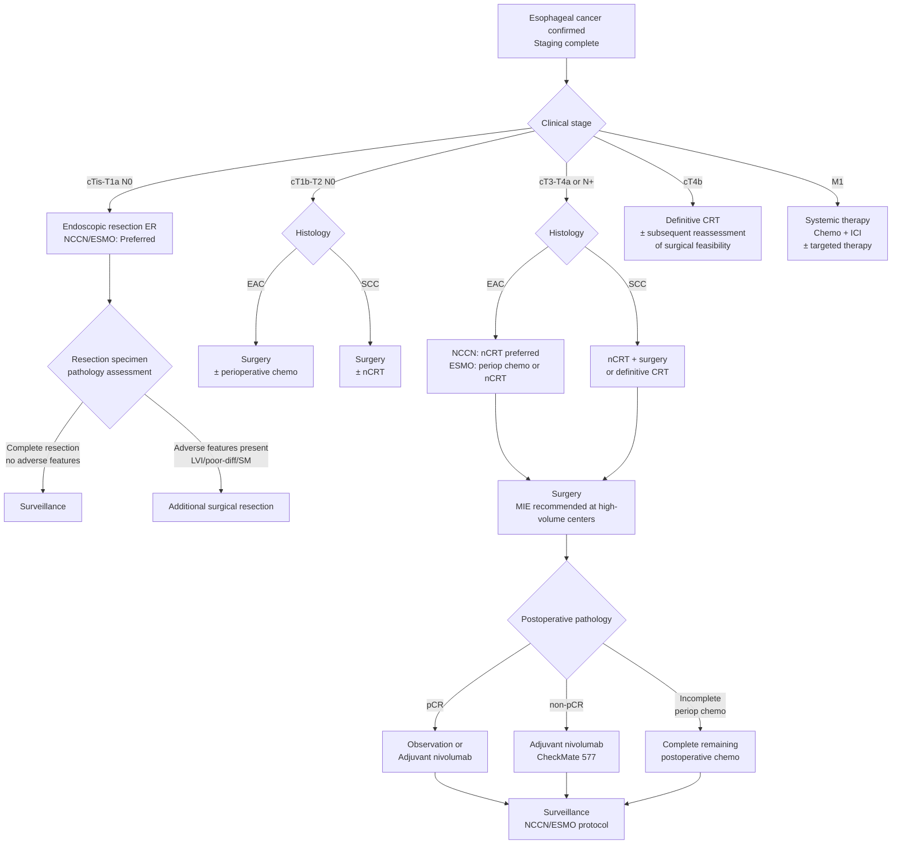

# International Guidelines Summary: NCCN, ESMO, JSMO

## Guideline Versions

| Guideline | Version | Issuing Body | Scope |
|-----------|---------|-------------|-------|
| **NCCN** | 2025 v1 | National Comprehensive Cancer Network (USA) | Widely cited globally |
| **ESMO** | 2022 formal + 2025 interim update | European Society for Medical Oncology (Europe) | European and international |
| **JSMO Pan-Asian** | Adapted from ESMO | Japanese Society of Medical Oncology | Asia-Pacific region |

---

## Staging Workup Recommendations

| Test | NCCN 2025 | ESMO 2022/2025 | JSMO Pan-Asian |
|------|-----------|----------------|----------------|
| EGD + biopsy | Required | Required (≥6 biopsies) | Required (≥6 biopsies) |
| CT chest/abdomen | Required | Required | Required |
| PET/CT | Required (all cT1b and above) | Recommended (cT2 and above or N+) | Recommended |
| EUS | Recommended (especially for T staging) | Recommended | Recommended |
| Bronchoscopy | Upper/middle esophageal tumors | Upper/middle esophageal tumors | Upper/middle esophageal tumors |
| Diagnostic laparoscopy | Recommended for GEJ adenocarcinoma | Recommended for GEJ adenocarcinoma | Selective |
| Molecular testing | PD-L1, HER2, MSI | PD-L1, HER2, MSI | PD-L1, HER2 |
| Nutritional assessment | Required | Required | Required |
| Cardiopulmonary assessment | Required (preoperative) | Required (preoperative) | Required (preoperative) |

---

## Early Esophageal Cancer Treatment Recommendations (cTis-T1)

| Clinical Scenario | NCCN 2025 | ESMO 2022/2025 | Evidence Level |
|-------------------|-----------|----------------|----------------|
| Tis / T1a, well-diff, no LVI | ER (EMR/ESD) preferred | ER preferred | **High** |
| T1a + LVI or poor-diff | Surgical resection or ER + close surveillance | Surgical resection preferred | Moderate |
| T1b SM1 (superficial submucosa) | Consider ER (highly selective) or surgery | Surgery preferred | Moderate |
| T1b SM2-3 (deep submucosa) | Surgical resection | Surgical resection | **High** |

> **NCCN 2025 Important Update:** For early-stage esophageal cancer, indications for endoscopic resection (ER) have been expanded, with emphasis on performance at experienced centers.

---

## Locally Advanced Disease Treatment Recommendations (cT2-T4a / N+)

### Adenocarcinoma (EAC)

| Clinical Scenario | NCCN 2025 | ESMO 2022/2025 | Evidence Level |
|-------------------|-----------|----------------|----------------|
| cT2 N0 | Surgery first ± adjuvant | Surgery first or perioperative chemo | Moderate |
| cT3-T4a or N+ | **Neoadjuvant CRT (nCRT) preferred** | Perioperative chemo or nCRT | **High** |
| nCRT regimen | CROSS regimen is standard (carboplatin + paclitaxel + 41.4 Gy) | CROSS or FLOT-type | High |
| Perioperative chemo regimen | FLOT (5-FU, leucovorin, oxaliplatin, docetaxel) | FLOT preferred | **High** |
| Surgery timing after neoadjuvant | 6-10 weeks after nCRT | 4-8 weeks | Moderate |

### Squamous Cell Carcinoma (SCC)

| Clinical Scenario | NCCN 2025 | ESMO 2022/2025 | Evidence Level |
|-------------------|-----------|----------------|----------------|
| cT2 N0 | Surgery ± neoadjuvant | Surgery or nCRT + surgery | Moderate |
| cT3-T4a or N+ | nCRT + surgery or definitive CRT | nCRT + surgery preferred | **High** |
| nCRT regimen | CROSS regimen | CROSS or cisplatin/5-FU based | High |
| Definitive CRT (dCRT) | Preferred for cervical esophageal cancer; acceptable alternative for other locations | Preferred for cervical; may omit surgery if good response | High |

### JSMO Pan-Asian Supplementary Recommendations

| Topic | JSMO Recommendation | Difference from ESMO |
|-------|---------------------|---------------------|
| SCC-predominant populations | nCRT + surgery is standard | Same as ESMO |
| Chemotherapy regimen | Cisplatin + 5-FU may be used | Adds commonly used Asian regimens |
| Surgical approach | Supports MIE at experienced centers | Same as ESMO |
| Three-field lymph node dissection | May be considered for upper/middle SCC | More aggressively recommended than ESMO |

---

## Surgery-Related Recommendations

| Topic | NCCN 2025 | ESMO 2022/2025 |
|-------|-----------|----------------|
| **Surgical approach** | MIE or open, based on surgeon experience | MIE recommended at high-volume centers (evidence-based) |
| **Lymph node harvest** | ≥15 lymph nodes | ≥15 lymph nodes (≥20 recommended) |
| **Resection margins** | R0 is the goal (proximal margin ≥3 cm) | R0 is the goal |
| **Volume threshold** | Referral to high-volume center recommended | Annual volume ≥20 recommended |
| **ERAS protocol** | Recommended | Recommended |
| **MDT discussion** | **Required** | **Required** |

---

## Adjuvant Therapy

| Scenario | NCCN 2025 | ESMO 2022/2025 | Evidence Level |
|----------|-----------|----------------|----------------|
| Post-nCRT surgery, non-pCR | Consider adjuvant nivolumab (CheckMate 577) | Adjuvant nivolumab recommended | **High** |
| Post-nCRT surgery, pCR | Adjuvant nivolumab may be considered | Observation or nivolumab | Moderate |
| Perioperative chemotherapy (FLOT) | Complete postoperative chemotherapy course | Complete remaining chemotherapy course | High |
| No neoadjuvant therapy, pN+ | Adjuvant chemoradiation or chemotherapy | Adjuvant chemotherapy | Moderate |

> **CheckMate 577 Key Data:** In esophageal/GEJ cancer patients who underwent surgery following nCRT, adjuvant nivolumab immunotherapy achieved a median disease-free survival (DFS) of 22.4 months vs. 11.0 months for placebo (HR 0.69).

---

## Role of Immunotherapy (ICI)

### Neoadjuvant Immunotherapy

| Setting | Agent / Trial | Current Status |
|---------|-------------|----------------|
| nCRT + ICI (SCC) | Pembrolizumab / Nivolumab + nCRT | Multiple Phase III trials ongoing |
| nChemo + ICI (EAC) | FLOT + ICI | Preliminary data encouraging |

### Advanced / Metastatic Esophageal Cancer ICI

| Guideline | First-Line Treatment | Notes |
|-----------|---------------------|-------|
| NCCN 2025 | Pembrolizumab / Nivolumab + chemo (CPS ≥5 preferred) | Add trastuzumab for HER2+ |
| ESMO 2025 interim | Nivolumab + chemo (SCC preferred); Pembrolizumab + chemo (EAC, CPS ≥5) | Emphasizes PD-L1 testing |

---

## Surveillance Protocol

| Timepoint | NCCN 2025 | ESMO 2022/2025 |
|-----------|-----------|----------------|
| First 2 years | Every 3-6 months: H&P, nutritional assessment; every 6-12 months: CT | Every 3-6 months: H&P; every 6-12 months: CT |
| Years 3-5 | Every 6-12 months: H&P, CT | Every 6-12 months: H&P; annual CT |
| After year 5 | Annual follow-up | Annual follow-up |
| Endoscopy | As clinically indicated | Once at 6-12 months postop, then as needed |
| PET/CT | Not routine; based on clinical suspicion | Not routine |
| Nutritional monitoring | Every visit | Every visit (emphasizes long-term nutritional support) |

---

## Treatment Algorithm

---

## Key Comparison Summary Across Three Guidelines

| Topic | NCCN 2025 | ESMO 2022/2025 | JSMO Pan-Asian |
|-------|-----------|----------------|----------------|
| **EAC neoadjuvant preference** | nCRT (CROSS) | Periop chemo (FLOT) or nCRT | Per ESMO |
| **SCC neoadjuvant preference** | nCRT (CROSS) | nCRT (CROSS) | nCRT |
| **Neoadjuvant ICI role** | Under clinical trial | Under clinical trial | Closely monitoring |
| **Adjuvant ICI (non-pCR)** | Nivolumab recommended | Nivolumab recommended | Nivolumab recommended |
| **dCRT vs surgery (SCC)** | Both acceptable (dCRT preferred for cervical) | Surgery preferred, dCRT as alternative | Surgery preferred |
| **MDT requirement** | Required | Required | Required |
| **MIE recommendation** | Recommended at experienced centers | Recommended at high-volume centers | Supported |
| **LN harvest number** | ≥15 | ≥15 (≥20 recommended) | ≥15 |
| **Biopsy number** | Adequate biopsies | ≥6 | ≥6 |

---

## Key Clinical Trial References

| Trial | Design | Key Conclusion |
|-------|--------|----------------|
| **CROSS** | nCRT vs surgery alone (GEJ/esophageal) | nCRT significantly improved OS; pCR rate: SCC 49%, EAC 23% |
| **MIRO** | Hybrid MIE vs Open | MIE reduced major complications; OS non-inferior |
| **ROBOT** | RAMIE vs Open | RAMIE reduced complications, improved functional recovery |
| **TIME** | Total MIE vs Open | MIE reduced pulmonary infections, improved short-term QoL |
| **CheckMate 577** | Adjuvant nivolumab vs placebo (post-nCRT) | Nivolumab extended DFS (22.4 vs 11.0 months) |
| **KEYNOTE-590** | Pembrolizumab + chemo vs chemo (advanced) | Improved OS, especially CPS ≥10 |
| **CheckMate 648** | Nivolumab + chemo vs chemo (advanced SCC) | Improved OS |
| **FLOT4** | FLOT vs ECF/ECX (periop, GEJ/gastric) | FLOT improved OS, became standard |

---
